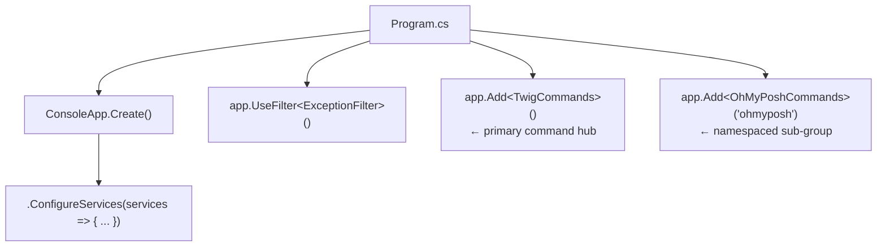
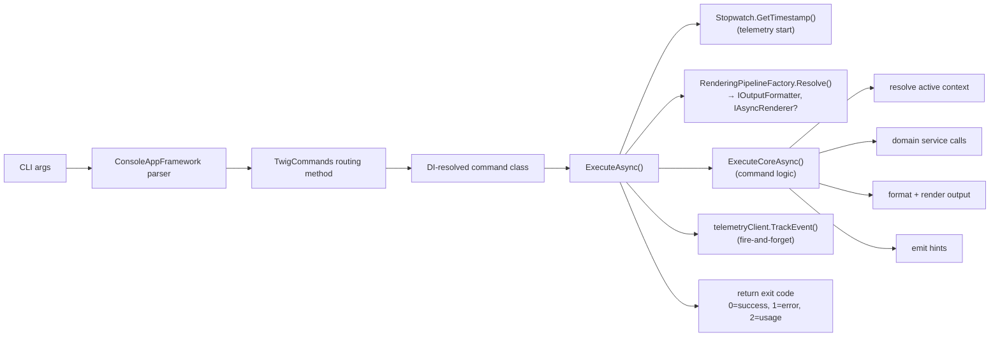

# CLI Command Architecture

Technical reference for Twig's command layer — how commands are defined, registered,
executed, and rendered. Covers the full pipeline from argument parsing through output
formatting, contextual hints, and telemetry.

---

## 1. ConsoleAppFramework

Twig uses [ConsoleAppFramework](https://github.com/Cysharp/ConsoleAppFramework) as its CLI
framework. ConsoleAppFramework is **source-generated** — it emits the argument parser, help
text, and command router at compile time with zero reflection. This is critical for Twig's
`PublishAot=true` constraint.

### Command Registration

All CLI commands are routed through a single hub class registered at startup:



**`TwigCommands`** (`src/Twig/Program.cs`) is a thin routing class that maps every CLI verb
to a dedicated command service resolved from DI. Public methods become CLI commands; method
parameters become CLI arguments and options. ConsoleAppFramework's source generator handles
all parsing.

```csharp
public sealed class TwigCommands(IServiceProvider services)
{
    public async Task<int> Status(string output = "human", ...) =>
        await services.GetRequiredService<StatusCommand>().ExecuteAsync(output, ...);
}
```

Key design decisions:

- **Lazy resolution**: Commands call `GetRequiredService<T>()` at invocation time, not at
  DI construction. This allows `twig init` to run before the SQLite database exists.
- **`[Command]` attribute**: Compound commands use `[Command("seed new")]`, `[Command("nav up")]`,
  etc. for multi-word verbs.
- **`[Hidden]` attribute**: Backward-compat aliases (`up`, `down`, `next`, `prev`, `back`,
  `fore`, `history`, `save`, `refresh`) are hidden from help but still routed.
- **`[Argument]` attribute**: Positional parameters are annotated with `[Argument]`.

### Custom Help & Routing

Twig overrides ConsoleAppFramework's default help with **`GroupedHelp`**
(`src/Twig/Program.cs`), which organises commands by category (Getting Started, Views,
Context, Navigation, Work Items, Seeds, System, Experimental). Unknown commands
are intercepted before `app.Run()` to show a grouped error instead of the framework's
flat output.

**`CommandExamples`** (`src/Twig/CommandExamples.cs`) appends usage examples when `--help`
is requested for a specific command.

**Smart landing**: When invoked with no arguments, Twig routes to `status` if the workspace
is initialised, otherwise shows grouped help.

---

## 2. Command Lifecycle

Every command follows a consistent execution pipeline:



### DI Injection Pattern

Command classes use **primary constructors** for dependency injection. All dependencies are
injected at construction; optional dependencies (e.g. `ITelemetryClient?`,
`RenderingPipelineFactory?`) use nullable parameters with defaults:

```csharp
public sealed class StatusCommand(
    IContextStore contextStore,
    IWorkItemRepository workItemRepo,
    IPendingChangeStore pendingChangeStore,
    TwigConfiguration config,
    OutputFormatterFactory formatterFactory,
    HintEngine hintEngine,
    ActiveItemResolver activeItemResolver,
    ...
    ITelemetryClient? telemetryClient = null)
```

Commands are registered in **`CommandRegistrationModule`**
(`src/Twig/DependencyInjection/CommandRegistrationModule.cs`) using factory lambdas
(AOT-safe, no `ActivatorUtilities`).

### Rendering Pipeline Resolution

Every command that produces output resolves a formatter and optional async renderer:

```csharp
var (fmt, renderer) = pipelineFactory.Resolve(outputFormat, noLive);
```

`RenderingPipelineFactory` (`src/Twig/Rendering/RenderingPipelineFactory.cs`) returns:

| Condition | Formatter | Renderer |
|-----------|-----------|----------|
| `human` + TTY + no `--no-live` | `HumanOutputFormatter` | `SpectreRenderer` |
| `human` + piped/redirected | `HumanOutputFormatter` | `null` |
| `json` / `json-full` | `JsonOutputFormatter` | `null` |
| `json-compact` | `JsonCompactOutputFormatter` | `null` |
| `minimal` | `MinimalOutputFormatter` | `null` |

When `renderer` is non-null, the command uses Spectre.Console `LiveDisplay` for progressive
rendering. When `null`, it falls back to synchronous `IOutputFormatter` string output.

---

## 3. Command Catalog

### Getting Started

| Command | Description |
|---------|-------------|
| `init` | Initialise workspace, sync process metadata |
| `sync` | Flush pending changes then refresh local cache |

### Views

| Command | Description |
|---------|-------------|
| `status` | Show active item with pending changes and child progress |
| `tree` | Display work-item hierarchy as a tree |
| `workspace` / `ws` | Show sprint backlog with active context and seeds |
| `sprint` | Sprint items grouped by assignee |
| `show <id>` | Display a work item without changing context |
| `show-batch` | Display multiple work items by comma-separated IDs |

### Context & Navigation

| Command | Description |
|---------|-------------|
| `set <id\|pattern>` | Set active context by ID or title pattern match |
| `query` | Search work items via ad-hoc WIQL with filters |
| `web [id]` | Open work item in browser |
| `nav` | Interactive tree navigator (keyboard-driven) |
| `nav up` / `nav down` | Navigate to parent or child |
| `nav next` / `nav prev` | Navigate to next or previous sibling |
| `nav back` / `nav fore` | Navigate backward/forward in history |
| `nav history` | Show navigation breadcrumb trail |

### Work Items

| Command | Description |
|---------|-------------|
| `state <name>` | Change active item state (with transition validation) |
| `states` | List available workflow states for active item's type |
| `new` | Create a new work item in ADO |
| `update <field> <value>` | Update a single field (immediate push) |
| `note [text]` | Add a comment/note (stages locally) |
| `edit [field]` | Bulk field editor via external editor |
| `discard [id]` | Clear pending changes |

### Seeds (Draft Work Items)

| Command | Description |
|---------|-------------|
| `seed new` | Create a local seed work item |
| `seed edit <id>` | Edit seed fields in external editor |
| `seed discard <id>` | Delete a local seed |
| `seed view` | Dashboard of seeds grouped by parent |
| `seed chain` | Create a chain of linked seeds |
| `seed link` / `seed unlink` | Manage virtual links between seeds |
| `seed links [id]` | List virtual links |
| `seed validate [id]` | Validate seeds against publish rules |
| `seed publish [id] [--link-branch <name>]` | Publish seeds to ADO; optionally link to a branch |
| `seed reconcile` | Fix links after partial publish |

### Links (Published Items)

| Command | Description |
|---------|-------------|
| `link parent <id>` | Set parent of active item |
| `link unparent` | Remove parent link |
| `link reparent <id>` | Remove current parent and set a new one |

### System

| Command | Description |
|---------|-------------|
| `config <key> [value]` | Read or set configuration |
| `config status-fields` | Configure status view fields |
| `version` | Print version |
| `upgrade` | Self-update from GitHub Releases |
| `changelog` | Show recent release notes |
| `tui` | Launch full-screen TUI mode |
| `mcp` | Launch MCP server |

---

## 4. Output Formatting

### IOutputFormatter

`IOutputFormatter` (`src/Twig/Formatters/IOutputFormatter.cs`) defines the synchronous
formatting contract. Every command calls formatter methods to produce output strings. The
interface covers work items, trees, workspaces, field changes, errors, hints, seeds, links,
query results, and PR status.

### Implementations

| Class | Format flag | Purpose |
|-------|-------------|---------|
| `HumanOutputFormatter` | `human` (default) | Spectre.Console ANSI markup, type badges, icons, colors |
| `JsonOutputFormatter` | `json` / `json-full` | Full DTO serialization via `TwigJsonContext` (source-gen) |
| `JsonCompactOutputFormatter` | `json-compact` | Slim schema for scripting |
| `MinimalOutputFormatter` | `minimal` | Pipe-friendly plain text |

Files: `src/Twig/Formatters/`

### OutputFormatterFactory

`OutputFormatterFactory` (`src/Twig/Formatters/OutputFormatterFactory.cs`) resolves
formatters via a compile-time switch expression — no reflection, AOT-safe:

```csharp
public IOutputFormatter GetFormatter(string format) =>
    format.ToLowerInvariant() switch
    {
        "json" or "json-full" => json,
        "json-compact"        => jsonCompact,
        "minimal"             => minimal,
        _                     => human,   // fallback
    };
```

Every command accepts an `--output` / `-o` flag (default: `"human"`).

### FormatterHelpers

`FormatterHelpers` (`src/Twig/Formatters/FormatterHelpers.cs`) provides shared utilities:

- **`HtmlToSpectreMarkup`**: Converts ADO HTML description fields to Spectre.Console markup
  via a single-pass state machine (no regex, AOT-safe). Handles `<b>`, `<i>`, `<br>`, HTML
  entities, and escapes user text via `Markup.Escape`.

---

## 5. Rendering

### IAsyncRenderer

`IAsyncRenderer` (`src/Twig/Rendering/IAsyncRenderer.cs`) defines the async progressive
rendering contract used when output goes to a TTY in `human` format. Methods include:

| Method | Usage |
|--------|-------|
| `RenderWorkspaceAsync` | Progressive workspace with `IAsyncEnumerable<WorkspaceDataChunk>` |
| `RenderTreeAsync` | Tree hierarchy with lazy data loading |
| `RenderStatusAsync` | Status panel with pending changes and child progress |
| `RenderWorkItemAsync` | Single work item detail view |
| `RenderSeedViewAsync` | Seed dashboard with table rendering |
| `RenderWithSyncAsync` | Cache→render→fetch→revise pattern |
| `RenderInteractiveTreeAsync` | Keyboard-driven tree navigator (Live region) |
| `PromptDisambiguationAsync` | Interactive selection for ambiguous matches |
| `RenderHints` | Hint display after command output |

### SpectreRenderer

`SpectreRenderer` (`src/Twig/Rendering/SpectreRenderer.cs`) implements `IAsyncRenderer`
using Spectre.Console's `LiveDisplay`. Key patterns:

- **Progressive streaming**: Commands yield `WorkspaceDataChunk` discriminated-union records
  (`ContextLoaded`, `SprintItemsLoaded`, `SeedsLoaded`, `RefreshStarted`, `RefreshCompleted`)
  via `IAsyncEnumerable`. The renderer updates the terminal incrementally as data arrives.
- **Live regions**: Uses `_console.Live(table).StartAsync(...)` for flicker-free updates.
- **Loading placeholders**: Shows `"Loading workspace..."` until the first real data chunk.
- **State-category styling**: Colors items by workflow state category (Green=Completed,
  Blue=InProgress, Grey=Proposed, Red=Removed) via `SpectreTheme`.

### SpectreTheme

`SpectreTheme` (`src/Twig/Rendering/SpectreTheme.cs`) maps work item types and states to
Spectre styles. It accepts `DisplayConfig` and pre-computed `StateEntry` lists. State
styling uses `StateCategoryResolver` — the renderer is fully process-agnostic.

### RenderingPipelineFactory

`RenderingPipelineFactory` (`src/Twig/Rendering/RenderingPipelineFactory.cs`) selects the
rendering path at runtime:

- **Async path**: `human` format + stdout is a TTY + `--no-live` not set → returns
  `SpectreRenderer`.
- **Sync path**: All other cases → returns formatter only, renderer is `null`.
- TTY detection uses `Console.IsOutputRedirected` (injectable for testing).

### Supporting Classes

| Class | File | Purpose |
|-------|------|---------|
| `HexToSpectreColor` | `Rendering/HexToSpectreColor.cs` | Hex → `Spectre.Console.Color` conversion |
| `TreeNavigatorState` | `Rendering/TreeNavigatorState.cs` | State record for interactive tree navigation |

---

## 6. Hint Engine

`HintEngine` (`src/Twig/Hints/HintEngine.cs`) provides contextual suggestions after
command execution. Hints guide users toward logical next actions.

### Behaviour

- **Suppressed** when `config.display.hints` is `false`, or output format is `json` or
  `minimal`.
- Returns `IReadOnlyList<string>` — commands may emit zero or more hints.
- Process-config-aware: uses `IProcessConfigurationProvider` to resolve state categories
  and available transitions.

### Hint Rules by Command

| Command | Hints |
|---------|-------|
| `set` | Suggests `status`, `tree`, `state`; sibling navigation if item has parent |
| `state` | When completing: checks if all siblings are done → suggests closing parent. Warns about pending notes |
| `seed` | After creation: suggests `seed edit`, `seed view` |
| `note` | Reminds that notes stage locally until `save`/`sync` |
| `edit` | Reminds to run `save` to persist changes |
| `status` | Warns about stale seeds |
| `workspace` | Warns about dirty items |
| `init` | Suggests `workspace` or `set` |
| `query` | Suggests `set`, `show`, and `--output ids` for piping |

---

## 7. Telemetry

### Architecture

Telemetry is opt-in via two environment variables:

- `TWIG_TELEMETRY_ENDPOINT` — Application Insights ingestion URL
- `TWIG_TELEMETRY_KEY` — Instrumentation key

When either is unset, `TelemetryClient` (`src/Twig.Infrastructure/Telemetry/TelemetryClient.cs`)
is a complete no-op. The client implements `ITelemetryClient`
(`src/Twig.Domain/Interfaces/ITelemetryClient.cs`).

### What Is Tracked

Each command calls `telemetryClient?.TrackEvent("CommandExecuted", ...)` with:

| Property | Example |
|----------|---------|
| `command` | `"status"`, `"tree"`, `"set"` |
| `exit_code` | `"0"`, `"1"` |
| `output_format` | `"human"`, `"json"` |
| `twig_version` | `"1.2.3"` |
| `os_platform` | OS description string |
| `duration_ms` | Elapsed milliseconds (metric) |

### Privacy Rules (Non-Negotiable)

**Never send** — even hashed:

- Organisation, project, or team names
- User names, display names, or email addresses
- Process template or work item type names
- Field names or reference names
- Area paths, iteration paths, work item IDs, titles, or content
- Repository names, branch names, or commit hashes

**Safe to send**: Command name, duration, exit code, output format, version, OS platform,
generic booleans, generic counts (numbers only, no identifiers).

### Enforcement

- Telemetry property keys must pass an allowlist check in tests.
- Keys containing `org`, `project`, `user`, `type`, `name`, `path`, `template`, `field`,
  `title`, `area`, `iteration`, or `repo` are rejected.
- Zero network calls when `TWIG_TELEMETRY_ENDPOINT` is unset.
- Telemetry failures never affect command execution or exit codes.
- Fire-and-forget: `TrackEvent` is synchronous, POSTs happen in background with 5s timeout.

---

## 8. Error Handling

### ExceptionFilter

`ExceptionFilter` (`src/Twig/Program.cs`) is a ConsoleAppFramework filter registered via
`app.UseFilter<ExceptionFilter>()`. It wraps every command invocation and delegates to
`ExceptionHandler.Handle()`.

### ExceptionHandler

`ExceptionHandler` (`src/Twig/Program.cs`) maps exception types to exit codes and
user-friendly stderr messages:

| Exception | Exit Code | Message |
|-----------|-----------|---------|
| `OperationCanceledException` | 130 | (silent — Ctrl+C) |
| `AdoOfflineException` | 1 | `⚠ ADO unreachable. Operating in offline mode.` |
| `AdoAuthenticationException` | 1 | Auth error + remediation hint (PAT or `az login`) |
| `AdoNotFoundException` | 1 | `Work item #N not found.` |
| `AdoBadRequestException` | 1 | Error message + transition hint if state-related |
| `AdoConflictException` | 1 | `Concurrency conflict` + `twig sync` suggestion |
| `EditorNotFoundException` | 1 | Editor not configured message |
| `SqliteException` | 1 | `⚠ Cache corrupted. Run 'twig init --force' to rebuild.` |
| Any other `Exception` | 1 | `error: {message}` |

### Exit Code Conventions

| Code | Meaning |
|------|---------|
| `0` | Success |
| `1` | Runtime error (ADO failure, not found, conflict, etc.) |
| `2` | Usage error (missing or invalid arguments) |
| `130` | Cancelled (Ctrl+C / `OperationCanceledException`) |

All error output goes to **stderr** (`Console.Error`). Commands that need formatted errors
use `IOutputFormatter.FormatError()` for format-appropriate error messages (ANSI markup for
human, structured JSON for json output).

---

## File Index

| Path | Purpose |
|------|---------|
| `src/Twig/Program.cs` | Entry point, `TwigCommands`, `ExceptionFilter`, `GroupedHelp` |
| `src/Twig/CommandExamples.cs` | Per-command usage examples |
| `src/Twig/Commands/` | 50+ command implementation classes |
| `src/Twig/Formatters/IOutputFormatter.cs` | Output formatting contract |
| `src/Twig/Formatters/OutputFormatterFactory.cs` | Format flag → implementation resolver |
| `src/Twig/Formatters/HumanOutputFormatter.cs` | ANSI/Spectre markup output |
| `src/Twig/Formatters/JsonOutputFormatter.cs` | Full JSON output (source-gen) |
| `src/Twig/Formatters/JsonCompactOutputFormatter.cs` | Compact JSON output |
| `src/Twig/Formatters/MinimalOutputFormatter.cs` | Pipe-friendly plain text |
| `src/Twig/Formatters/FormatterHelpers.cs` | `HtmlToSpectreMarkup`, shared utilities |
| `src/Twig/Rendering/IAsyncRenderer.cs` | Progressive rendering contract |
| `src/Twig/Rendering/SpectreRenderer.cs` | Spectre.Console LiveDisplay implementation |
| `src/Twig/Rendering/RenderingPipelineFactory.cs` | Sync/async rendering path resolver |
| `src/Twig/Rendering/SpectreTheme.cs` | Type badges, state colours, style mapping |
| `src/Twig/Rendering/HexToSpectreColor.cs` | Hex colour → Spectre colour conversion |
| `src/Twig/Hints/HintEngine.cs` | Contextual post-command suggestions |
| `src/Twig/DependencyInjection/CommandRegistrationModule.cs` | Command class DI registration |
| `src/Twig/DependencyInjection/CommandServiceModule.cs` | Domain service DI for commands |
| `src/Twig/DependencyInjection/RenderingServiceModule.cs` | Formatter + renderer DI |
| `src/Twig.Domain/Interfaces/ITelemetryClient.cs` | Telemetry contract |
| `src/Twig.Infrastructure/Telemetry/TelemetryClient.cs` | App Insights telemetry client |
