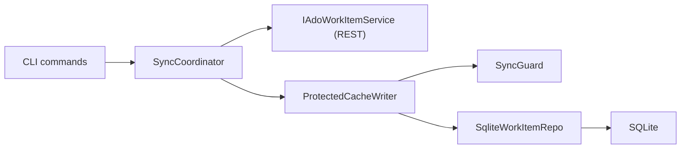

# Data Layer Architecture

This document describes how twig persists, caches, and synchronises work-item data
between the local SQLite store and Azure DevOps.

---

## 1. SQLite Storage

### Database Location

Each workspace stores its cache in a context-scoped SQLite database:

```
.twig/{org}/{project}/twig.db
```

Path construction is handled by `TwigPaths.GetContextDbPath()` in
`src/Twig.Infrastructure/Config/TwigPaths.cs`. The `org` and `project` segments are
sanitised with `TwigPaths.SanitizePathSegment()` to strip filesystem-unsafe characters.
When org/project are not yet configured, a flat fallback (`<twigDir>/twig.db`) is used.

### Connection and WAL Mode

`SqliteCacheStore` (`src/Twig.Infrastructure/Persistence/SqliteCacheStore.cs`) owns the
single `SqliteConnection` for the CLI invocation. On construction it:

1. Opens the connection and enables **WAL journal mode** (`PRAGMA journal_mode=WAL`).
2. Sets a **busy timeout of 5 000 ms** (`PRAGMA busy_timeout=5000`).
3. Calls `EnsureSchema()` to check or rebuild the schema.

WAL mode allows concurrent readers without blocking writes — important when the MCP
server and CLI are running against the same database file.

### Schema Versioning

Twig uses a **drop-and-recreate** strategy instead of incremental migrations. The
compiled-in constant `SqliteCacheStore.SchemaVersion` (currently **9**) is compared
against the value in the `metadata` table. If the version differs or the table is
missing, all tables are dropped and re-created from the DDL string. The
`SchemaWasRebuilt` property signals to callers that a full re-sync is needed.

### Database Tables

| Table | Purpose |
|-------|---------|
| `metadata` | Key-value store (schema version, process config data) |
| `work_items` | Cached work items with fields, state, dirty tracking, and `last_synced_at` |
| `pending_changes` | Staged field mutations and notes (auto-increment PK) |
| `process_types` | Process type definitions with states JSON and child-type mappings |
| `context` | Active work item ID and key-value settings |
| `field_definitions` | Custom field metadata (ref name, display name, data type, read-only flag) |
| `work_item_links` | Non-hierarchy link relationships between work items |
| `seed_links` | Links between seed (draft) work items |
| `publish_id_map` | Maps seed IDs to real ADO IDs after publish |
| `navigation_history` | Breadcrumb trail of visited work items |

Key indices cover `parent_id`, `iteration_path`, `assigned_to`, `is_dirty` (partial),
and `is_seed` (partial) on `work_items`, plus `work_item_id` on `pending_changes`.

### Corruption Detection

If the connection fails to open (e.g. corrupt file), `SqliteCacheStore` catches the
`SqliteException` and throws an `InvalidOperationException` advising the user to run
`twig init --force` to rebuild.

---

## 2. Repository Pattern

All persistence contracts live in `src/Twig.Domain/Interfaces/`. Infrastructure
implementations in `src/Twig.Infrastructure/Persistence/` use raw, parameterised SQL
against the `SqliteCacheStore` connection — no ORM.

### Core Interfaces

#### `IWorkItemRepository`

Primary repository for cached work items. Key operations:

- `GetByIdAsync`, `GetByIdsAsync` — single/bulk lookup
- `GetChildrenAsync`, `GetParentChainAsync` — hierarchy traversal
- `GetByIterationAsync`, `GetByIterationAndAssigneeAsync` — sprint queries
- `FindByPatternAsync` — title pattern search (SQL `LIKE`)
- `GetDirtyItemsAsync`, `GetSeedsAsync` — filtered queries
- `SaveAsync`, `SaveBatchAsync` — upsert via `INSERT OR REPLACE`
- `EvictExceptAsync` — cache eviction (keeps only specified IDs)
- `DeleteByIdAsync`, `RemapParentIdAsync` — seed publish support
- `ClearPhantomDirtyFlagsAsync` — cleans `is_dirty` flags with no backing pending changes

**Implementation:** `SqliteWorkItemRepository`. Batch saves wrap all inserts in an
explicit transaction with rollback on failure. Large keep-set evictions (>900 IDs) use a
temp table to avoid the SQLite parameter limit (999).

#### `IContextStore`

Active work-item context and key-value settings. Backed by the `context` table.

- `GetActiveWorkItemIdAsync` / `SetActiveWorkItemIdAsync` — active item cursor
- `GetValueAsync` / `SetValueAsync` — generic key-value pairs

**Implementation:** `SqliteContextStore` — `INSERT OR REPLACE` on every write.

#### `IPendingChangeStore`

Staging area for uncommitted mutations (field edits, notes) before they are flushed to
ADO.

- `AddChangeAsync`, `AddChangesBatchAsync` — enqueue changes (batch is transactional)
- `GetChangesAsync` — ordered retrieval by auto-increment ID
- `ClearChangesAsync`, `ClearChangesByTypeAsync` — per-item or per-type cleanup
- `GetDirtyItemIdsAsync` — distinct IDs with pending changes
- `ClearAllChangesAsync` — bulk clear (preserves seed items)
- `GetChangeSummaryAsync` — note vs. field-edit counts

**Implementation:** `SqlitePendingChangeStore`.

#### `IFieldDefinitionStore`

Custom field metadata synced from ADO.

- `GetByReferenceNameAsync`, `GetAllAsync` — lookup
- `SaveBatchAsync` — batch upsert in a transaction

**Implementation:** `SqliteFieldDefinitionStore`.

#### `IProcessTypeStore`

Process type definitions (states, child types, colours, icons) and the
`ProcessConfigurationData` blob.

- `GetByNameAsync`, `GetAllAsync` — type lookups
- `SaveAsync` — upsert with JSON-serialised state entries
- `SaveProcessConfigurationDataAsync` / `GetProcessConfigurationDataAsync` — stores the
  full configuration blob in the `metadata` table

**Implementation:** `SqliteProcessTypeStore`. State entries and valid child types are
stored as JSON arrays within their respective columns, using source-generated
`TwigJsonContext` serialisers for AOT safety.

#### Other Stores

| Interface | Implementation | Purpose |
|-----------|---------------|---------|
| `IWorkItemLinkRepository` | `SqliteWorkItemLinkRepository` | Non-hierarchy links |
| `ISeedLinkRepository` | `SqliteSeedLinkRepository` | Seed-to-seed links |
| `IPublishIdMapRepository` | `SqlitePublishIdMapRepository` | Seed→real ID mapping |
| `INavigationHistoryStore` | `SqliteNavigationHistoryStore` | Breadcrumb trail |

### Transaction Support

`IUnitOfWork` / `SqliteUnitOfWork` wraps `SqliteTransaction` in an `ITransaction` token.
When a transaction is active, `SqliteCacheStore.ActiveTransaction` is set so that
individual repository commands automatically enrol in the ambient transaction.

---

## 3. Caching Strategy

### Cache-First Reads

All read commands (`status`, `tree`, `show`, `workspace`) read from the local SQLite
cache. Network calls happen only when:

- The cache is empty (first run / after schema rebuild).
- A per-item staleness check determines the item is stale.
- An explicit `twig refresh` is requested.

### Per-Item Staleness

Each `WorkItem` row carries a `last_synced_at` timestamp set at save time. The
`SyncCoordinator` compares `DateTimeOffset.UtcNow - LastSyncedAt` against a configurable
`cacheStaleMinutes` threshold. Items within the threshold return `SyncResult.UpToDate`
without any network call.

### Tiered TTL

`SyncCoordinatorFactory` (`src/Twig.Domain/Services/SyncCoordinatorFactory.cs`) creates
two `SyncCoordinator` instances with different staleness thresholds:

| Tier | Property | Typical TTL | Used By |
|------|----------|-------------|---------|
| **Read-only** | `SyncCoordinatorFactory.ReadOnly` | 30 min | `status`, `tree`, `show` |
| **Read-write** | `SyncCoordinatorFactory.ReadWrite` | 5 min | `set`, `link`, `refresh` |

The factory enforces `readOnlyStaleMinutes >= readWriteStaleMinutes` so display commands
never refresh more aggressively than mutating ones.

### Protected Cache Writes

`ProtectedCacheWriter` (`src/Twig.Domain/Services/ProtectedCacheWriter.cs`) prevents
remote sync from overwriting items with local pending changes. Before writing, it
queries `SyncGuard.GetProtectedItemIdsAsync()` to build a set of protected IDs (union
of dirty items and items with pending changes), then skips any item in that set.

Batch operations accept pre-computed protected IDs to avoid N+1 queries.

---

## 4. Sync Coordination

### Architecture



### SyncCoordinator

`SyncCoordinator` (`src/Twig.Domain/Services/SyncCoordinator.cs`) is the single-item and
working-set sync engine:

- **`SyncItemAsync(id)`** — checks staleness, fetches from ADO if stale, saves through
  `ProtectedCacheWriter`. Items confirmed deleted in ADO are evicted from the cache.
- **`SyncWorkingSetAsync(workingSet)`** — filters candidate IDs (positive, non-dirty),
  fetches stale items concurrently via `Task.WhenAll`, batch-saves through
  `ProtectedCacheWriter`.
- **`SyncItemSetAsync(ids)`** — like `SyncWorkingSetAsync` but accepts explicit IDs
  without requiring a `WorkingSet`.
- **`SyncChildrenAsync(parentId)`** — unconditional fetch of children (no per-parent
  staleness check).
- **`SyncLinksAsync(itemId)`** — fetches item with non-hierarchy links, persists both.

Partial failures return `SyncResult.PartiallyUpdated` with per-item error details.

### RefreshOrchestrator

`RefreshOrchestrator` (`src/Twig.Domain/Services/RefreshOrchestrator.cs`) coordinates
full workspace refreshes:

1. Executes WIQL to get sprint item IDs.
2. Cleanses phantom dirty flags (`ClearPhantomDirtyFlagsAsync`).
3. Computes protected IDs via `SyncGuard` (unless `--force`).
4. Fetches sprint items, active item, and children concurrently.
5. Detects revision conflicts (remote revision > local revision on protected items).
6. Saves through `ProtectedCacheWriter` (or raw save if `--force`).
7. Hydrates ancestor chains iteratively (up to 5 levels).
8. Syncs the working set via `SyncCoordinatorFactory.ReadWrite`.

### Push-on-Write: PendingChangeFlusher

`PendingChangeFlusher` (`src/Twig/Commands/PendingChangeFlusher.cs`) pushes staged
changes to ADO:

1. Iterates dirty item IDs.
2. Separates pending changes into **field changes** and **notes**.
3. For field changes: fetches the remote item, runs `ConflictResolutionFlow`, then
   calls `ConflictRetryHelper.PatchWithRetryAsync`.
4. For notes: posts comments directly (notes are additive and skip conflict resolution).
5. Post-push: clears pending changes, re-fetches the item, and updates the cache.
6. Continues past individual failures, collecting them in `FlushResult.Failures`.

### Conflict Resolution

`ConflictRetryHelper` (`src/Twig.Infrastructure/Ado/ConflictRetryHelper.cs`) handles
HTTP 412 (revision mismatch) from the ADO REST API:

1. Attempt 1: `PatchAsync(itemId, changes, expectedRevision)`.
2. On `AdoConflictException`: re-fetch the item for a fresh revision.
3. Attempt 2: `PatchAsync(itemId, changes, freshRevision)`.
4. A second conflict propagates to the caller.

### SyncGuard

`SyncGuard` (`src/Twig.Domain/Services/SyncGuard.cs`) computes protected item IDs by
unioning:
- Items with `is_dirty = 1` from `IWorkItemRepository.GetDirtyItemsAsync()`
- Item IDs with rows in `pending_changes` from `IPendingChangeStore.GetDirtyItemIdsAsync()`

These IDs are excluded from cache overwrites during sync to prevent data loss.

---

## 5. Process-Agnostic Design

Twig never hardcodes process template state names, work item type names, or field
reference names. All process-specific metadata is discovered at runtime.

### IProcessConfigurationProvider

`IProcessConfigurationProvider` (`src/Twig.Domain/Interfaces/IProcessConfigurationProvider.cs`)
returns a `ProcessConfiguration` aggregate built from dynamic data:

```csharp
public interface IProcessConfigurationProvider
{
    ProcessConfiguration GetConfiguration();
}
```

The `ProcessConfiguration` (`src/Twig.Domain/Aggregates/ProcessConfiguration.cs`)
contains per-type `TypeConfig` entries with:
- Ordered state names
- State entries with category metadata
- Allowed child types
- Auto-generated transition rules (Forward/Backward/Cut)

It is built via `ProcessConfiguration.FromRecords(IReadOnlyList<ProcessTypeRecord>)`,
which processes `ProcessTypeRecord` data persisted in `SqliteProcessTypeStore`.

### Dynamic State and Type Discovery

During `twig init`, process type data is synced from ADO via `IAdoWorkItemService` and
stored in the `process_types` table. The `ProcessConfigurationData` blob is also cached
in the `metadata` table. This means:

- State names (e.g. "New", "Active", "Closed") come from ADO, not from code.
- Transition rules are computed from state ordering, not hardcoded per-template.
- Work item types and their child-type relationships are discovered dynamically.

### StateCategoryResolver

`StateCategoryResolver` (`src/Twig.Domain/Services/StateCategoryResolver.cs`) maps a
state name to a `StateCategory` enum (`Proposed`, `InProgress`, `Resolved`,
`Completed`, `Removed`, `Unknown`):

1. **Authoritative path:** searches the `StateEntry` list (from `ProcessTypeRecord`) for
   a case-insensitive name match.
2. **Fallback path:** uses a hardcoded heuristic mapping for common state names across
   ADO process templates (Agile, Scrum, CMMI, Basic).

The `ParseCategory()` method converts ADO category strings (e.g. `"InProgress"`) to the
enum.

---

## 6. Workspace Discovery

### Walk-Up Search

`WorkspaceDiscovery.FindTwigDir()` (`src/Twig.Infrastructure/Config/WorkspaceDiscovery.cs`)
walks up the directory tree from the current working directory (or a supplied start
directory) looking for a `.twig/` subdirectory — analogous to how git locates `.git/`.
Returns `null` if none is found up to the filesystem root.

### WorkspaceGuard

`WorkspaceGuard` (`src/Twig.Mcp/WorkspaceGuard.cs`) validates workspace readiness for
the MCP server:

1. Calls `WorkspaceDiscovery.FindTwigDir(cwd)`.
2. Returns an error if no `.twig/` directory exists.
3. Checks that `.twig/config` is present — if not, advises `twig init`.
4. Returns `(IsValid: true, TwigDir)` on success.

### Path Building

`TwigPaths.BuildPaths(twigDir, config)` selects the layout:
- **Context-scoped** (`.twig/{org}/{project}/twig.db`) when both `Organization` and
  `Project` are configured.
- **Flat** (`.twig/twig.db`) as a fallback for unconfigured workspaces.

A `LegacyDbMigrator` (called from `Program.cs` at startup) handles migration from the
flat layout to the context-scoped layout.

---

## Key Files Reference

| File | Role |
|------|------|
| `src/Twig.Infrastructure/Persistence/SqliteCacheStore.cs` | Connection, WAL, schema management |
| `src/Twig.Infrastructure/Persistence/SqliteWorkItemRepository.cs` | Work item CRUD |
| `src/Twig.Infrastructure/Persistence/SqliteContextStore.cs` | Active context persistence |
| `src/Twig.Infrastructure/Persistence/SqlitePendingChangeStore.cs` | Pending change staging |
| `src/Twig.Infrastructure/Persistence/SqliteProcessTypeStore.cs` | Process type cache |
| `src/Twig.Infrastructure/Persistence/SqliteFieldDefinitionStore.cs` | Field metadata cache |
| `src/Twig.Infrastructure/Persistence/SqliteUnitOfWork.cs` | Transaction support |
| `src/Twig.Domain/Services/SyncCoordinator.cs` | Single-item and working-set sync |
| `src/Twig.Domain/Services/SyncCoordinatorFactory.cs` | Tiered TTL coordinator factory |
| `src/Twig.Domain/Services/ProtectedCacheWriter.cs` | Dirty-item-safe cache writes |
| `src/Twig.Domain/Services/SyncGuard.cs` | Protected ID computation |
| `src/Twig.Domain/Services/RefreshOrchestrator.cs` | Full workspace refresh |
| `src/Twig.Domain/Services/StateCategoryResolver.cs` | State→category mapping |
| `src/Twig.Domain/Aggregates/ProcessConfiguration.cs` | Dynamic process config aggregate |
| `src/Twig/Commands/PendingChangeFlusher.cs` | Push pending changes to ADO |
| `src/Twig.Infrastructure/Ado/ConflictRetryHelper.cs` | 412 conflict retry |
| `src/Twig.Infrastructure/Config/WorkspaceDiscovery.cs` | `.twig/` walk-up search |
| `src/Twig.Infrastructure/Config/TwigPaths.cs` | Context-scoped path builder |
| `src/Twig.Mcp/WorkspaceGuard.cs` | MCP workspace validation |
