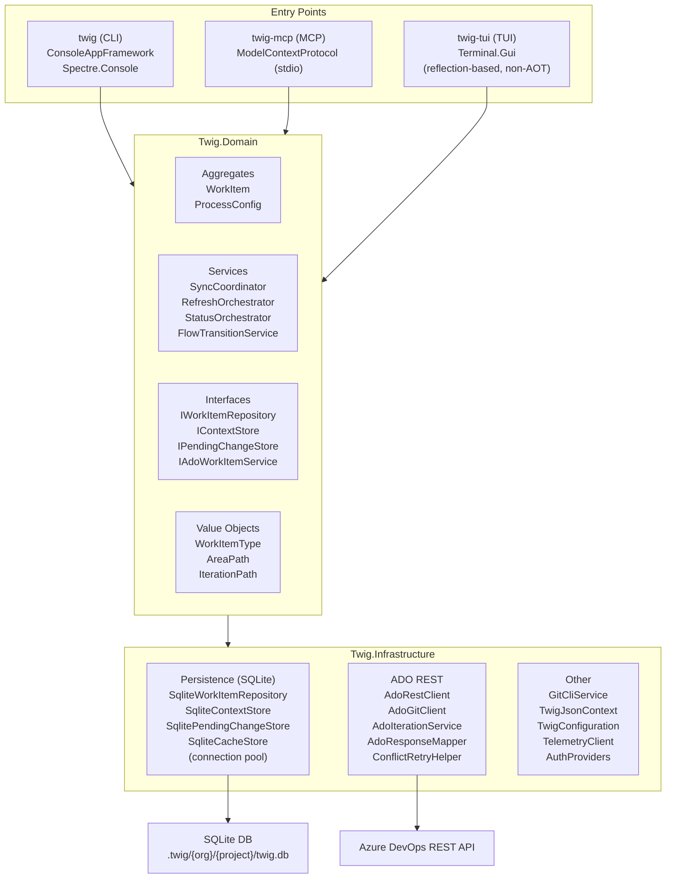

# Architecture Overview

## Introduction

Twig is a .NET 10 AOT-compiled CLI for Azure DevOps work-item triage. It renders sprint
backlogs as rich terminal trees, supports offline-first caching with SQLite, and exposes
an MCP server for AI agent integration. The primary audience is individual contributors
and engineering managers who work with ADO boards daily and want fast, keyboard-driven
access to their sprint backlog without leaving the terminal.

The system is built around a local SQLite cache that mirrors a subset of ADO data. Most
read operations are served from cache with configurable staleness thresholds, while
mutations are staged locally and flushed to ADO in atomic PATCH requests. This design
gives sub-second response times for tree rendering and status queries, even on large
backlogs.

Twig ships three executable entry points — a CLI (`twig`), an MCP server (`twig-mcp`),
and a Terminal.Gui-based TUI (`twig-tui`) — all sharing the same domain and
infrastructure layers. The CLI and MCP server are AOT-compiled native binaries; the TUI
is published as a self-contained single-file bundle (Terminal.Gui does not support AOT).

---

## Architecture Diagram



**Dependency rule:** Dependencies flow downward only. Domain has zero references to
Infrastructure or entry-point projects. Infrastructure implements Domain interfaces.
Entry points compose the full object graph via dependency injection.

---

## Project Structure

### Source Projects (`src/`)

| Project | Assembly | Description |
|---------|----------|-------------|
| `Twig` | `twig` | CLI entry point. ConsoleAppFramework commands, Spectre.Console rendering, output formatters, hint engine. AOT-compiled. |
| `Twig.Domain` | (class library) | Core business logic. Aggregates (`WorkItem`, `ProcessConfiguration`), domain services, interfaces, value objects, enums. No external dependencies. |
| `Twig.Infrastructure` | (class library) | SQLite persistence, ADO REST clients, authentication providers, git CLI wrapper, JSON serialization (`TwigJsonContext`), configuration, telemetry. |
| `Twig.Mcp` | `twig-mcp` | MCP server for AI agent integration. Stdio transport, 8 tools across 3 tool classes (`ContextTools`, `ReadTools`, `MutationTools`). AOT-compiled. |
| `Twig.Tui` | `twig-tui` | Terminal.Gui interactive viewer. Three-pane layout (menu, tree navigator, form). Published as self-contained single-file (non-AOT). |

### Test Projects (`tests/`)

| Project | Covers |
|---------|--------|
| `Twig.Cli.Tests` | CLI commands, DI composition, integration tests |
| `Twig.Domain.Tests` | Domain services, aggregates, sync coordination, state transitions |
| `Twig.Infrastructure.Tests` | SQLite repositories, JSON serialization, ADO response mapping |
| `Twig.Mcp.Tests` | MCP tool handlers, result builders |
| `Twig.Tui.Tests` | TUI views, tree navigation |
| `Twig.TestKit` | Shared test utilities: in-memory repositories, fake ADO services, `WorkItemBuilder` |

### Other Notable Directories

| Path | Purpose |
|------|---------|
| `tools/` | Build scripts, plan-to-ADO seeding, helper PowerShell scripts |
| `docs/` | User-facing documentation, examples, Oh-My-Posh integration guide |
| `.github/instructions/` | Copilot coding instructions (process-agnostic rules, conventions) |
| `.twig/` | Local workspace data (config, SQLite databases — not committed) |

---

## Key Constraints

### AOT Compilation

The CLI and MCP server are published with Native AOT (`PublishAot=true`, `TrimMode=full`).
This imposes strict rules on the entire codebase:

- **No runtime reflection.** DI uses factory registrations (`sp => new Foo(...)`)
  instead of `ActivatorUtilities`. Generic type activation is forbidden.
- **Source-generated JSON only.** `JsonSerializerIsReflectionEnabledByDefault=false`
  is set in the project files. All serializable types must be registered in
  `TwigJsonContext` with `[JsonSerializable]` attributes (90+ types).
- **No dynamic assembly loading.** Self-update downloads a new binary; it does not
  load assemblies at runtime.

### Invariant Globalization

`InvariantGlobalization=true` eliminates ICU dependency, reducing binary size. Culture-
specific formatting (dates, numbers) is unavailable. UTF-8 output encoding is set
explicitly at startup with a fallback for restricted environments.

### Warnings as Errors

`TreatWarningsAsErrors=true` is set in `Directory.Build.props` and applies to all
projects. No suppressed warnings except NuGet audit informational messages
(`NU1900`–`NU1904`).

### Process-Agnostic Design

Twig never hardcodes ADO process template names, work-item type names, state names, or
field reference names. All process-specific metadata is loaded at runtime from
`IProcessConfigurationProvider` and stored in the local SQLite cache. This allows twig to
work with Agile, Scrum, CMMI, Basic, and custom process templates without code changes.

### Nullable Reference Types

Nullable annotations are enabled globally (`<Nullable>enable</Nullable>` in
`Directory.Build.props`). All public API surfaces use nullable annotations, and the
compiler enforces null safety at build time.

---

## Technology Stack

| Category | Technology | Version | Purpose |
|----------|-----------|---------|---------|
| Runtime | .NET | 10.0 | Target framework, AOT compilation |
| CLI framework | ConsoleAppFramework | 5.7.x | Source-generated command routing (no reflection) |
| Rendering | Spectre.Console | 0.54.x | Rich terminal output — trees, tables, live display |
| TUI framework | Terminal.Gui | 2.0.0-dev | Interactive terminal UI (three-pane layout) |
| Database | SQLite (via Microsoft.Data.Sqlite) | 10.0.x | Local work-item cache, pending changes, process config |
| SQLite native | SQLitePCLRaw.bundle_e_sqlite3 | 2.1.x | Native SQLite bindings for AOT |
| MCP | ModelContextProtocol | 1.2.x | MCP server for AI agent integration (stdio transport) |
| Markdown | Markdig | 1.1.x | Markdown-to-HTML conversion for ADO description fields |
| Versioning | MinVer | 7.0.x | Git-tag-based semantic versioning |
| DI | Microsoft.Extensions.DependencyInjection | 10.0.x | Service composition (factory-based for AOT) |
| Hosting | Microsoft.Extensions.Hosting | 10.0.x | MCP server host lifecycle |
| Testing | xUnit + Shouldly + NSubstitute | — | Unit/integration tests with fluent assertions and mocks |

### Authentication

Two authentication providers, selected via configuration:

- **Azure CLI** (`azcli`, default): Delegates to `az account get-access-token`. No
  credentials stored.
- **Personal Access Token** (`pat`): Read from `TWIG_PAT` environment
  variable. Used in CI/CD pipelines.

### Data Storage

SQLite databases are stored per-workspace at `.twig/{org}/{project}/twig.db` with WAL
mode enabled. Key tables:

- `work_items` — cached work items with `LastSyncedAt` staleness tracking
- `pending_changes` — staged field mutations (flushed to ADO on save/sync)
- `ProcessTypes` — process configuration metadata (states, rules, backlog levels)
- `FieldDefinitions` — custom field metadata synced from ADO
- `WorkItemLinks`, `SeedLinks` — relationship tracking

---

## Entry Point Startup Sequence

All three entry points follow a similar bootstrap pattern with entry-point-specific
additions.

### CLI (`twig`)

1. Set `Console.OutputEncoding` to UTF-8 (with fallback for InvariantGlobalization).
2. Discover workspace: walk up from CWD to find `.twig/` directory.
3. Load `TwigConfiguration` from `.twig/config`.
4. Run `LegacyDbMigrator.MigrateIfNeeded()` (flat → nested DB path migration).
5. Start background git remote detection (overlapped with DI setup).
6. Compose DI: core services, network services, rendering services, command handlers.
7. Route to `ConsoleApp.Create()` for command dispatch.

### MCP Server (`twig-mcp`)

1. Initialize SQLite (`SQLitePCL.Batteries.Init()`).
2. `WorkspaceGuard.CheckWorkspace()` — exit immediately if `.twig/config` is missing.
3. Load configuration, compose DI with core + network services.
4. Register MCP tool classes (`ContextTools`, `ReadTools`, `MutationTools`).
5. Start stdio transport and enter the host run loop.
6. All logging goes to stderr (stdout is reserved for MCP protocol messages).

### TUI (`twig-tui`)

1. Initialize SQLite, discover workspace, load configuration.
2. Compose minimal DI (core services only — no commands, no rendering pipeline).
3. Build three-pane layout: menu bar, `TreeNavigatorView` (40%), `WorkItemFormView` (60%).
4. Wire `WorkItemSelected` event to load the form panel.
5. Enter `Application.Run()` loop.

---

## Key Architectural Patterns

### Sync Coordination (Cache Staleness)

Each cached work item carries a `LastSyncedAt` timestamp. The `SyncCoordinator` checks
staleness before making network calls. If the item was synced within the configured TTL,
no network request is made. A `SyncCoordinatorFactory` produces two tiers:

- **Read-only** (30-minute TTL): Used for tree rendering and status queries where
  slightly stale data is acceptable. Minimizes ADO API calls during exploratory
  navigation.
- **Read-write** (5-minute TTL): Used before mutations to ensure fresh revision numbers
  and avoid update conflicts.

The `RefreshOrchestrator` coordinates multi-item sync: it syncs the context item, walks
the parent chain, syncs children (two levels deep, capped at 100 + 50), and performs a
best-effort link sync. Link sync failures are non-fatal — the UI still renders with
cached data.

### Command Queue (Dirty Tracking)

The `WorkItem` aggregate uses a command-queue pattern. Mutations (`ChangeState`,
`UpdateField`, `AddNote`) are enqueued as command objects rather than applied
immediately. On flush, all queued commands are serialized into a single ADO PATCH
request, providing:

- **Transactional semantics**: All changes succeed or fail together.
- **Minimal API calls**: One PATCH per flush, not one per field change.
- **Rollback safety**: Pending state is persisted in the `pending_changes` SQLite table,
  surviving process crashes.

### Protected Cache Writer (Revision Safety)

Writes to the local cache are guarded by revision checks via `ProtectedCacheWriter`. If
the cached revision does not match the incoming revision, a `ConflictException` is
raised. The `ConflictRetryHelper` handles this by re-fetching the latest revision from
ADO and retrying the PATCH (up to 2 attempts). This prevents lost updates when multiple
clients modify the same work item.

### Rendering Pipeline

Output format is resolved at startup by `RenderingPipelineFactory` based on the
`--format` flag and TTY detection:

- **TTY + `human` format**: Spectre.Console `LiveDisplay` for progressive rendering.
  The tree builds incrementally as items are fetched.
- **Piped/redirected output**: Formatter-only mode. No live display, no ANSI escape
  codes. Output is a clean text/JSON stream suitable for scripts.
- **`json` / `json-compact` / `minimal` formats**: Direct serialization via
  `TwigJsonContext`. No Spectre markup.
- The `--no-live` flag forces formatter-only mode even on a TTY.

Four output formatters are available:

| Format | Formatter | Use Case |
|--------|-----------|----------|
| `human` (default) | `HumanOutputFormatter` | Interactive terminal use. Spectre markup, icons, colors. |
| `json` | `JsonOutputFormatter` | Script automation. Full DTO serialization. |
| `json-compact` | `JsonCompactOutputFormatter` | Compact JSON for piping. |
| `minimal` | `MinimalOutputFormatter` | Minimal text output for simple parsing. |

### DI Composition

Each entry point composes its own service graph by calling shared registration methods
defined in `TwigServiceRegistration.cs`:

```
AddTwigCoreServices(config, twigDir)     → Domain + persistence (SQLite repos, stores)
AddTwigNetworkServices(config, ...)      → ADO REST clients, auth, telemetry, git client
```

The CLI adds rendering services (`RenderingServiceModule`), command handlers
(`CommandRegistrationModule`), and domain orchestration services
(`CommandServiceModule`). The MCP server adds MCP tool classes and a subset of domain
services (excluding `BacklogOrderer`, `SeedPublishOrchestrator`, and other CLI-only
services). The TUI uses only core services.

All DI registrations use the factory pattern (`sp => new Foo(...)`) to remain AOT-safe.
`ActivatorUtilities` and generic `AddSingleton<T>()` overloads that rely on constructor
reflection are forbidden.

### Conditional Service Registration

Some services are registered conditionally based on runtime state:

- **`IAdoGitService`**: Only registered if a git remote with an ADO project is
  detected. Git commands gracefully degrade when the service is absent.
- **`ITelemetryClient`**: Only active when `TWIG_TELEMETRY_ENDPOINT` is set. Telemetry
  failures never affect command execution or exit codes.
- **Git remote detection**: Runs as a background task during CLI startup and overlaps
  with DI composition to minimize cold-start latency.

---

## Error Handling

### ADO Error Mapping

`AdoErrorHandler` provides standardized HTTP error mapping. Network errors, API errors,
and authentication errors are distinguished and surfaced with actionable messages.
Timeout handling uses exponential backoff via `HttpClient` policies.

### Best-Effort Sync

Non-critical operations (link sync, working set extension) are wrapped in catch-all
handlers that suppress errors. The UI continues to render with cached data. Only
`OperationCanceledException` is re-thrown to honor cancellation tokens.

### Global Exception Filter

The CLI installs an `ExceptionFilter` that catches unhandled exceptions, pretty-prints
them to stderr, and exits with code 1. This ensures users never see raw stack traces in
normal operation.

---

## Testing Architecture

Tests use **xUnit** with **Shouldly** for fluent assertions and **NSubstitute** for
mocking. Test projects mirror the source project directory structure (e.g., domain
services tests live in `tests/Twig.Domain.Tests/Services/`).

### Shared Test Kit

`Twig.TestKit` provides reusable test infrastructure:

- **`InMemoryWorkItemRepository`**: Fast, isolated repository that avoids SQLite I/O in
  unit tests.
- **`FakeAdoService`**: Deterministic ADO responses for predictable test behavior.
- **`WorkItemBuilder`**: Fluent builder for constructing test `WorkItem` instances with
  sensible defaults.

### Test Patterns

- All async methods are tested with proper `CancellationToken` propagation.
- Domain tests are pure unit tests with no I/O.
- Infrastructure tests use real SQLite (in-memory mode) for schema verification.
- CLI tests exercise full command pipelines through the DI container.
- MCP tests verify tool handler input/output contracts.

---

## Cross-References

| Document | Scope |
|----------|-------|
| [Data Layer](data-layer.md) | SQLite schema, cache staleness, sync coordination, pending changes |
| [Commands](commands.md) | CLI command reference, flow commands, seed commands, git integration |
| [Rendering](rendering.md) | Output formatters, Spectre.Console theming, live display pipeline |
| [MCP Server](mcp-server.md) | MCP tool reference, result builders, workspace guard |
| [TUI](tui.md) | Terminal.Gui views, three-pane layout, vim keybindings |
| [Configuration](configuration.md) | `.twig/config` schema, type appearances, display options |
| [Testing](testing.md) | Test architecture, shared test kit, mocking patterns |
| [AOT & Trimming](aot-trimming.md) | AOT constraints, `TwigJsonContext`, DI factory patterns |

> **Note:** Cross-referenced documents may not exist yet. This list defines the planned
> decomposition of architecture documentation.
