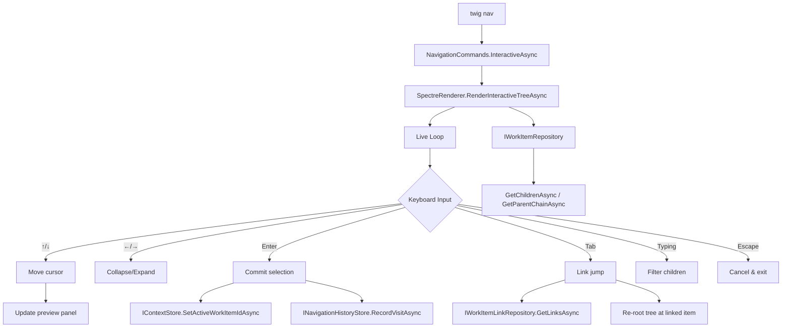
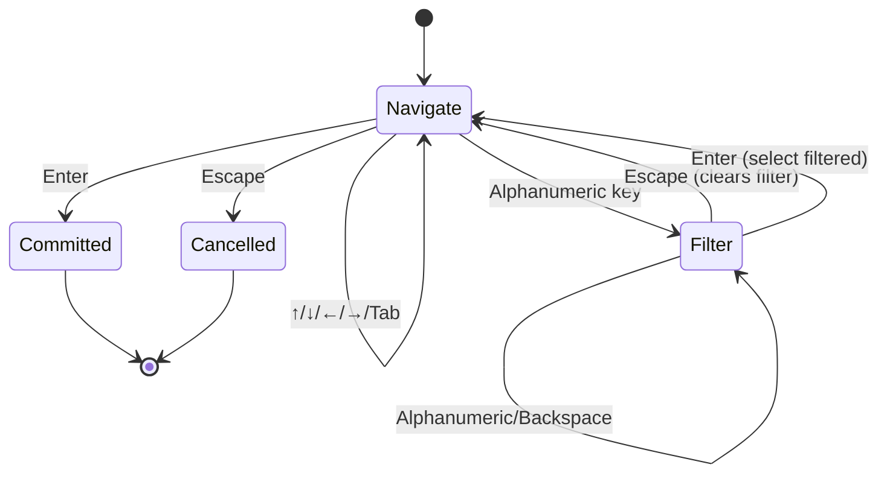

# Introduction

This plan adds an interactive tree navigation mode to the Twig CLI invoked via `twig nav` (no subcommand). The navigator renders a live Spectre.Console tree view with keyboard-driven traversal — arrow keys move between parent/child/sibling nodes, Enter sets context and exits, Tab cycles through non-hierarchy links, and typing filters children by pattern. Unlike the individual `twig nav up/down/next/prev` commands (which execute a single navigation step and exit), the interactive navigator keeps the user in a persistent exploration loop until they commit to a selection or press Escape.

The key words "MUST", "MUST NOT", "REQUIRED", "SHALL", "SHALL NOT", "SHOULD", "SHOULD NOT", "RECOMMENDED", "MAY", and "OPTIONAL" in this document are to be interpreted as described in RFC 2119.

**Cross-reference conventions**: This document uses standardized prefixes for traceability — `FR-` (functional requirements), `NFR-` (non-functional requirements), `FM-` (failure modes), `AC-` (acceptance criteria), and `RD-` (resolved decisions).

## 1. Goals and Non-Goals

- **Goal 1**: Provide a single persistent interactive view for exploring the work item hierarchy without repeatedly running `twig nav up` / `twig nav down`
- **Goal 2**: Support keyboard-driven traversal: up/down arrows move in the tree, left collapses, right expands, Enter commits, Escape exits
- **Goal 3**: Allow jumping across non-hierarchy links (Related, Predecessor, Successor) to pivot to linked items
- **Goal 4**: Show a live preview of the highlighted item's metadata (type, state, assigned, effort) as the user navigates
- **Goal 5**: Integrate with navigation history — every committed selection records a visit via `INavigationHistoryStore`
- **Non-Goal 1**: Replacing the TUI (`twig-tui`) — the interactive navigator is a lightweight CLI experience, not a full terminal UI application
- **Non-Goal 2**: Editing work items from within the navigator — it is read-only; mutations happen after exiting
- **Non-Goal 3**: Fetching data from ADO during navigation — the navigator operates on cached data only

### In Scope

- `twig nav` command (no subcommand) launches the interactive navigator
- Keyboard traversal: ↑/↓ (vertical), ←/→ (collapse/expand), Enter (commit), Escape (cancel), j/k (vim aliases)
- Tab cycles to next linked item (Related, Successor, Predecessor) — re-roots the tree at the linked item
- Type-to-filter on children of the current node
- Live item preview panel alongside the tree
- History recording on committed selection
- Configurable tree depth limit

### Out of Scope (deferred)

- Mouse support — Spectre.Console `Live()` does not support mouse events
- ADO fetch during navigation — would add latency and network dependency to an interactive loop
- Multi-select — selecting multiple items for batch operations
- Bookmarks — saving favorite items for quick access

## 2. Terminology

| Term | Definition |
|------|------------|
| Interactive navigator | The persistent `Live()` rendering loop launched by `twig nav` that accepts keyboard input and updates the tree display in real-time |
| Committed selection | The user presses Enter on a highlighted node, which sets the active context and records a history visit |
| Link jump | Pressing Tab to traverse a non-hierarchy link (Related, Successor, Predecessor), re-rooting the tree at the linked item |
| Preview panel | A compact metadata panel displayed alongside the tree showing the highlighted item's details |
| Cursor | The currently highlighted node in the tree, distinct from the "active context" which is the committed work item |
| Filter mode | Activated by typing alphanumeric characters; filters visible children of the current cursor's parent |
| Tree depth | Maximum number of hierarchical levels loaded below the cursor node (controls performance for deep hierarchies) |

## 3. Solution Architecture

The interactive navigator is a single new method on `SpectreRenderer` that runs a `Live()` rendering loop with keyboard input handling. It reuses existing data access patterns: `IWorkItemRepository` for tree data, `IWorkItemLinkRepository` / `ISeedLinkRepository` for link traversal, and `INavigationHistoryStore` for recording selections.



### Display Layout

The navigator uses a two-column layout within the `Live()` renderable:

```
┌─ Tree ──────────────────────────────────┬─ Preview ─────────────┐
│  ◆ Epic: Platform Redesign              │ #42 Fix login bug     │
│    ▪ Feature: Auth Module               │ Type:  ● Bug          │
│  ❯   ● User Story: Login Flow           │ State: [Active]       │
│        □ Task: Fix login bug ← cursor   │ Assigned: jdoe        │
│        □ Task: Add MFA                  │ Iteration: Sprint 14  │
│        □ Task: Session timeout          │ Effort: 3 pts         │
│    ▪ Feature: Dashboard                 │                       │
│      ...4                               │ Links:                │
│                                         │  Related: #55         │
│                                         │  Successor: #43       │
│ Filter: _                               │                       │
├─────────────────────────────────────────┴───────────────────────┤
│ ↑↓ navigate · ←→ collapse/expand · Enter select · Tab link · Esc│
└─────────────────────────────────────────────────────────────────┘
```

### State Machine

The navigator operates as a state machine with two modes:

1. **Navigate mode** (default): Arrow keys move the cursor, Enter commits, Tab jumps links
2. **Filter mode**: Activated when the user types alphanumeric characters. Shows filter text at the bottom. Backspace removes characters. Escape clears the filter and returns to Navigate mode. The filter applies to children of the cursor's parent node, hiding non-matching children.



### Data Model: TreeNavigatorState

A mutable state object managed by the rendering loop:

```csharp
internal sealed class TreeNavigatorState
{
    public WorkItem? CursorItem { get; set; }       // Currently highlighted item
    public IReadOnlyList<WorkItem> ParentChain { get; set; }  // Root → cursor parent
    public IReadOnlyList<WorkItem> VisibleSiblings { get; set; } // Siblings of cursor (children of cursor's parent), used for ↑/↓
    public IReadOnlyList<WorkItem> Children { get; set; }     // Children of cursor item (shown below cursor in tree)
    public IReadOnlyList<WorkItemLink> Links { get; set; }    // Non-hierarchy links of cursor
    public IReadOnlyList<SeedLink> SeedLinks { get; set; }    // Seed links of cursor
    public int CursorIndex { get; set; }             // Cursor position within VisibleSiblings
    public string FilterText { get; set; }           // Current filter string
    public int LinkJumpIndex { get; set; }           // Current link cycle position
    public bool IsFilterMode { get; set; }
}
```

**Navigation model**: `VisibleSiblings` are children of cursor's parent — ↑/↓ moves `CursorIndex` within this list. `Children` are the cursor item's own children — → expands (loads children), ← collapses (clears children). When filter is active, `VisibleSiblings` is narrowed to matching items.

**Unified link type for `GetCombinedLinks()`**:

```csharp
internal readonly record struct NavigatorLink(int TargetId, string LinkType, bool IsSeed);
```

`GetCombinedLinks()` returns `IReadOnlyList<NavigatorLink>` by merging `Links` (with `IsSeed = false`) and `SeedLinks` (with `IsSeed = true`).

## 4. Requirements

**Summary**: The interactive navigator MUST work within the existing Spectre.Console `Live()` infrastructure, use only cached local data, and maintain AOT compatibility. It MUST not block on network calls or modify work items.

**Items**:
- **REQ-001**: `twig nav` (no subcommand) MUST launch the interactive navigator when output is TTY and format is `human`
- **REQ-002**: The navigator MUST render a tree view using Spectre.Console `Tree` + `Live()` — no Terminal.Gui dependency
- **REQ-003**: All data MUST come from the local SQLite cache via existing repository interfaces — no ADO API calls during navigation
- **REQ-004**: The navigator MUST record the committed selection to `INavigationHistoryStore` and update `IContextStore`
- **REQ-005**: The navigator MUST be AOT-compatible — no reflection, no `SelectionPrompt<T>`, no `TypeConverterHelper`
- **REQ-006**: Non-TTY terminals MUST fall back to displaying help text: "Interactive navigation requires a terminal. Use: twig nav up/down/next/prev"
- **REQ-007**: The navigator MUST handle empty trees (no active context, no children) gracefully with informative messages
- **REQ-008**: Link jumps MUST support both `WorkItemLink` (published items) and `SeedLink` (unpublished seeds) via a unified link list
- **REQ-009**: The preview panel MUST update in real-time as the cursor moves
- **REQ-010**: The navigator MUST respect the configured tree depth limit (`config.display.treeDepth`, default 50)
- **CON-001**: The `Live()` rendering loop MUST use `Console.ReadKey(true)` for input — same pattern as `PromptDisambiguationAsync`
- **CON-002**: No new NuGet packages — Spectre.Console 0.50+ only
- **GUD-001**: Reuse `SpectreTheme` for type badges, state colors, and link formatting — visual consistency with `twig tree`
- **GUD-002**: Reuse Vim keybindings (j=down, k=up) consistent with the TUI `TreeNavigatorView`

## 5. Risk Classification

**Risk**: 🟡 MEDIUM

**Summary**: The interactive loop is a new rendering pattern for the CLI. While it reuses existing `Live()` + `ReadKey()` patterns from `PromptDisambiguationAsync`, the two-column layout and continuous data reloading during navigation add complexity. The risk is primarily in UX quality (flicker, performance with deep trees) rather than correctness.

**Items**:
- **RISK-001**: Deep hierarchies (100+ nodes) may cause visible flicker during `Live()` re-renders — mitigated by limiting rendered depth and lazy child loading
- **RISK-002**: `Console.ReadKey(true)` is blocking and cannot be cleanly cancelled on all platforms — mitigated by wrapping in `Task.Run()` with cancellation token (same pattern as `PromptDisambiguationAsync`)
- **RISK-003**: Two-column layout (tree + preview) may not fit in narrow terminals (< 80 columns) — mitigated by collapsing to single-column when terminal width is below threshold
- **RISK-004**: Link jumps may navigate to items not in cache (e.g., Related item was never fetched) — mitigated by showing "(not cached)" for missing items and skipping to next link
- **ASSUMPTION-001**: `IAnsiConsole.Profile.Width` reliably returns terminal width in Spectre.Console
- **ASSUMPTION-002**: The existing `PromptDisambiguationAsync` `ReadKey()` + `Live()` pattern is proven stable for interactive loops

## 6. Dependencies

**Summary**: No new external dependencies. The feature builds entirely on existing infrastructure.

**Items**:
- **DEP-001**: `SpectreRenderer` — existing `Live()` rendering infrastructure, `BuildSpectreTreeAsync()` helper
- **DEP-002**: `SpectreTheme` — type badges, state colors, link formatting
- **DEP-003**: `IWorkItemRepository` — `GetByIdAsync`, `GetChildrenAsync`, `GetParentChainAsync`
- **DEP-004**: `IWorkItemLinkRepository` — `GetLinksAsync` for non-hierarchy links
- **DEP-005**: `ISeedLinkRepository` — `GetLinksForItemAsync` for seed links
- **DEP-006**: `INavigationHistoryStore` — `RecordVisitAsync` for committed selections
- **DEP-007**: `IContextStore` — `SetActiveWorkItemIdAsync` for context updates
- **DEP-008**: `NavigationCommands` — host class for the new `InteractiveAsync` method
- **DEP-009**: `PromptDisambiguationAsync` pattern — proven `Live()` + `ReadKey()` loop architecture

## 7. Quality & Testing

**Summary**: The interactive navigator is tested at three levels: unit tests for state management and rendering helpers, integration tests for the input loop via mock console, and manual visual testing for UX quality.

**Items**:
- **TEST-001**: `TreeNavigatorState` cursor movement — verify up/down/left/right boundary handling
- **TEST-002**: Filter mode — verify filter applies to children, clears on Escape, selects on Enter
- **TEST-003**: Link jump — verify Tab cycles through available links, re-roots tree at linked item
- **TEST-004**: Committed selection — verify context store and history store are called with correct ID
- **TEST-005**: Empty tree — verify graceful message when no active context or no children
- **TEST-006**: Non-TTY fallback — verify help text is displayed instead of interactive loop
- **TEST-007**: Preview panel — verify it shows correct metadata for the cursor item
- **TEST-008**: Narrow terminal — verify single-column fallback when width < 80
- **TEST-009**: Missing linked item — verify "(not cached)" display for links to unfetched items
- **TEST-010**: Tree rendering helpers — verify `BuildInteractiveTree` produces correct Spectre markup

### Acceptance Criteria

| ID | Criterion | Verification | Traces To |
|----|-----------|--------------|-----------|
| AC-001 | `twig nav` launches interactive tree view in TTY terminal | Manual test | REQ-001 |
| AC-002 | ↑/↓ keys move cursor between visible tree nodes | Automated test on state transitions | REQ-002 |
| AC-003 | ←/→ keys collapse/expand child nodes | Automated test on state transitions | REQ-002 |
| AC-004 | Enter sets active context and records history visit | Automated test on store calls | REQ-004 |
| AC-005 | Tab cycles through Related/Successor/Predecessor links | Automated test on link jump | REQ-008 |
| AC-006 | Typing alphanumeric characters filters visible children | Automated test on filter mode | FR-005 |
| AC-007 | Escape exits the navigator without changing context | Automated test on cancel path | REQ-001 |
| AC-008 | Preview panel updates when cursor moves to a different node | Automated test on state change | REQ-009 |
| AC-009 | Non-TTY falls back to help text | Automated test on redirected output | REQ-006 |
| AC-010 | All 3,154+ existing tests pass after changes | `dotnet test Twig.slnx` exit code 0 | REQ-005 |
| AC-011 | Navigator works with empty tree (no children) | Automated test on empty state | REQ-007 |

## 8. Security Considerations

No security considerations identified. The navigator reads only from the local SQLite cache. No new user input is sent to external systems. No new file I/O or network calls. Keyboard input is consumed via `Console.ReadKey(true)` which does not echo to the terminal.

## 9. Deployment & Rollback

Standard CLI binary release. The feature is additive — it adds a new code path to the existing `twig nav` command group. Existing `twig nav up/down/next/prev` subcommands are unchanged. Rollback is reverting to the previous binary version.

## 10. Resolved Decisions

| ID | Decision | Rationale |
|----|----------|-----------|
| RD-001 | Use Spectre.Console `Live()` + `ReadKey()` instead of Terminal.Gui | The CLI already has a working `Live()` + `ReadKey()` pattern in `PromptDisambiguationAsync`. Adding Terminal.Gui to the CLI project would double the binary size and introduce a conflicting console abstraction. The TUI (`twig-tui`) uses Terminal.Gui but it is a separate project. |
| RD-002 | Two-column layout (tree + preview) instead of full-screen tree | Users navigating a hierarchy need context about the highlighted item (assigned to, state, effort) to make decisions. A tree alone forces them to exit, run `twig status`, and re-enter. The preview panel eliminates this back-and-forth. |
| RD-003 | Cache-only navigation, no ADO fetches | Interactive navigation must be instantaneous (< 16ms per keystroke). ADO round-trips (200-2000ms) would make the experience sluggish. Users can run `twig refresh` before navigating if they want fresh data. |
| RD-004 | `twig nav` (bare) for interactive, keep subcommands for scripting | The bare `twig nav` command currently shows help text (no default action). This is the natural entry point for interactive mode. `twig nav up/down/next/prev` remain for scripting and non-TTY contexts. |
| RD-005 | Filter mode activated by typing, not a separate `/` command | Typing to filter is the convention in tools like fzf, Telescope, and the existing `PromptDisambiguationAsync`. It requires no mode-switch key, which is more discoverable. |
| RD-006 | Tab for link traversal instead of a separate keybinding | Tab is universally associated with "cycle through alternatives" in CLI tools. It maps naturally to "cycle through linked items" without needing a visible link list. The preview panel shows available links, giving Tab visual context. |
| RD-007 | Mutable `TreeNavigatorState` instead of immutable state rebuilds | The navigation loop updates cursor position, filter text, and visible children on every keystroke. Immutable rebuilds would allocate on every frame. Mutable state with targeted updates is more efficient for the 60fps interactive loop. |

## 11. Alternatives Considered

| Alternative | Pros | Cons | Decision |
|-------------|------|------|----------|
| Add Terminal.Gui dependency to CLI | Rich widget library, mouse support, built-in TreeView | Doubles binary size (~8MB), conflicts with Spectre.Console, breaks AOT trim | Rejected — too heavy for a single feature |
| Full-screen Spectre layout (no preview) | Simpler rendering, more horizontal space for tree | Users must exit to see item details, back-and-forth defeats the purpose | Rejected — preview is essential for decision-making |
| `/` key to enter filter mode (vim-style) | Explicit mode switch, no accidental filtering | Less discoverable than type-to-filter; extra keystroke | Rejected — type-to-filter is more natural |
| Separate `twig explore` command | Clean namespace, no collision with existing `twig nav` | Adds another command to learn; `twig nav` bare is already unused | Rejected — `twig nav` bare is the natural home |
| Spectre `SelectionPrompt<T>` for item picker | Built-in filtering, keyboard handling | IL2067 AOT trim warning via TypeConverterHelper; already rejected in ITEM-001A spike | Rejected — AOT incompatible |
| Tree-only view with status bar | Compact, familiar from file managers | Insufficient context for work item decisions (no state, no assigned, no effort) | Rejected — preview panel is essential |

## 12. Files

- **FILE-001**: `src/Twig/Rendering/SpectreRenderer.cs` — New `RenderInteractiveTreeAsync` method (~250 lines)
- **FILE-002**: `src/Twig/Rendering/IAsyncRenderer.cs` — New `RenderInteractiveTreeAsync` method signature
- **FILE-003**: `src/Twig/Rendering/TreeNavigatorState.cs` — New state management class + `NavigatorLink` record (~90 lines)
- **FILE-004**: `src/Twig/Commands/NavigationCommands.cs` — New `InteractiveAsync` method + updated constructor (add `INavigationHistoryStore`, `IPromptStateWriter`)
- **FILE-005**: `src/Twig/Program.cs` — New `[Command("nav")]` route to `InteractiveAsync`
- **FILE-006**: `src/Twig/Program.cs` — Route `twig nav` bare to `InteractiveAsync`
- **FILE-007**: `src/Twig/Rendering/SpectreTheme.cs` — Helper for link type display formatting
- **FILE-008**: `tests/Twig.Cli.Tests/Rendering/TreeNavigatorStateTests.cs` — State management unit tests
- **FILE-009**: `tests/Twig.Cli.Tests/Commands/NavigationCommandsInteractiveTests.cs` — Interactive nav integration tests

## 13. Implementation Plan

- EPIC-001: Core Interactive Loop — Keyboard input, cursor movement, tree rendering **[DONE]**

| Task | Description | Status | Relevant Files |
|------|-------------|--------|----------------|
| ITEM-001 | Create `TreeNavigatorState` class and `NavigatorLink` record in `src/Twig/Rendering/TreeNavigatorState.cs`. `NavigatorLink`: `internal readonly record struct NavigatorLink(int TargetId, string LinkType, bool IsSeed)`. `TreeNavigatorState` properties: `CursorItem` (WorkItem?), `ParentChain` (IReadOnlyList\<WorkItem\>), `VisibleSiblings` (IReadOnlyList\<WorkItem\> — children of cursor's parent, used for ↑/↓ navigation), `Children` (IReadOnlyList\<WorkItem\> — cursor item's own children), `CursorIndex` (int — position within VisibleSiblings), `FilterText` (string), `IsFilterMode` (bool), `Links` (IReadOnlyList\<WorkItemLink\>), `SeedLinks` (IReadOnlyList\<SeedLink\>), `LinkJumpIndex` (int). Methods: `MoveCursorUp()`, `MoveCursorDown()`, `Expand()` (sets Children), `Collapse()` (clears Children), `ApplyFilter(string)`, `ClearFilter()`, `GetCombinedLinks()` (returns IReadOnlyList\<NavigatorLink\> by merging Links and SeedLinks). | Done | `src/Twig/Rendering/TreeNavigatorState.cs` |
| ITEM-002 | Add `RenderInteractiveTreeAsync` to `IAsyncRenderer`. Signature: `Task<int?> RenderInteractiveTreeAsync(TreeNavigatorState initialState, Func<int, Task<TreeNavigatorState>> loadNodeState, CancellationToken ct)`. Returns the committed work item ID, or null if cancelled. The `loadNodeState` callback loads `ParentChain`, `Children`, `Links`, `SeedLinks` for a given work item ID — owned by the caller (NavigationCommands), not the renderer. | Done | `src/Twig/Rendering/IAsyncRenderer.cs` |
| ITEM-003 | Implement `RenderInteractiveTreeAsync` in `SpectreRenderer`. Structure: outer `_console.Live(renderable).StartAsync()` with inner `while (!done)` loop. Each iteration: (1) build renderable from state, (2) `ctx.UpdateTarget(renderable)`, (3) `ctx.Refresh()`, (4) `await Task.Run(() => Console.ReadKey(true), ct)`, (5) dispatch keypress to state mutation, (6) if navigation changed cursor item, call `loadNodeState(newId)` to reload data. Build renderable as a `Columns(treePanel, previewPanel)` layout — tree on left (60% width), preview on right (40%). Fall back to tree-only when terminal width < 80. | Done | `src/Twig/Rendering/SpectreRenderer.cs` |
| ITEM-004 | Implement tree renderable builder as a static helper `BuildInteractiveTreeRenderable(TreeNavigatorState state, SpectreTheme theme)` in `SpectreRenderer`. Builds a Spectre `Tree` from `state.ParentChain` (dimmed ancestors) → cursor item (bold, `[aqua]❯[/]` marker) → `state.Children` (with state-colored prefixes using `SpectreTheme.FormatTypeBadge` and `FormatState`). Shows `...N` sibling count at cursor level via `FormatSiblingCount`. Appends filter status bar at bottom: `Filter: {text}_` when in filter mode, or keybinding help when in navigate mode. | Done | `src/Twig/Rendering/SpectreRenderer.cs` |
| ITEM-005 | Implement preview panel builder as a static helper `BuildPreviewPanel(WorkItem? item, IReadOnlyList<WorkItemLink> links, IReadOnlyList<SeedLink> seedLinks, SpectreTheme theme)` in `SpectreRenderer`. Renders a `Panel` with `Grid`: Type (badge + name), State (colored), Assigned, Iteration, Effort (if present). Below the grid, a Links section listing each link as `{linkType}: #{targetId}`. Panel header: `[bold]#{id} {title}[/]`. Panel border: `BoxBorder.Rounded`. When item is null, shows `[dim italic]No item selected[/]`. | Done | `src/Twig/Rendering/SpectreRenderer.cs` |
| ITEM-006 | Add unit tests for `TreeNavigatorState`: cursor movement bounds, expand/collapse, filter application, link cycling. Test edge cases: empty children, single child, cursor at first/last position. | Done | `tests/Twig.Cli.Tests/Rendering/TreeNavigatorStateTests.cs` |
| ITEM-007 | Add unit tests for `BuildInteractiveTreeRenderable` and `BuildPreviewPanel`: verify markup output contains expected badges, colors, cursor marker, and link entries. | Done | `tests/Twig.Cli.Tests/Rendering/InteractiveTreeRenderTests.cs` |

- EPIC-002: Command Wiring — Route `twig nav` to the interactive navigator **[DONE]**

| Task | Description | Status | Relevant Files |
|------|-------------|--------|----------------|
| ITEM-008 | Add `InteractiveAsync` method to `NavigationCommands`. This method: (1) resolves the rendering pipeline, (2) checks if renderer is available (TTY check), (3) loads initial state from active context via `IContextStore` + `IWorkItemRepository`, (4) builds `loadNodeState` callback that calls `GetByIdAsync`, `GetParentChainAsync`, `GetChildrenAsync`, `GetLinksAsync`, `GetLinksForItemAsync` for a given work item ID and returns a new `TreeNavigatorState`, (5) calls `renderer.RenderInteractiveTreeAsync(initialState, loadNodeState, ct)`, (6) if result is non-null, sets context and records history. For non-TTY, prints fallback help text: "Interactive navigation requires a terminal. Use: twig nav up, twig nav down, twig nav next, twig nav prev". | Done | `src/Twig/Commands/NavigationCommands.cs` |
| ITEM-009 | Update `NavigationCommands` constructor to accept `INavigationHistoryStore` and `IPromptStateWriter` (both optional with `= null`). Note: `IWorkItemLinkRepository` and `ISeedLinkRepository` are already in the constructor. The new params are needed for the interactive navigator's history recording and prompt state updates after committed selections. DI auto-resolution handles registration automatically — no changes to `CommandRegistrationModule.cs` needed. | Done | `src/Twig/Commands/NavigationCommands.cs` |
| ITEM-010 | Route `twig nav` (bare, no subcommand) to `NavigationCommands.InteractiveAsync`. Add a new method to `TwigCommands` with `[Command("nav")]` attribute that delegates to `NavigationCommands.InteractiveAsync`. ConsoleAppFramework v5 supports bare parent commands alongside subcommands — its source-generated router checks `args.Length == 1` for the parent before dispatching to child subcommands like `nav up`, `nav down`, etc. No changes to existing subcommand routing needed. | Done | `src/Twig/Program.cs` |
| ITEM-011 | Add integration tests for `InteractiveAsync`: mock repositories return test data, mock renderer captures `RenderInteractiveTreeAsync` call and returns a predetermined result. Verify context store and history store are called with correct IDs on commit. Verify no stores are called on cancel (null result). Verify non-TTY fallback outputs help text. | Done | `tests/Twig.Cli.Tests/Commands/NavigationCommandsInteractiveTests.cs` |

- EPIC-003: Filter Mode & Link Traversal

| Task | Description | Status | Relevant Files |
|------|-------------|--------|----------------|
| ITEM-012 | Implement filter mode in `RenderInteractiveTreeAsync` keyboard dispatch. When `IsFilterMode` is false and user presses an alphanumeric key: set `IsFilterMode = true`, append character to `FilterText`, call `state.ApplyFilter(filterText)` which filters `VisibleSiblings` to items whose Title contains the filter text (case-insensitive). When `IsFilterMode` is true: Backspace removes last character (if empty, exit filter mode), Escape clears filter and exits filter mode, Enter selects the filtered item at cursor position and exits filter mode, alphanumeric appends to filter. Filter visual: show `Filter: {text}_` bar below the tree in the renderable. | Not Started | `src/Twig/Rendering/SpectreRenderer.cs` |
| ITEM-013 | Implement link traversal in `RenderInteractiveTreeAsync` keyboard dispatch. Tab key: (1) get combined links via `state.GetCombinedLinks()`, (2) if no links, ignore, (3) increment `LinkJumpIndex` (wrapping to 0), (4) get the target ID from the link at current index, (5) call `loadNodeState(targetId)` to load the linked item's full tree context, (6) replace the current state with the new state. Shift+Tab cycles backward. The preview panel already shows the link list — highlight the current link jump target in the list with `[aqua]` color. | Not Started | `src/Twig/Rendering/SpectreRenderer.cs` |
| ITEM-014 | Handle missing linked items: if `loadNodeState(targetId)` returns a state where `CursorItem` is null (item not in cache), show `[yellow]Item #{targetId} not in cache. Run 'twig refresh' to fetch.[/]` in the preview panel instead of the item details. Do not change the tree view — keep the current tree and show the error in the preview only. Advance to the next link on the next Tab press. | Not Started | `src/Twig/Rendering/SpectreRenderer.cs` |
| ITEM-015 | Add unit tests for filter mode: verify filter narrows VisibleSiblings, cursor resets to 0 on filter change, empty filter restores all siblings, Escape clears filter. Add unit tests for link traversal: verify Tab cycles through links in order, Shift+Tab cycles backward, missing items show error message, empty link list ignores Tab. | Not Started | `tests/Twig.Cli.Tests/Rendering/TreeNavigatorStateTests.cs` |

## 14. Change Log

- 2026-03-27: EPIC-002 DONE — Fixed 3 code review issues: (1) added `nav` bare command to help text in `GroupedHelp.Show()`, (2) eliminated double-fetch of initial work item by adding `preloadedItem` parameter to `LoadNodeStateAsync`, (3) removed spurious `SetupActiveItem` from non-TTY redirected output test. All 3,220 tests pass.
- 2026-03-27: EPIC-001 DONE — Fixed 5 code review issues: (1) private setters + `UpdateNodeData()` encapsulation in `TreeNavigatorState`, (2) removed dead `ResetSiblings()` method, (3) fixed markup-escaping bug in `BuildPreviewPanel` header title truncation (truncate raw then escape), (4) extracted key-dispatch to static `ProcessKey()` returning `NavigatorAction` enum with 16 new unit tests, (5) `ClearFilter()` now restores pre-filter cursor index. All 3,211 tests pass.
- 2026-03-27: v1.1 — Grounding review against codebase. Fixes: (1) Section 3 data model now includes `VisibleSiblings` and `NavigatorLink` record to match ITEM-001, (2) ITEM-009 corrected — `IWorkItemLinkRepository`/`ISeedLinkRepository` already exist in constructor; only `INavigationHistoryStore`/`IPromptStateWriter` need adding, (3) FILE-005 removed `CommandRegistrationModule.cs` — auto-resolution handles DI, (4) ITEM-010 clarified with concrete `[Command("nav")]` routing via ConsoleAppFramework v5 nested switch, (5) AC-010 test count updated from 2,965 to 3,154, (6) ITEM-004 cross-reference replaced with explicit `SpectreTheme` method names, (7) `GetCombinedLinks()` return type defined as `IReadOnlyList<NavigatorLink>`.
- 2026-03-26: Initial plan created
