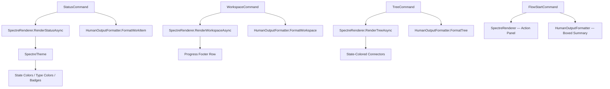

# Introduction

Visual polish pass across the five highest-impact Twig CLI views: `twig status`, `twig workspace`, `twig tree`, `twig flow-start`, and disambiguation prompts. Each improvement is scoped to rendering-layer changes only — no domain model or persistence changes — and targets the Spectre.Console async path with equivalent ANSI fallback updates in `HumanOutputFormatter`.

The key words "MUST", "MUST NOT", "REQUIRED", "SHALL", "SHALL NOT", "SHOULD", "SHOULD NOT", "RECOMMENDED", "MAY", and "OPTIONAL" in this document are to be interpreted as described in RFC 2119.

**Cross-reference conventions**: This document uses standardized prefixes for traceability — `FR-` (functional requirements), `NFR-` (non-functional requirements), `FM-` (failure modes), `AC-` (acceptance criteria), and `RD-` (resolved decisions).

## 1. Goals and Non-Goals

- **Goal 1**: Make `twig workspace` instantly communicable — sprint progress visible at a glance without counting rows
- **Goal 2**: Make `twig tree` scannable by encoding state information into tree connectors and visual structure
- **Goal 3**: Make `twig flow-start` feel like a premium action moment with a structured summary panel
- **Goal 4**: Improve `twig status` with richer temporal context and progress indication for parent items
- **Goal 5**: Create visual consistency across hint, error, success, and empty-state messaging glyphs
- **Non-Goal 1**: Changing JSON or minimal output formats — this plan ONLY affects human/Spectre output
- **Non-Goal 2**: Adding new commands or subcommands
- **Non-Goal 3**: Modifying domain models, persistence, or ADO API interactions

### In Scope

- Workspace sprint progress summary footer
- Workspace category separator rules
- Tree node state-colored connectors
- Tree link section visual differentiation
- Flow-start action summary panel
- Status panel progress bar for parent items
- Status panel relative timestamps
- Status panel pending-changes footer consolidation
- Hint/error/success/empty-state glyph standardization
- Dirty marker glyph upgrade (• → ✎)
- Transition arrow coloring (→ with green)
- Disambiguation type badge + state color enrichment

### Out of Scope (deferred)

- Interactive tree navigation — separate plan (`twig-interactive-nav.plan.md`)
- Sparkline/proportional bar in workspace header — deferred pending user feedback on progress footer
- Stale-item detection in workspace for proposed items — requires domain-layer `ChangedDate` tracking

## 2. Terminology

| Term | Definition |
|------|------------|
| Spectre path | Async rendering via `SpectreRenderer` + `IAnsiConsole.Live()`, active when output is TTY and format is `human` |
| ANSI path | Synchronous rendering via `HumanOutputFormatter` using raw ANSI escape codes, active when output is piped or `--no-live` |
| Progress footer | A single-line summary below the workspace table showing sprint completion counts by state category |
| State-colored connector | Tree box-drawing glyphs (`├──`, `└──`) tinted with the child node's state category color |
| Action panel | A bordered Spectre `Panel` grouping multiple field changes into a single visual block |
| Progress bar | An inline text-based progress indicator (`[████░░] 4/6`) for parent items showing child completion |

## 3. Solution Architecture

All changes are confined to the rendering layer — two files carry the bulk of the work:

```
src/Twig/Rendering/SpectreRenderer.cs   ← Spectre async path (Live tables, Trees, Panels)
src/Twig/Formatters/HumanOutputFormatter.cs ← ANSI sync path (raw escape codes)
```

Supporting changes:

```
src/Twig/Rendering/SpectreTheme.cs      ← New helper: GetStateCategoryColor() for connector tinting
src/Twig/Rendering/IAsyncRenderer.cs    ← Signature change for RenderStatusAsync (progress data)
src/Twig/Commands/FlowStartCommand.cs   ← Restructured summary output to use action panel
src/Twig/Commands/StatusCommand.cs      ← Pass child progress data to renderer
src/Twig/Formatters/FormatterHelpers.cs ← Progress bar string builder
```

No new projects, assemblies, NuGet packages, or DI registrations are required.



## 4. Requirements

**Summary**: All changes MUST maintain backward compatibility with piped output, JSON format, and minimal format. Spectre and ANSI paths MUST render equivalent information. No new dependencies.

**Items**:
- **REQ-001**: All visual changes MUST be confined to the `human` output format — JSON and minimal formats MUST NOT change
- **REQ-002**: ANSI path (`HumanOutputFormatter`) MUST render a text approximation of every Spectre path improvement
- **REQ-003**: No new NuGet packages — all rendering MUST use existing Spectre.Console 0.50+ APIs
- **REQ-004**: Progress indicators MUST handle zero-child and zero-total edge cases gracefully (no division by zero, no empty bars)
- **REQ-005**: State-colored connectors MUST fall back to default color for unknown state categories
- **REQ-006**: All glyph changes MUST use BMP codepoints only (U+0000–U+FFFF) for terminal compatibility
- **CON-001**: `SpectreRenderer` MUST remain AOT-compatible — no `TypeConverterHelper`, no `SelectionPrompt<T>`
- **GUD-001**: Prefer Spectre `Markup` string formatting over `Style` objects for consistency with existing codebase patterns

## 5. Risk Classification

**Risk**: 🟢 LOW

**Summary**: All changes are rendering-only with no domain, persistence, or API impact. The existing 2,965-test suite covers formatter output end-to-end. Visual regressions are easily caught by existing snapshot-style assertions on formatter output.

**Items**:
- **RISK-001**: Unicode glyph rendering varies by terminal — mitigated by using only BMP codepoints and existing NerdFont constraint
- **RISK-002**: Progress bar width calculation may overflow for very wide terminals — mitigated by capping bar width
- **ASSUMPTION-001**: Spectre.Console `Table.Caption` supports markup strings (verified in current codebase usage)
- **ASSUMPTION-002**: `CountChildProgress` in `HumanOutputFormatter` correctly counts resolved/completed children (verified in code review)

## 6. Dependencies

**Summary**: No external dependencies. All work builds on existing Spectre.Console APIs and internal rendering infrastructure.

**Items**:
- **DEP-001**: `SpectreTheme` state category resolution via `StateCategoryResolver.Resolve()` — already implemented
- **DEP-002**: `FormatterHelpers.CountChildProgress()` — existing recursive helper, reusable for progress bar
- **DEP-003**: `WorkspaceDataChunk.SprintItemsLoaded` — existing async streaming chunk, footer appends after all chunks

## 7. Quality & Testing

**Summary**: Each visual change maps to at least one unit test verifying formatter output. Spectre path changes are validated via existing `BuildSelectionRenderable` pattern (unit-testable static methods). Integration testing via manual visual inspection.

**Items**:
- **TEST-001**: `HumanOutputFormatter.FormatWorkspace` output MUST contain sprint progress summary line with correct counts
- **TEST-002**: `HumanOutputFormatter.FormatTree` output MUST include state-colored ANSI codes on box-drawing connectors
- **TEST-003**: `FormatterHelpers.BuildProgressBar` MUST return correct bar string for various ratios (0/0, 0/5, 3/5, 5/5)
- **TEST-004**: `HumanOutputFormatter.FormatHint` output MUST start with the new glyph prefix
- **TEST-005**: `HumanOutputFormatter.FormatError` output MUST start with `✗ error:` prefix
- **TEST-006**: `SpectreRenderer.BuildSelectionRenderable` MUST include type badge markup when provided
- **TEST-007**: Flow-start human output MUST contain boxed summary block with state transition arrow
- **TEST-008**: Status panel progress bar MUST show `[████░░] 4/6` format for parent with 4/6 resolved children
- **TEST-009**: Dirty marker MUST render as `✎` (U+270E) instead of `•`

### Acceptance Criteria

| ID | Criterion | Verification | Traces To |
|----|-----------|--------------|-----------|
| AC-001 | `twig workspace` displays `Sprint: N/M done · X in progress · Y proposed` below the table | Automated test on FormatWorkspace output | FR-001 |
| AC-002 | `twig workspace` renders `[dim]────[/]` separator between state category groups | Automated test on SprintItemsLoaded rendering | FR-002 |
| AC-003 | `twig tree` child connectors are tinted with state category color (green/blue/grey/red) | Automated test on FormatTree ANSI output | FR-003 |
| AC-004 | `twig tree` Links section uses distinct glyph and non-dim color for link types | Automated test on FormatTree link section | FR-004 |
| AC-005 | `twig flow-start` renders bordered panel with state transition, branch, and iteration | Automated test on flow output | FR-005 |
| AC-006 | `twig status` shows `[████░░] 4/6` progress bar for parent items | Automated test on FormatWorkItem parent progress | FR-006 |
| AC-007 | `twig status` shows relative timestamps for ChangedDate/CreatedDate | Automated test on extended field rendering | FR-007 |
| AC-008 | Hints render with `[yellow]→[/]` prefix glyph; errors render with `[red]✗[/]` prefix | Automated test on FormatHint / FormatError | FR-008 |
| AC-009 | Dirty marker renders as ✎ (U+270E) in both Spectre and ANSI paths | Automated test on dirty marker output | FR-009 |
| AC-010 | Disambiguation shows type badges and state colors in selection items | Automated test on BuildSelectionRenderable | FR-010 |
| AC-011 | All 2,965+ existing tests pass after changes | `dotnet test Twig.slnx` exit code 0 | REQ-001 |

## 8. Security Considerations

No security considerations identified. All changes are purely visual formatting of already-loaded in-memory data. No new user input parsing, no new network calls, no new file I/O.

## 9. Deployment & Rollback

Standard CLI binary release. Visual changes are cosmetic — no configuration migration, no schema changes, no breaking changes. Rollback is simply reverting to the previous binary version.

## 10. Resolved Decisions

| ID | Decision | Rationale |
|----|----------|-----------|
| RD-001 | Use inline text progress bar (`[████░░]`) instead of Spectre `BarChart` | `BarChart` is a standalone renderable, not composable into a `Grid` row. Inline text integrates cleanly into the existing panel layout. |
| RD-002 | Use `→` arrow glyph for hints instead of `💡` emoji | Emojis have inconsistent width rendering across terminals. Arrow is single-width BMP and matches the transition arrow vocabulary already in use. |
| RD-003 | Dirty marker ✎ (U+270E) instead of current • (U+2022) | Pencil is semantically clearer ("edited") than a bullet dot. U+270E is BMP, single-width, widely supported. |
| RD-004 | State-colored connectors use category colors, not per-state colors | Category colors (4 values) are stable across all ADO process templates. Per-state colors would require N lookups and risk missing states falling to default. |
| RD-005 | Progress footer on workspace uses text, not a bar | A textual summary (`6/14 done · 3 in progress · 5 proposed`) is more informative than a proportional bar for sprint burndown — users need counts, not ratios. |
| RD-006 | Action panel for flow-start uses `Panel` + `Grid` | Consistent with the existing `RenderStatusAsync` panel pattern. Avoids introducing a new rendering primitive. |

## 11. Alternatives Considered

| Alternative | Pros | Cons | Decision |
|-------------|------|------|----------|
| Spectre `BarChart` for progress | Rich visual, native Spectre component | Not composable into Grid/Panel rows; takes full console width | Rejected — inline text bar is more composable |
| Emoji hints (💡) | Universally recognized | Double-width on some terminals, breaks alignment; Windows Terminal inconsistent | Rejected — arrow glyph is more reliable |
| Full-width sparkline in workspace header | Eye-catching visual | Requires computing proportions; adds visual noise above the data table | Deferred — may revisit after progress footer ships |
| Remove ANSI path entirely, Spectre-only | Simpler codebase | Breaks piped output, CI/CD capture, `--no-live` flag | Rejected — ANSI path is essential for non-TTY |

## 12. Files

- **FILE-001**: `src/Twig/Rendering/SpectreRenderer.cs` — Workspace footer, tree connectors, status progress, flow panel, hint rendering
- **FILE-002**: `src/Twig/Formatters/HumanOutputFormatter.cs` — ANSI equivalents for all Spectre changes
- **FILE-003**: `src/Twig/Rendering/SpectreTheme.cs` — New `GetStateCategoryMarkupColor(string state)` helper
- **FILE-004**: `src/Twig/Rendering/IAsyncRenderer.cs` — Optional progress data parameter on `RenderStatusAsync`
- **FILE-005**: `src/Twig/Commands/FlowStartCommand.cs` — Restructured summary output section
- **FILE-006**: `src/Twig/Commands/StatusCommand.cs` — Child progress data pass-through
- **FILE-007**: `src/Twig/Formatters/FormatterHelpers.cs` — `BuildProgressBar(int done, int total)` helper
- **FILE-008**: `src/Twig/Hints/HintEngine.cs` — No code changes; downstream consumers updated for glyph prefix
- **FILE-009**: `tests/Twig.Cli.Tests/Formatters/HumanOutputFormatterTests.cs` — New tests for visual changes
- **FILE-010**: `tests/Twig.Cli.Tests/Rendering/SpectreRendererTests.cs` — New tests for Spectre path changes
- **FILE-011**: `tests/Twig.Cli.Tests/Commands/FlowStartCommandTests.cs` — Updated assertions for action panel

## 13. Implementation Plan

- EPIC-001: Sprint Progress Footer & Category Separators (`twig workspace`) — **DONE**

| Task | Description | Status | Relevant Files |
|------|-------------|--------|----------------|
| ITEM-001 | Add `GetStateCategoryMarkupColor(string state)` to `SpectreTheme` that returns the Spectre markup color string (`"green"`, `"blue"`, `"grey"`, `"red"`) for a given state. This is a pure extraction from `FormatState` — the color switch already exists, just not exposed as a standalone method. | Done | `src/Twig/Rendering/SpectreTheme.cs` |
| ITEM-002 | In `SpectreRenderer.RenderWorkspaceAsync`, after each `SprintItemsLoaded` category group is added to the table, insert a `[dim]────[/]` separator row between category groups (not before the first one, not after the last). Track category index to conditionally add separators. | Done | `src/Twig/Rendering/SpectreRenderer.cs` |
| ITEM-003 | In `SpectreRenderer.RenderWorkspaceAsync`, after all `SprintItemsLoaded` items and `SeedsLoaded` items are processed, compute the progress summary: count items by state category (`Proposed`, `InProgress`, `Resolved`, `Completed`) and set the table footer to `Sprint: {resolved+completed}/{total} done · {inProgress} in progress · {proposed} proposed` using state category colors for each count. Use `table.Caption` for the footer line (below table). | Done | `src/Twig/Rendering/SpectreRenderer.cs` |
| ITEM-004 | In `HumanOutputFormatter.FormatWorkspace`, add equivalent text progress summary line after the table output. Format: `Sprint: {done}/{total} done · {inProgress} in progress · {proposed} proposed` using ANSI color codes for each segment. Add separator lines between category groups in the sync rendered output. | Done | `src/Twig/Formatters/HumanOutputFormatter.cs` |
| ITEM-005 | Add unit tests for workspace progress footer — verify correct counts for various category distributions (all proposed, all complete, mixed, empty sprint). Test separator row presence between categories. | Done | `tests/Twig.Cli.Tests/Formatters/HumanOutputFormatterTests.cs` |

- EPIC-002: State-Colored Tree Connectors & Link Differentiation (`twig tree`)

| Task | Description | Status | Relevant Files |
|------|-------------|--------|----------------|
| ITEM-006 | In `SpectreRenderer.RenderTreeAsync`, when adding child nodes to `focusContainer`, change the label format from `{badge} #{id} {title} {state}` to include a state-colored prefix on the connector. Since Spectre.Console `Tree` controls the actual connector glyphs (`├──`/`└──`), achieve this by adding a colored vertical bar before the badge: `[{stateColor}]│[/] {badge} #{id} ...`. Use `SpectreTheme.GetStateCategoryMarkupColor()` for the color. | Done | `src/Twig/Rendering/SpectreRenderer.cs`, `src/Twig/Rendering/SpectreTheme.cs` |
| ITEM-007 | In `SpectreRenderer.RenderTreeAsync`, update the Links section rendering. Change link node labels from `[dim]{linkType}: #{targetId}[/]` to `[blue]{linkType}[/]: #{targetId}` — link type in blue (distinguishable from dim), target ID in default color. Change the links header from `[dim]Links[/]` to `[blue]⇄[/] [dim]Links[/]` with the ⇄ glyph (U+21C4). | Done | `src/Twig/Rendering/SpectreRenderer.cs` |
| ITEM-008 | In `HumanOutputFormatter.FormatTree`, update the box-drawing connector characters (`├──`, `└──`, `│`) for child nodes to include the child's state category ANSI color. Resolve the color via `GetStateColor(child.State)` and wrap the connector glyph: `{stateColor}├──{Reset} {badge} ...`. | Done | `src/Twig/Formatters/HumanOutputFormatter.cs` |
| ITEM-009 | In `HumanOutputFormatter.FormatTree`, update the Links section to use `Blue` ANSI color for link type names instead of `Dim`. Add `⇄` glyph to the links header: `╰── ⇄ Links`. | Done | `src/Twig/Formatters/HumanOutputFormatter.cs` |
| ITEM-010 | Add unit tests for tree state-colored connectors — verify ANSI output contains state color codes in connector positions. Test link section contains blue-colored link types. | Done | `tests/Twig.Cli.Tests/Formatters/HumanOutputFormatterTests.cs` |

- EPIC-003: Flow-Start Action Panel (`twig flow-start`)

| Task | Description | Status | Relevant Files |
|------|-------------|--------|----------------|
| ITEM-011 | Add `RenderFlowSummaryAsync` method to `IAsyncRenderer` and `SpectreRenderer`. The method accepts: work item, original state, new state, branch name (nullable), list of action strings. Renders a success header line (`[green]✓[/] [bold]Flow started for #{id} — {title}[/]`) followed by a `Panel` with `Grid` rows: `State: {oldState} [green]→[/] {newState}` (with state colors), `Branch: {branchName}` (if present), `Context: set to #{id}`. Panel border is `BoxBorder.Rounded`, header is `[bold]Summary[/]`. | Not Started | `src/Twig/Rendering/IAsyncRenderer.cs`, `src/Twig/Rendering/SpectreRenderer.cs` |
| ITEM-012 | In `FlowStartCommand`, replace the current `FormatSuccess` + `FormatInfo` loop (lines 275-277) with a call to `renderer.RenderFlowSummaryAsync()` when renderer is available. For the ANSI fallback path, create `FormatFlowSummary` in `HumanOutputFormatter` that renders a box-drawn summary block using `─`, `│`, `┌`, `┐`, `└`, `┘` box-drawing characters with the same field layout. | Not Started | `src/Twig/Commands/FlowStartCommand.cs`, `src/Twig/Formatters/HumanOutputFormatter.cs` |
| ITEM-013 | Color the transition arrow in `FormatFieldChange`: change `{Dim}{oldValue}{Reset} → {newValue}` to `{Dim}{oldValue}{Reset} {Green}→{Reset} {newValue}`. This affects all field change display, not just flow-start. | Not Started | `src/Twig/Formatters/HumanOutputFormatter.cs` |
| ITEM-014 | Add unit tests for flow-start panel — verify panel contains state transition with arrow, branch name, and context. Test ANSI path produces box-drawn equivalent. Test transition arrow is green-colored. | Not Started | `tests/Twig.Cli.Tests/Commands/FlowStartCommandTests.cs` |

- EPIC-004: Status Panel Enhancements (`twig status`)

| Task | Description | Status | Relevant Files |
|------|-------------|--------|----------------|
| ITEM-015 | Add `BuildProgressBar(int done, int total, int width = 20)` to `FormatterHelpers`. Returns a string like `[████░░░░░░] 4/10` using block characters: `█` (U+2588) for filled, `░` (U+2591) for empty. When `total` is 0, returns empty string. When `done >= total`, returns all-filled bar in green. | Not Started | `src/Twig/Formatters/FormatterHelpers.cs` |
| ITEM-016 | In `SpectreRenderer.RenderStatusAsync`, after adding core field rows to `itemGrid`, check if the item has children (via a new optional `Func<Task<int>>? getChildCount` parameter or pass pre-computed progress). If children exist, add a `Progress:` row with the progress bar string from `BuildProgressBar`. Dim-color the bar. | Not Started | `src/Twig/Rendering/SpectreRenderer.cs`, `src/Twig/Rendering/IAsyncRenderer.cs` |
| ITEM-017 | In `SpectreRenderer.RenderStatusAsync`, consolidate the separate "Pending Changes" panel into a single dim footer line inside the main item panel: `[dim]{fieldCount} field changes, {noteCount} notes staged[/]`. Remove the standalone `changesPanel`. This reduces vertical space and keeps the view compact. | Not Started | `src/Twig/Rendering/SpectreRenderer.cs` |
| ITEM-018 | In `HumanOutputFormatter.FormatWorkItem`, add progress bar line for parent items after the core fields section. Use `CountChildProgress` (already exists) to compute done/total, then `BuildProgressBar` to format. Add consolidated pending changes line at the bottom instead of separate section. | Not Started | `src/Twig/Formatters/HumanOutputFormatter.cs` |
| ITEM-019 | In `StatusCommand.ExecuteAsync`, pass child progress data to the renderer. For the Spectre path, compute `(done, total)` from the active item's children using `workItemRepo.GetChildrenAsync` and add to the `RenderStatusAsync` call. For parent items only (items that have children in cache). | Not Started | `src/Twig/Commands/StatusCommand.cs` |
| ITEM-020 | Add unit tests for progress bar — test edge cases (0/0, 0/5, 3/5, 5/5, 100/100), verify correct block character counts, verify green color when complete. Test status output includes progress bar for parent items and excludes it for leaf items. | Not Started | `tests/Twig.Cli.Tests/Formatters/FormatterHelperTests.cs`, `tests/Twig.Cli.Tests/Formatters/HumanOutputFormatterTests.cs` |

- EPIC-005: Glyph Consistency & Micro-Polish (cross-cutting)

| Task | Description | Status | Relevant Files |
|------|-------------|--------|----------------|
| ITEM-021 | Change dirty marker from `•` (U+2022) to `✎` (U+270E) in both rendering paths. In `SpectreRenderer`: update `FormatFocusedNode`, child rendering in `RenderTreeAsync`, panel header in `RenderStatusAsync`, and workspace table rows. In `HumanOutputFormatter`: update `FormatWorkItem`, `FormatTree`, `FormatStatusSummary`, and `FormatWorkspace`. Search for `"•"` and `Yellow` dirty markers. | Not Started | `src/Twig/Rendering/SpectreRenderer.cs`, `src/Twig/Formatters/HumanOutputFormatter.cs` |
| ITEM-022 | Change `FormatHint` from `{Dim}  hint: {hint}{Reset}` to `{Yellow}→{Reset} {Dim}hint: {hint}{Reset}` in `HumanOutputFormatter`. In `SpectreRenderer.RenderHints`, update the markup equivalent: `[yellow]→[/] [dim]hint: {hint}[/]`. | Not Started | `src/Twig/Formatters/HumanOutputFormatter.cs`, `src/Twig/Rendering/SpectreRenderer.cs` |
| ITEM-023 | Change `FormatError` from `{Red}error:{Reset} {message}` to `{Red}✗ error:{Reset} {message}` in `HumanOutputFormatter`. The ✗ (U+2717) glyph balances the existing ✓ (U+2713) success glyph. | Not Started | `src/Twig/Formatters/HumanOutputFormatter.cs` |
| ITEM-024 | Update empty-state messages to use dim italic styling. In `SpectreRenderer`, wrap empty-state text in `[dim italic]...[/]`. In `HumanOutputFormatter`, use `{Dim}` wrapper (ANSI has no standard italic; dim is sufficient). Affected messages: "Navigation history is empty", "No children to navigate to", "No active work item", "No pending changes". | Not Started | `src/Twig/Rendering/SpectreRenderer.cs`, `src/Twig/Formatters/HumanOutputFormatter.cs` |
| ITEM-025 | Update `FormatDisambiguation` to include type badge and state color when available. Add an overload `FormatDisambiguation(IReadOnlyList<(int Id, string Title, string? TypeName, string? State)> matches)` that renders badges and state colors. Update `BuildSelectionRenderable` in `SpectreRenderer` to accept the same enriched tuple and render badges inline. | Not Started | `src/Twig/Formatters/HumanOutputFormatter.cs`, `src/Twig/Rendering/SpectreRenderer.cs` |
| ITEM-026 | Update all existing tests that assert on dirty marker text, hint format, error format, or disambiguation output to match the new glyph patterns. Run full test suite to identify all affected assertions. | Not Started | `tests/Twig.Cli.Tests/` |

## 14. Change Log

- 2026-03-26: Initial plan created from code review visual assessment
- 2026-03-26: EPIC-001 DONE — Sprint Progress Footer & Category Separators implemented and approved. Fixed StateCategory.Unknown not counted in footer switch (SpectreRenderer.cs, HumanOutputFormatter.cs), and fixed two tests asserting on raw ANSI output instead of stripped output. Added FormatWorkspace_UnknownState_CountsAsProposed test for direct coverage of bug path.
- 2026-03-26: EPIC-002 DONE — State-Colored Tree Connectors & Link Differentiation implemented. Added state-colored vertical bar prefix on Spectre tree child nodes, state-colored ANSI connectors in HumanOutputFormatter, blue link types with ⇄ glyph in both rendering paths. All 2,984 tests pass.
- 2026-03-26: EPIC-001 review-feedback pass approved — added negative assertions to FormatWorkspace_AllComplete_ShowsAllDone, added FormatWorkspace_UnknownState_CountsAsProposed test, refactored SpectreTheme.GetCategoryMarkupColor to static for EPIC-002 ITEM-006 prep.
