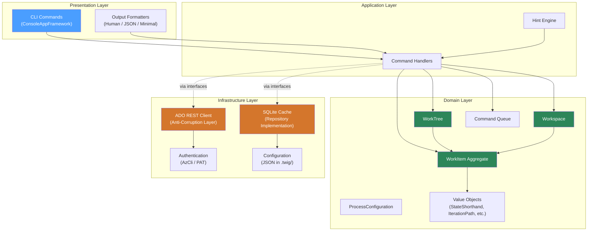
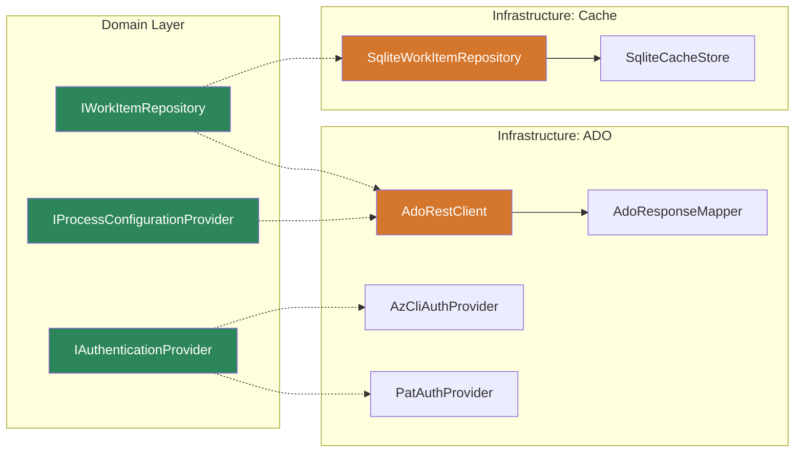
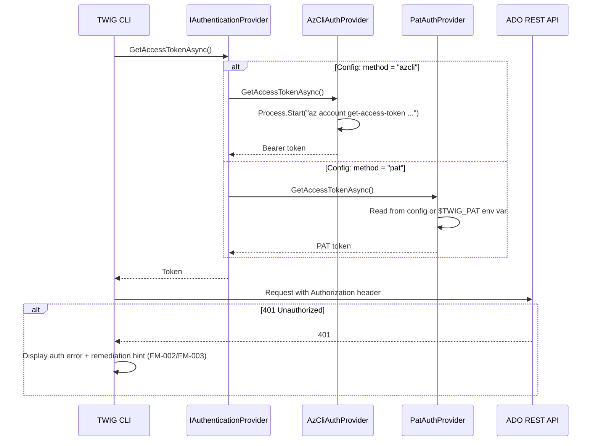

# Introduction

Product Requirements Document for TWIG (Terminal Work Integration Gadget) — a high-performance, opinionated CLI tool for Azure DevOps work item context management. TWIG applies a git-like interaction model to ADO work tracking: fast local reads, terse commands, context-aware operations, and seamless integration with AI agent workflows. Built with C# .NET Native AOT for single-binary distribution with sub-100ms cold start.

This PRD translates the requirements defined in [twig.req.md](twig.req.md) into an executable implementation plan. All functional requirements (FR-001 through FR-016), non-functional requirements (NFR-001 through NFR-005), failure modes (FM-001 through FM-009), and resolved decisions (RD-001 through RD-021) from the requirements document are incorporated by reference.

The key words "MUST", "MUST NOT", "REQUIRED", "SHALL", "SHALL NOT", "SHOULD", "SHOULD NOT", "RECOMMENDED", "MAY", and "OPTIONAL" in this document are to be interpreted as described in RFC 2119.

**Cross-reference conventions**: This document uses standardized prefixes for traceability — `FR-` (functional requirements), `NFR-` (non-functional requirements), `FM-` (failure modes), `AC-` (acceptance criteria), and `RD-` (resolved decisions). Identifiers from [twig.req.md](twig.req.md) are referenced directly.

## 1. Goals and Non-Goals

- **Goal 1**: Deliver a single native binary CLI tool that manages ADO work item context from the terminal with git-like ergonomics
- **Goal 2**: Achieve < 200ms local read operations and < 100ms cold start via .NET Native AOT and SQLite-backed local cache
- **Goal 3**: Apply Domain-Driven Design to produce a testable, infrastructure-isolated domain model that is resilient to ADO API changes
- **Goal 4**: Support the full work context lifecycle: set context, navigate tree, create seeds, transition states, edit fields, take notes, view workspace
- **Goal 5**: Provide structured output modes (JSON, minimal) for AI agent and automation consumption

- **Non-Goal 1**: TUI (Terminal User Interface) — post-MVP, but data model MUST accommodate future TUI needs (RD-021)
- **Non-Goal 2**: MCP server exposure — future phase after CLI stabilization
- **Non-Goal 3**: Cross-repository work item management — V1 is single-repo context
- **Non-Goal 4**: Multi-user collaboration — V1 is single-user context

### In Scope

- Complete CLI command surface as defined in DI-002 of [twig.req.md](twig.req.md)
- Domain model for work items, work tree, workspace, and process configuration
- SQLite-backed local cache with JSON columns
- ADO REST API integration via anti-corruption layer
- Authentication (az cli + PAT fallback)
- Per-repository configuration in `.twig/config`
- Test environment setup (personal ADO org with OS-like process)

### Out of Scope (deferred)

- TUI implementation — data model accounts for it but no UI code in V1
- MCP server — requires stable CLI first
- Attachments, linked artifacts (PRs, branches, builds) — future enrichment
- ADO Boards views — TWIG is tree-and-item focused
- Exposed WIQL — internal use only

## 2. Terminology

All terms from [twig.req.md § Terminology](twig.req.md) apply. Additional PRD-specific terms:

| Term | Definition |
|------|------------|
| Anti-Corruption Layer (ACL) | A DDD boundary that translates between ADO's REST API data model and TWIG's domain model. Prevents ADO's representation from leaking into domain logic. Implemented as interfaces + infrastructure adapters. |
| Aggregate | A cluster of domain objects treated as a single unit for data changes. In TWIG: `WorkItem` (root), `WorkTree`, `Workspace`. |
| Repository (DDD) | An abstraction that provides collection-like access to aggregates. Domain code calls `repository.GetByIdAsync(id)` without knowing the storage mechanism. |
| Unit of Work | Tracks all changes during an operation and commits them atomically. Ensures partial failures don't leave inconsistent state. |
| Command Queue | A list of pending change intents (e.g., `SetField`, `AddNote`) that accumulate during an `edit` session and are applied on `save`. Enables dirty tracking, undo, and conflict clarity. |
| Value Object | An immutable domain object identified by its attributes, not an ID. Examples: `StateShorthand`, `IterationPath`, `AreaPath`. |
| Source Generator | A C# compiler plugin that generates code at compile time. Used by ConsoleAppFramework (CLI routing) and System.Text.Json (serialization) to avoid runtime reflection, enabling AOT compatibility. |
| ConsoleAppFramework | A .NET CLI framework by Cysharp that uses source generators to produce zero-reflection, zero-allocation command routing. Selected for AOT compatibility and < 100ms startup. |

## 3. Solution Architecture

### 3.1 Layered Architecture

TWIG follows a **clean architecture** with four layers. Dependencies flow inward — outer layers depend on inner layers, never the reverse.



### 3.2 Domain Model

The domain model is designed for **testability first** — all domain logic can be tested with pure unit tests, no database, no HTTP, no file system.

#### Aggregates

**WorkItem** (Aggregate Root):
- Identity: ADO work item ID (integer)
- Fields: title, state, type, assignedTo, areaPath, iterationPath, description, tags, parentId, revision
- Behavior: `TransitionState(shorthand)`, `ValidateTransition(from, to)`, `IsForwardTransition(from, to)`
- Tracks: dirty fields, pending notes, whether it's a seed, stale seed status

**WorkTree** (Read Model / Composite):
- A rooted hierarchy of work items (parent chain + children)
- Behavior: `GetParentChain()`, `GetChildren(id)`, `FindByPattern(pattern)` (case-insensitive substring match)
- Navigation: `MoveUp()`, `MoveDown(id|pattern)`
- Note: WorkTree is a navigational composite, not a true DDD aggregate — it has no identity or invariants of its own. It assembles WorkItem aggregates into a tree structure for navigation purposes.

**Workspace** (Read Model / Composite):
- Composite of: current context item + sprint items + all seeds
- Behavior: `GetStaleSeeds(threshold)`, `GetDirtyItems()`, `ListAll()`
- Note: Workspace is a projection/composite, not a true DDD aggregate — it aggregates data from multiple sources for display. No lifecycle or identity.

**ProcessConfiguration**:
- Work item type definitions, state models, hierarchy rules
- Behavior: `GetStatesForType(type)`, `GetDefaultChildType(parentType)`, `IsValidParentChild(parentType, childType)`, `MapShorthand(type, shorthand)`

#### Value Objects

| Value Object | Purpose | Immutable Properties |
|--------------|---------|---------------------|
| `StateShorthand` | Maps single-character input to ADO state name | `Shorthand`, `StateName`, `Category` |
| `IterationPath` | Represents an ADO iteration, parseable from path string | `Path`, `SprintName`, `StartDate`, `EndDate` |
| `AreaPath` | Represents an ADO area path | `Path`, `Segments` |
| `WorkItemType` | Encapsulates type name + state model + child rules | `Name`, `AllowedStates`, `DefaultChildType` |
| `FieldChange` | A single pending change intent | `FieldName`, `OldValue`, `NewValue`, `Timestamp` |
| `PendingNote` | A local note not yet pushed to ADO | `Text`, `CreatedAt` |
| `EditorFallback` | Platform-aware `$EDITOR` resolution | `EditorPath`, `Platform` |

#### Domain Services

| Service | Methods | Purpose |
|---------|---------|---------|
| `StateTransitionService` | `Validate(item, targetShorthand)` → `TransitionResult` | Enforces forward/backward/cut rules, returns whether confirmation is needed |
| `SeedFactory` | `Create(title, parentContext, processConfig, typeOverride?)` → `WorkItem` | Creates seeds with inherited context, validates parent/child rules |
| `PatternMatcher` | `Match(pattern, candidates)` → `MatchResult` | Case-insensitive substring match against work item titles, returns single match or disambiguation list |
| `ConflictResolver` | `Resolve(local, remote)` → `MergeResult` | Compares revisions, identifies field-level conflicts, merges non-conflicting changes |
| `EditorLauncher` | `OpenEditor(filePath, fallback?)` → `EditorResult` | Resolves `$EDITOR` / `$VISUAL` with platform fallback (`notepad` on Windows, `nano` on Unix). Returns edited content or error if editor not found. |

### 3.3 Infrastructure: ADO REST Anti-Corruption Layer

The ACL translates between ADO's REST API responses and TWIG's domain model. It is the **only component that knows about ADO's JSON shape**.



**Key interfaces** (domain layer — no ADO types):

```
IWorkItemRepository
├── GetByIdAsync(int id) → WorkItem?
├── GetChildrenAsync(int parentId) → IReadOnlyList<WorkItem>
├── GetByIterationAsync(IterationPath iterationPath) → IReadOnlyList<WorkItem>
├── GetParentChainAsync(int id) → IReadOnlyList<WorkItem>
├── FindByPatternAsync(string pattern) → IReadOnlyList<WorkItem>
├── SaveLocalAsync(WorkItem item)        // persist to cache
└── GetDirtyItemsAsync() → IReadOnlyList<WorkItem>

IUnitOfWork
├── BeginAsync() → void
├── CommitAsync() → void                // atomically persist all changes
└── RollbackAsync() → void              // discard all changes in this unit

IAdoWorkItemService
├── FetchAsync(int id) → WorkItem
├── FetchChildrenAsync(int parentId) → IReadOnlyList<WorkItem>
├── PushAsync(WorkItem item) → PushResult
├── CreateAsync(WorkItem seed) → int     // returns new ID
├── AddCommentAsync(int id, string text) → void
└── QueryByWiqlAsync(string wiql) → IReadOnlyList<int>

IProcessConfigurationProvider
├── GetWorkItemTypesAsync() → IReadOnlyList<WorkItemType>
├── GetCurrentIterationAsync() → IterationPath
└── RefreshAsync() → void

IAuthenticationProvider
├── GetAccessTokenAsync() → string
└── AuthMethod → AuthMethod (AzCli | Pat)
```

**ADO API version pinning**: All REST calls pin to `api-version=7.1`. The `AdoRestClient` stores this as a constant. If ADO deprecates 7.1, a version bump is a single-constant change. The domain layer is unaffected because the ACL maps responses to domain objects.

### 3.4 Infrastructure: SQLite Cache

Database schema — hybrid indexed columns + JSON blob:

```sql
-- Schema version tracking
CREATE TABLE metadata (
    key TEXT PRIMARY KEY,
    value TEXT NOT NULL
);
-- INSERT INTO metadata VALUES ('schema_version', '1');

-- Work items: indexed hot-path fields + full JSON blob
CREATE TABLE work_items (
    id INTEGER PRIMARY KEY,
    type TEXT NOT NULL,
    title TEXT NOT NULL,
    state TEXT NOT NULL,
    parent_id INTEGER,
    assigned_to TEXT,
    iteration_path TEXT,
    area_path TEXT,
    revision INTEGER NOT NULL,
    is_seed INTEGER NOT NULL DEFAULT 0,
    seed_created_at TEXT,           -- ISO 8601, for stale detection
    fields_json TEXT NOT NULL,      -- full ADO field bag as JSON
    is_dirty INTEGER NOT NULL DEFAULT 0,
    last_synced_at TEXT NOT NULL    -- ISO 8601
);

-- Pending changes (Command Queue)
CREATE TABLE pending_changes (
    id INTEGER PRIMARY KEY AUTOINCREMENT,
    work_item_id INTEGER NOT NULL,
    change_type TEXT NOT NULL,      -- 'set_field', 'add_note'
    field_name TEXT,                -- null for notes
    old_value TEXT,
    new_value TEXT NOT NULL,        -- for notes: the full note text
    created_at TEXT NOT NULL,       -- ISO 8601, also serves as note timestamp
    FOREIGN KEY (work_item_id) REFERENCES work_items(id)
);
-- Note: PendingNote value objects map to pending_changes rows where
-- change_type='add_note', new_value=note text, created_at=note timestamp.
-- No separate notes table needed — the command queue IS the note store.

-- Process configuration cache
CREATE TABLE process_types (
    type_name TEXT PRIMARY KEY,
    states_json TEXT NOT NULL,      -- JSON array of {name, category, shorthand}
    default_child_type TEXT,
    valid_child_types_json TEXT,    -- JSON array of type names
    last_synced_at TEXT NOT NULL
);

-- Active context
CREATE TABLE context (
    key TEXT PRIMARY KEY,
    value TEXT NOT NULL
);
-- Keys: 'active_work_item_id', 'current_iteration'

-- Indexes for hot-path queries
CREATE INDEX idx_work_items_type ON work_items(type);
CREATE INDEX idx_work_items_parent ON work_items(parent_id);
CREATE INDEX idx_work_items_iteration ON work_items(iteration_path);
CREATE INDEX idx_work_items_assigned ON work_items(assigned_to);
CREATE INDEX idx_work_items_dirty ON work_items(is_dirty) WHERE is_dirty = 1;
CREATE INDEX idx_work_items_seed ON work_items(is_seed) WHERE is_seed = 1;
CREATE INDEX idx_pending_changes_item ON pending_changes(work_item_id);
```

**Schema versioning**: On startup, TWIG reads `metadata.schema_version`. If it doesn't match the expected version compiled into the binary, TWIG drops all tables and rebuilds from ADO via `twig refresh`. No migration framework — the cache is disposable.

### 3.5 Configuration

`.twig/config` is a JSON file:

```json
{
    "organization": "contoso",
    "project": "MyProject",
    "auth": {
        "method": "azcli"
    },
    "defaults": {
        "areaPath": "MyProject\\BackendService",
        "iterationPath": "MyProject\\Future"
    },
    "seed": {
        "staleDays": 14,
        "defaultChildType": {
            "Deliverable": "Task",
            "Scenario": "Deliverable",
            "Feature": "Deliverable",
            "Epic": "Scenario",
            "TaskGroup": "Task"
        }
    },
    "display": {
        "hints": true,
        "treeDepth": 3
    }
}
```

### 3.6 Authentication Flow



## 4. Requirements

**Summary**: All functional and non-functional requirements are defined in [twig.req.md](twig.req.md). This section captures additional implementation-level requirements and constraints that emerged during architectural design.

**Items**:
- **REQ-001**: TWIG MUST use direct ADO REST API calls via `HttpClient`, not the ADO .NET SDK. The SDK is not AOT-compatible (no `IsAotCompatible`, .NET Standard 2.0 only, reflection-based serialization). All REST API calls MUST pin to `api-version=7.1`. Traces to: NFR-002, RD-001.
- **REQ-002**: All JSON serialization/deserialization MUST use `System.Text.Json` source generators with `JsonSerializerIsReflectionEnabledByDefault=false`. No runtime reflection for serialization. Traces to: NFR-002, NFR-004.
- **REQ-003**: The CLI framework MUST be ConsoleAppFramework v5 (Cysharp), which uses source generators for zero-reflection command routing. Traces to: NFR-002, NFR-004.
- **REQ-004**: The local cache MUST use SQLite via `contoso.Data.Sqlite` with the `e_sqlite3` native library bundle. JSON1 extension functions (`json_extract`, etc.) MUST be available. Traces to: NFR-001, NFR-003.
- **REQ-005**: Domain model aggregates (`WorkItem`, `WorkTree`, `Workspace`, `ProcessConfiguration`) MUST have no dependencies on infrastructure types (no `HttpClient`, no `SqliteConnection`, no `System.IO`). All infrastructure access MUST go through interfaces defined in the domain layer. Traces to: testability, DDD.
- **REQ-006**: The `.twig/` directory MUST contain: `config` (JSON), `twig.db` (SQLite), and MAY contain temporary files for `$EDITOR` integration. Traces to: FR-005, RD-003.
- **REQ-007**: TWIG MUST validate AOT compatibility early by producing a functional AOT-compiled prototype as part of EPIC-001. Any AOT trimming warnings MUST be resolved before proceeding to domain implementation. Traces to: NFR-002.
- **REQ-008**: A personal ADO organization with a test project MUST be set up that replicates the target project's process (work item types, states, hierarchy rules). All integration tests MUST run against this test org, never against production. Traces to: testing safety.
- **SEC-001**: PAT tokens MUST NOT be logged, displayed in output, or written to any file other than `.twig/config`. `.twig/config` SHOULD be added to `.gitignore` by `twig init`. Traces to: FR-007.
- **SEC-002**: Azure CLI token acquisition MUST use the ADO resource ID (`499b84ac-1321-427f-aa17-267ca6975798`) and MUST NOT cache tokens to disk — az cli manages its own token cache. Traces to: FR-007.
- **CON-001**: The project MUST target .NET 9 (LTS) or .NET 10 with `PublishAot=true`. The binary MUST be a single file with no runtime dependencies. Traces to: NFR-002.
- **CON-002**: The SQLite database schema MUST include a `schema_version` in the `metadata` table. On version mismatch, TWIG MUST drop and rebuild the cache from ADO. No migration framework. Traces to: cache simplicity.
- **GUD-001**: DDD tactical patterns MUST be applied: Repository for data access, Unit of Work for atomic operations, Command Queue for edit session tracking, Value Objects for immutable domain concepts, Domain Services for cross-aggregate logic. Traces to: testability, maintainability.
- **GUD-002**: All domain logic MUST be testable via xUnit with no infrastructure dependencies. Use test doubles (fakes/mocks) for repository and service interfaces. Traces to: testability.
- **PAT-001**: Follow the Anti-Corruption Layer pattern for all ADO interactions. The `AdoResponseMapper` class is the single translation point between ADO JSON responses and domain objects. Traces to: resilience to ADO changes.

## 5. Risk Classification

**Risk**: 🟡 MEDIUM

**Summary**: The primary risk is the ADO REST API stability assumption. TWIG depends on ADO REST API v7.1 maintaining backward compatibility. contoso's track record with API versioning is good, but breaking changes in response shapes would require `AdoResponseMapper` updates. The ACL pattern mitigates blast radius. Secondary risk is AOT maturity for the chosen library stack — mitigated by early prototype validation (EPIC-001).

**Items**:
- **RISK-001**: ADO REST API v7.1 deprecation or breaking changes. **Mitigation**: ACL isolates all ADO-specific code in `AdoResponseMapper` and `AdoRestClient`. Process configuration is dynamically fetched and cached (FR-006), so state and type name changes are handled automatically. Pin API version, detect unexpected response shapes, surface warnings (FM-009).
- **RISK-002**: ConsoleAppFramework v5 source generator incompatibilities with future .NET versions. **Mitigation**: The framework has 2.1k stars, active maintenance, and explicit .NET 10 RC1 testing. Fallback: `System.CommandLine` v2.0.3 is now stable and AOT-compatible.
- **RISK-003**: SQLite native library (`e_sqlite3`) platform edge cases (musl Linux, unusual ARM variants). **Mitigation**: Test on primary targets (Windows x64, Linux x64, macOS Arm64) in CI. The `SQLitePCLRaw` package handles platform distribution.
- **RISK-004**: `System.Text.Json` source generator limitations (polymorphic types, `object`-typed fields in ADO responses). **Mitigation**: Define explicit DTO types for all ADO response shapes. Avoid `object`-typed properties. Register all types in `TwigJsonContext`.
- **ASSUMPTION-001**: The developer has access to create or reactivate a personal ADO organization for testing.
- **ASSUMPTION-002**: `az account get-access-token` is available on all target platforms (requires Azure CLI installation).
- **ASSUMPTION-003**: The OS project's process configuration (types, states, hierarchy) is representative of TWIG's target users.
- **RISK-005**: `$EDITOR` / `$VISUAL` environment variable not set, especially on Windows. **Mitigation**: `EditorLauncher` domain service resolves `$VISUAL` → `$EDITOR` → platform default (`notepad.exe` on Windows, `nano` on Unix). If no editor is found, display clear error with instructions to set `$EDITOR`.

## 6. Dependencies

**Summary**: TWIG is a greenfield project with minimal external dependencies. All dependencies are selected for AOT compatibility.

**Items**:
- **DEP-001**: .NET 9 LTS (or .NET 10) SDK — build and AOT compilation
- **DEP-002**: `ConsoleAppFramework` v5.7.x — CLI framework (source generator, zero runtime dependency)
- **DEP-003**: `contoso.Data.Sqlite` v10.x — SQLite database access (includes `SQLitePCLRaw.bundle_e_sqlite3`)
- **DEP-004**: `System.Text.Json` (inbox) — JSON serialization with source generators
- **DEP-005**: Azure CLI — runtime dependency for default authentication (`az account get-access-token`)
- **DEP-006**: `xunit` v2.x + `xunit.runner.visualstudio` — unit and integration testing
- **DEP-007**: `NSubstitute` or `Moq` (if AOT-compatible) — test doubles for interface mocking. **Note**: Evaluate AOT compatibility; if neither works, use hand-written fakes.
- **DEP-008**: Personal ADO organization with cloned OS process — integration test target

## 7. Quality & Testing

**Summary**: Testing strategy follows the DDD principle of "test the domain first, infrastructure last." The domain layer has the highest test density with pure unit tests. Infrastructure tests require real SQLite and ADO connections.

**Items**:
- **TEST-001**: Domain model unit tests — cover all aggregate behaviors (state transitions, seed creation, conflict detection, pattern matching), value object equality, and domain services. No mocks needed — domain objects are pure. **Coverage target**: 95%+ of domain layer.
- **TEST-002**: Command handler unit tests — verify handler logic with mocked repositories and services. Validate output formatting, hint generation, and error messages.
- **TEST-003**: SQLite repository integration tests — verify CRUD operations, JSON column queries, dirty tracking, pending changes queue. Uses in-memory SQLite (`:memory:`).
- **TEST-004**: ADO REST client integration tests — verify request construction, response mapping, error handling. Run against personal ADO test org. Gated behind `[Trait("Category", "Integration")]`.
- **TEST-005**: CLI end-to-end tests — verify command parsing, argument validation, alias resolution. Use ConsoleAppFramework's test helpers.
- **TEST-006**: AOT smoke test — publish as AOT binary, run core commands, verify no trimming warnings and correct behavior. Run in CI for Windows, Linux, macOS.
- **TEST-007**: Offline mode tests — disable network, verify all read operations work from cache, verify write operations queue gracefully (FM-001).
- **TEST-008**: Performance benchmarks — p95 latency for `status`, `tree`, `workspace` from local cache (target: < 200ms per NFR-001). Cold start time (target: < 100ms per NFR-004).

### Acceptance Criteria

All acceptance criteria from [twig.req.md § 6](twig.req.md) (AC-001 through AC-020) apply. Additional PRD-level criteria:

| ID | Criterion | Verification | Traces To |
|----|-----------|--------------|-----------|
| AC-021 | AOT binary produced for Windows x64 with no trimming warnings | CI pipeline | NFR-002, REQ-007 |
| AC-022 | Domain model unit tests pass with 95%+ coverage | xUnit + coverage tool | GUD-002 |
| AC-023 | SQLite repository tests pass with in-memory database | xUnit integration test | REQ-004 |
| AC-024 | ADO REST client successfully fetches work items from test org | Integration test (gated) | REQ-001, REQ-008 |
| AC-025 | Cold start time < 100ms on AOT binary | Benchmark | NFR-004 |
| AC-026 | Schema version mismatch triggers automatic cache rebuild | Automated test | CON-002 |

## 8. Security Considerations

- **Data handling**: Work item data cached locally in `.twig/twig.db` (SQLite). No encryption at rest — this matches the threat model of a local repo (same as `.git/` contents). The database contains work item fields visible to the authenticated user in ADO.
- **Input validation**: Work item IDs are validated as positive integers before API calls. Pattern strings are used only for local substring matching (no SQL injection risk — parameterized queries). State shorthand values are validated against the process configuration whitelist.
- **Access control**: TWIG inherits the authenticated user's ADO permissions. It cannot access work items the user doesn't have permissions for. No TWIG-specific authorization model.
- **Secrets**: PAT tokens stored in `.twig/config` (file system permissions). `twig init` adds `.twig/` to `.gitignore` to prevent accidental commits (SEC-001). Azure CLI tokens are never cached by TWIG — `az` manages its own cache (SEC-002). Tokens are never logged or displayed in output.

## 9. Deployment & Rollback

TWIG is a **locally installed CLI tool**, not a deployed service. Distribution and versioning strategy:

- **Distribution**: Single AOT-compiled binary per platform (win-x64, linux-x64, osx-arm64). Initially manual distribution (download from GitHub releases or internal file share). Future: `winget`, `brew`, `dotnet tool`.
- **Versioning**: Semantic Versioning (SemVer). Version baked into binary at build time. `twig --version` displays it.
- **Upgrade path**: Download new binary, replace old. The schema version mechanism (CON-002) handles cache format changes — new binary auto-rebuilds cache on first run.
- **Rollback**: Keep previous binary version. Downgrading may trigger schema rebuild if the older binary expects an older schema version. No data loss — cache is rebuilt from ADO.

## 10. Resolved Decisions

All resolved decisions from [twig.req.md](twig.req.md) (RD-001 through RD-021) apply. Additional PRD-level decisions:

| ID | Decision | Rationale |
|----|----------|-----------|
| RD-022 | Direct REST API, not ADO .NET SDK | SDK is not AOT-compatible (.NET Standard 2.0, reflection-based). REST is simple, versioned, and the SDK is just a wrapper around it. ACL pattern isolates ADO from domain. |
| RD-023 | ConsoleAppFramework v5 for CLI | Source-generator approach: zero reflection, zero allocation, < 100ms cold start. Native command aliases. Explicit AOT test suite in repo. |
| RD-024 | xUnit for testing | Developer preference, community standard for .NET OSS, excellent ecosystem. |
| RD-025 | SQLite with JSON columns for cache | Hybrid: indexed hot-path fields for fast queries + JSON blob for full field bag. AOT-compatible via `contoso.Data.Sqlite`. Auto-rebuild on schema mismatch. |
| RD-026 | JSON for `.twig/config` | Zero-dependency (System.Text.Json is inbox). Source-generator-compatible. Trade-off: no comments in config file — acceptable for V1. |
| RD-027 | Repository + Unit of Work + Command Queue | DDD tactical patterns that fit TWIG's model. No event sourcing — ADO is the source of truth, not the local cache. Command Queue enables dirty tracking and conflict clarity. |
| RD-028 | Schema version marker, no migrations | Cache is disposable — rebuilt from ADO on version mismatch. Avoids migration framework complexity. |
| RD-029 | Case-insensitive substring matching, not fuzzy | Simple `string.Contains(OrdinalIgnoreCase)` — no external library, zero-dependency, trivially testable. Sufficient for matching against small local title sets. |
| RD-030 | Personal ADO test org, not production | Never test against production. Clone the target process to a personal org. Integration tests are safe and repeatable. |
| RD-031 | Hand-rolled Levenshtein reserved for future | V1 uses exact substring match. If inadequate, upgrade to Levenshtein distance — ~20 lines, no library dependency. |
| RD-032 | ADO API version pinned to 7.1 | Single constant in `AdoRestClient`. Bump requires updating one value + verifying response shapes still map. ACL absorbs changes. |

## 11. Alternatives Considered

| Alternative | Pros | Cons | Decision |
|-------------|------|------|----------|
| ADO .NET SDK | Rich typed client, WIQL convenience | NOT AOT-compatible, 6MB+ deps, reflection-based, .NET Standard 2.0 only | Rejected — incompatible with NFR-002 |
| LiteDB for cache | Document-oriented, C# native | No AOT support (reflection, Expression trees, BsonMapper). Would need manual wiring. | Rejected — AOT incompatible |
| Flat JSON files | Simplest possible cache | Hard to query across items (tree traversal, pattern match). No indexing. | Rejected — won't meet NFR-001 |
| TOML for config | Human-friendly, comments, git-like | Extra dependency (Tomlyn). Minor benefit over JSON for V1. | Deferred — revisit if users request comments |
| System.CommandLine v2 | Stable, AOT-compatible | Runtime parser (vs source generator). Higher startup cost. Less alias ergonomics. | Rejected — ConsoleAppFramework is purpose-built for this |
| Event Sourcing | Rich audit trail, replay capability | ADO is source of truth, not the local cache. One consumer, no projections. Massive complexity tax for zero benefit. | Rejected — mismatch for this domain |
| MSTest v4 | contoso's latest, workspace skill available | Developer prefers xUnit. xUnit is community standard. Both are solid. | Rejected — developer preference |
| FuzzySharp library | Proven fuzzy matching algorithms | Last updated 2020, .NET Standard 1.6, no AOT verification | Rejected — unnecessary for V1 (substring match is sufficient) |

## 12. Files

Key files and their purposes in the planned project structure:

- **FILE-001**: `src/Twig/Twig.csproj` — Main CLI project. AOT-enabled, ConsoleAppFramework, contoso.Data.Sqlite.
- **FILE-002**: `src/Twig/Program.cs` — Entry point. ConsoleAppFramework app builder, DI registration.
- **FILE-003**: `src/Twig/Commands/` — CLI command classes (one per verb: `SetCommand`, `StatusCommand`, `StateCommand`, etc.)
- **FILE-004**: `src/Twig.Domain/Twig.Domain.csproj` — Domain layer. No infrastructure dependencies. Pure domain model.
- **FILE-005**: `src/Twig.Domain/Aggregates/` — `WorkItem.cs`, `WorkTree.cs`, `Workspace.cs`, `ProcessConfiguration.cs`
- **FILE-006**: `src/Twig.Domain/ValueObjects/` — `StateShorthand.cs`, `IterationPath.cs`, `AreaPath.cs`, `WorkItemType.cs`, `FieldChange.cs`, `PendingNote.cs`
- **FILE-007**: `src/Twig.Domain/Services/` — `StateTransitionService.cs`, `SeedFactory.cs`, `PatternMatcher.cs`, `ConflictResolver.cs`, `EditorLauncher.cs`
- **FILE-008**: `src/Twig.Domain/Interfaces/` — `IWorkItemRepository.cs`, `IAdoWorkItemService.cs`, `IProcessConfigurationProvider.cs`, `IAuthenticationProvider.cs`, `IUnitOfWork.cs`
- **FILE-009**: `src/Twig.Infrastructure/Twig.Infrastructure.csproj` — Infrastructure layer. SQLite, ADO REST, auth, config.
- **FILE-010**: `src/Twig.Infrastructure/Ado/` — `AdoRestClient.cs`, `AdoResponseMapper.cs`, DTOs for ADO JSON responses.
- **FILE-011**: `src/Twig.Infrastructure/Sqlite/` — `SqliteWorkItemRepository.cs`, `SqliteCacheStore.cs`, schema creation/versioning.
- **FILE-012**: `src/Twig.Infrastructure/Auth/` — `AzCliAuthProvider.cs`, `PatAuthProvider.cs`
- **FILE-013**: `src/Twig.Infrastructure/Configuration/` — `TwigConfiguration.cs`, JSON serialization context.
- **FILE-014**: `src/Twig.Infrastructure/Serialization/` — `TwigJsonContext.cs` (System.Text.Json source generator context for all DTOs)
- **FILE-015**: `tests/Twig.Domain.Tests/` — Domain model unit tests (xUnit)
- **FILE-016**: `tests/Twig.Infrastructure.Tests/` — SQLite and ADO integration tests (xUnit)
- **FILE-017**: `tests/Twig.Cli.Tests/` — CLI end-to-end tests (xUnit)
- **FILE-018**: `Twig.sln` — Solution file
- **FILE-019**: `Directory.Build.props` — Shared build properties (LangVersion, TreatWarningsAsErrors, etc.)

## 13. Implementation Plan

### EPIC-001: Project Scaffold + AOT Validation ✅ DONE

**Goal**: Create the solution structure, configure AOT compilation, and validate that all key dependencies (ConsoleAppFramework, contoso.Data.Sqlite, System.Text.Json source generators) produce a working AOT binary. This is the **risk-reduction gate** — if AOT issues surface, they're caught here before any domain code is written.

**Completed**: 2026-03-13. EPIC-001 scaffold complete. Second-pass review issues resolved (2026-03-13): `JsonSerializerIsReflectionEnabledByDefault=false` and `InvariantGlobalization=true` added to Twig.csproj; `TwigJsonContext.cs` created with source-generated serialization for `SmokeSampleDto`; `.gitignore` added and 423 tracked build artifacts removed from git index; `LangVersion` corrected to `latest` in `Directory.Build.props`; `global.json` `rollForward` updated to `latestMinor`; `process.Kill()` updated to use `entireProcessTree: true`; placeholder tests added to `Twig.Domain.Tests` and `Twig.Infrastructure.Tests`; `json_extract()` test added to `Twig.Infrastructure.Tests`; `README.md` added.

| Task | Description | Status | Relevant Files |
|------|-------------|--------|----------------|
| ITEM-001 | Create solution file (`Twig.sln`) and three projects: `Twig` (CLI), `Twig.Domain` (class lib, no infra deps), `Twig.Infrastructure` (class lib) | Done | FILE-018, FILE-001, FILE-004, FILE-009 |
| ITEM-002 | Configure `Directory.Build.props` with shared properties: `LangVersion=latest`, `Nullable=enable`, `TreatWarningsAsErrors=true`, `ImplicitUsings=enable` | Done | FILE-019 |
| ITEM-003 | Configure `Twig.csproj` for AOT: `PublishAot=true`, `IsAotCompatible=true`, `JsonSerializerIsReflectionEnabledByDefault=false`, `InvariantGlobalization=true` | Done | FILE-001 |
| ITEM-004 | Add ConsoleAppFramework v5 to `Twig.csproj`. Create a minimal `Program.cs` with a single `hello` command. Verify it compiles and runs under AOT. | Done | FILE-001, FILE-002 |
| ITEM-005 | Add `contoso.Data.Sqlite` to `Twig.Infrastructure.csproj`. Write a minimal test that creates an in-memory SQLite DB, inserts JSON, and uses `json_extract()`. Verify under AOT. | Done | FILE-009 |
| ITEM-006 | Create `TwigJsonContext.cs` with source-generated serialization for a sample DTO. Verify serialization/deserialization works under AOT. | Done | FILE-014 |
| ITEM-007 | Publish AOT binary for `win-x64`. Measure cold start time. Verify no trimming warnings (`dotnet publish` output). Document binary size. | Done | FILE-001 |
| ITEM-008 | Create xUnit test projects (`Twig.Domain.Tests`, `Twig.Infrastructure.Tests`, `Twig.Cli.Tests`). Verify test runner works. | Done | FILE-015, FILE-016, FILE-017 |

### EPIC-002: Domain Model — Value Objects + Process Configuration

**Goal**: Implement the foundational domain types that have no infrastructure dependencies. These are the building blocks all subsequent code depends on. 100% unit-testable.

| Task | Description | Status | Relevant Files |
|------|-------------|--------|----------------|
| ITEM-009 | Implement `StateShorthand` value object: maps shorthand char to state name, handles standard types (`p/c/s/d/x`) and bug types (`a/r/d/c`). Implement equality, `ToString()`. | Not Started | FILE-006 |
| ITEM-010 | Implement `WorkItemType` value object: type name, allowed states, default child type, valid child types. Immutable. | Not Started | FILE-006 |
| ITEM-011 | Implement `IterationPath` value object: parse from string path (e.g., `MyProject\2026\Week 10`), extract sprint name. Immutable. | Not Started | FILE-006 |
| ITEM-012 | Implement `AreaPath` value object: parse from string path (e.g., `MyProject\BackendService`), extract segments. Immutable. | Not Started | FILE-006 |
| ITEM-013 | Implement `FieldChange` and `PendingNote` value objects for the command queue. | Not Started | FILE-006 |
| ITEM-014 | Implement `ProcessConfiguration` aggregate: holds all `WorkItemType` definitions, resolves states by type, resolves default child types, validates parent/child relationships. Implement hierarchy rules: Epic → Scenario/Feature → Deliverable/Bug → Task (Task Group situational). | Not Started | FILE-005 |
| ITEM-015 | Implement `StateTransitionService`: validate transitions (forward = auto, backward = confirm, cut = confirm + reason). Return `TransitionResult` (Allowed, RequiresConfirmation, RequiresReason, Invalid). | Not Started | FILE-007 |
| ITEM-016 | Write comprehensive xUnit tests for all value objects and ProcessConfiguration. Cover: valid shorthand mapping, invalid shorthand rejection, hierarchy validation (Task under Deliverable = valid, Epic under Task = invalid), Bug state model differences. | Not Started | FILE-015 |

### EPIC-003: Domain Model — WorkItem Aggregate + Command Queue ✅ DONE

**Goal**: Implement the core `WorkItem` aggregate and the command queue pattern for tracking pending changes. Pure domain logic, fully unit-testable.

**Completed**: 2026-03-13. EPIC-003 delivered: `WorkItem` aggregate, command queue (`PendingChangeTracker`), and `StateTransitionService`. Note: `SeedFactory`, `PatternMatcher`, and `ConflictResolver` were descoped from EPIC-003 and rescheduled to EPIC-004 (ITEM-047, ITEM-049, ITEM-051 respectively). Second-pass review issues resolved (2026-03-13): `Fields` property changed to return `ReadOnlyDictionary<string,string?>` wrapper (`_fieldsView`) cached at construction time — prevents cast-and-mutate bypass while transparently reflecting internal `SetField` mutations; `PendingNotes` property changed to return `ReadOnlyCollection<PendingNote>` wrapper (`_pendingNotesView`) cached at construction time — prevents `IList` cast mutation; explicit constructor added to initialize both wrappers; `using System.Collections.ObjectModel` import added; `StateTransitionService` switch arm updated from `_ =>` to `TransitionKind.None or _ =>` with explanatory comment; `Fields_CannotBeMutatedViaCast` and `PendingNotes_CannotBeMutatedViaCast` tests added; `IsDirty.ShouldBeFalse()` assertion added to `ApplyCommands_EmptyQueue_ReturnsEmpty` test.

| Task | Description | Status | Relevant Files |
|------|-------------|--------|----------------|
| ITEM-017 | Implement `WorkItem` aggregate: properties (id, title, state, type, assignedTo, areaPath, iterationPath, description, tags, parentId, revision), dirty tracking, seed flag, stale detection. | Done | FILE-005 |
| ITEM-018 | Implement `WorkItem.TransitionState(shorthand, processConfig)`: validates via `StateTransitionService`, applies state change, marks dirty. | Done | FILE-005 |
| ITEM-019 | Implement command queue: `PendingChangeTracker` class. Methods: `AddFieldChange(itemId, field, old, new)`, `AddNote(itemId, text)`, `GetPendingChanges(itemId)`, `GetAllDirtyItemIds()`, `Clear(itemId)`. | Done | FILE-005, FILE-006 |
| ITEM-020 | Implement `SeedFactory`: creates a `WorkItem` with inherited context (area path, iteration, parent), validates parent/child rules via `ProcessConfiguration`, defaults to `Proposed` state. | Not Started | FILE-007 |
| ITEM-021 | Implement `PatternMatcher`: case-insensitive substring match against a list of `(id, title)` pairs. Returns `SingleMatch`, `MultipleMatches(list)`, or `NoMatch`. | Not Started | FILE-007 |
| ITEM-022 | Implement `ConflictResolver`: compares local and remote `WorkItem` by revision. Identifies fields changed locally vs remotely. Returns `NoConflict`, `AutoMergeable(mergedItem)`, or `Conflict(conflictingFields)`. | Not Started | FILE-007 |
| ITEM-023 | Write comprehensive xUnit tests: state transition edge cases (forward, backward, cut, bug types), seed creation with various parent types, pattern matching (single match, multiple, none, case insensitivity), conflict resolution scenarios. | Done | FILE-015 |

### EPIC-004: Domain Model — WorkTree + Workspace

**Goal**: Implement the composite domain types that aggregate work items into navigable structures.

| Task | Description | Status | Relevant Files |
|------|-------------|--------|----------------|
| ITEM-024 | Implement `WorkTree`: rooted tree structure from parent chain + children. Methods: `GetParentChain()`, `GetChildren()`, `FindByPattern(pattern)`, `MoveUp()`, `MoveDown(id|pattern)`. | Not Started | FILE-005 |
| ITEM-025 | Implement `Workspace`: composite of current context item + sprint items + seeds. Methods: `GetStaleSeeds(threshold)`, `GetDirtyItems()`, `ListAll()`. | Not Started | FILE-005 |
| ITEM-026 | Define domain interfaces: `IWorkItemRepository`, `IAdoWorkItemService`, `IProcessConfigurationProvider`, `IAuthenticationProvider`. Pure interfaces in domain layer, no infrastructure types. | Not Started | FILE-008 |
| ITEM-027 | Write xUnit tests for WorkTree navigation (up, down, pattern match across children) and Workspace composition (seeds always included, stale detection, dirty items). | Not Started | FILE-015 |

### EPIC-005: Infrastructure — SQLite Cache + Configuration ✅ DONE

**Goal**: Implement the persistence layer. SQLite repository backed by the schema defined in § 3.4. JSON configuration loader.

**Completed**: 2026-03-14. Persistence layer delivered: `SqliteCacheStore` (schema creation, versioning, WAL mode), `SqliteWorkItemRepository` (all CRUD + query operations), `SqliteContextStore` (key-value context storage), `SqlitePendingChangeStore` (pending change tracking), `SqliteUnitOfWork` (transaction management), `TwigConfiguration` (JSON config POCO with `LoadAsync`/`SaveAsync`/`SetValue`), and `TwigJsonContext` (source-generated JSON serialization). Review fixes applied: `internal void SetDirty()` added to `WorkItem` to allow Infrastructure to restore dirty flag cleanly (replacing `__dirty_restore__` sentinel hack); `CommitAsync`/`RollbackAsync` throw `InvalidOperationException` on wrong `ITransaction` type; explanatory comment added to `DropAllTables` for safe string interpolation; WAL mode test renamed and assertion improved; `SetValue_KnownPath_Project` test added. All 408 tests pass.

| Task | Description | Status | Relevant Files |
|------|-------------|--------|----------------|
| ITEM-028 | Implement `SqliteCacheStore`: schema creation, schema version check (read `metadata.schema_version`), auto-rebuild on mismatch. Connection management (single connection, WAL mode for concurrent reads). | Done | FILE-011 |
| ITEM-029 | Implement `SqliteWorkItemRepository`: implements `IWorkItemRepository`. CRUD for work items (insert/update with JSON blob), `GetByIdAsync`, `GetChildrenAsync`, `GetByIterationAsync`, `GetParentChainAsync`, `FindByPatternAsync` (SQL `LIKE` on title column), `GetDirtyItemsAsync`. | Done | FILE-011 |
| ITEM-030 | Implement pending changes persistence: `pending_changes` table CRUD. `AddPendingChange`, `GetPendingChanges(itemId)`, `ClearPendingChanges(itemId)`. | Done | FILE-011 |
| ITEM-031 | Implement context persistence: `context` table for active work item ID and current iteration. | Done | FILE-011 |
| ITEM-032 | Implement `TwigConfiguration`: JSON deserialization from `.twig/config`. Source-generated serialization context. Default values for all settings. `twig config <key> <value>` write support. | Done | FILE-013 |
| ITEM-033 | Write xUnit integration tests for SQLite repository (in-memory SQLite). Cover: CRUD, JSON extract queries, dirty tracking, pending changes, schema version detection and rebuild. | Done | FILE-016 |
| ITEM-033a | Implement `IUnitOfWork` in SQLite infrastructure: wraps SQLite transactions (`BEGIN`/`COMMIT`/`ROLLBACK`). Used by command handlers during `save` operations to atomically persist staged edits + pending notes + dirty flag reset. | Done | FILE-011 |

### EPIC-006: Infrastructure — ADO REST Client + Authentication

**Goal**: Implement the anti-corruption layer for ADO REST API access and the authentication providers.

| Task | Description | Status | Relevant Files |
|------|-------------|--------|----------------|
| ITEM-034 | Set up personal ADO test organization. Create a project with a custom process that mirrors OS (work item types: Task, Task Group, Deliverable, Feature, Epic, Scenario, Bug; states matching OS process). Create sample work items for testing. | Done | — |
| ITEM-035 | Define ADO REST DTOs: `AdoWorkItemResponse`, `AdoWiqlQueryResult`, `AdoWorkItemBatchRequest`, `AdoProcessConfigResponse`, `AdoIterationResponse`. Register all in `TwigJsonContext`. | Done | FILE-010, FILE-014 |
| ITEM-036 | Implement `AdoResponseMapper`: translates ADO DTOs to domain objects (`WorkItem`, `ProcessConfiguration`, `IterationPath`). This is the ACL boundary — the ONLY class that knows about ADO field paths like `System.Title`. | Done | FILE-010 |
| ITEM-037 | Implement `AdoRestClient`: implements `IAdoWorkItemService`. Methods: `FetchAsync(id)`, `FetchChildrenAsync(parentId)` (WIQL query), `PushAsync(item)` (PATCH), `CreateAsync(seed)` (POST), `AddCommentAsync(id, text)`, `QueryByWiqlAsync(wiql)`. API version pinned to `7.1`. | Done | FILE-010 |
| ITEM-038 | Implement `AzCliAuthProvider`: executes `az account get-access-token --resource 499b84ac-1321-427f-aa17-267ca6975798 --query accessToken -o tsv`. Caches token in-memory for duration of command execution (not to disk). | Done | FILE-012 |
| ITEM-039 | Implement `PatAuthProvider`: reads PAT from `.twig/config` (`auth.pat` field) or `$TWIG_PAT` environment variable. | Done | FILE-012 |
| ITEM-040 | Write integration tests against personal ADO test org: fetch work item, create work item, transition state, add comment, WIQL query, process config fetch. Gated behind `[Trait("Category", "Integration")]`. | Done | FILE-016 |

### EPIC-007: CLI Commands — Core Operations ✅ DONE

**Goal**: Wire up the CLI commands using ConsoleAppFramework, connecting presentation to domain via command handlers. This is where everything comes together.

**Completed**: 2026-03-15. All 14 CLI commands implemented via ConsoleAppFramework: `init`, `set`, `status`, `state`, `tree`, `up`, `down`, `seed`, `note`, `update`, `edit`, `save`, `refresh`, `workspace`/`show`/`ws`, `config`. Full DI wiring in `Program.cs` with lazy/factory patterns for SQLite services (resolves chicken-and-egg issue with `twig init`). `TwigCommands` router delegates all 14 verbs to lazily-resolved command services. Global `ExceptionFilter` handles exit codes (0=success, 1=error, 2=usage, 130=cancel); `ExceptionHandler` split for testability. `InitCommand` constructs `AdoIterationService` directly from org/project args. All 595 tests pass (370 domain + 142 infrastructure + 83 CLI). Known future improvements: `SaveCommand` does not use `IUnitOfWork` (potential partial-failure window); `EditCommand` uses synthetic `_edited` field as workaround; `RefreshCommand` fetches items sequentially (batch fetch deferred).

| Task | Description | Status | Relevant Files |
|------|-------------|--------|----------------|
| ITEM-041 | Implement `twig init`: create `.twig/` directory, prompt for org/project, fetch process config, initialize SQLite DB, append `.twig/` to the repo root's `.gitignore` (create if not exists, skip if already present), validate connectivity. | Done | FILE-003 |
| ITEM-042 | Implement `twig set <id|pattern>`: resolve work item (exact ID or pattern match), fetch parent chain + children, set active context in cache. Display post-set hints. | Done | FILE-003 |
| ITEM-043 | Implement `twig status`: display current work item fields from local cache. Show dirty indicator, pending notes count. | Done | FILE-003 |
| ITEM-044 | Implement `twig state <shorthand>`: validate transition, prompt if needed (backward/cut), push to ADO immediately, display post-state hints. Handle cut reason. | Done | FILE-003 |
| ITEM-045 | Implement `twig tree`: display work tree from current context. Show type, title, state shorthand, dirty indicator. Configurable depth. | Done | FILE-003 |
| ITEM-046 | Implement `twig up` / `twig down <id|pattern>`: navigate tree, update active context. | Done | FILE-003 |
| ITEM-047 | Implement `twig seed [--type <type>] "title"`: create seed via `SeedFactory`, push to ADO, display new ID, post-seed hints. | Done | FILE-003 |
| ITEM-048 | Implement `twig note ["text"]`: append note locally (inline or `$EDITOR`). Display dirty indicator. | Done | FILE-003 |
| ITEM-049 | Implement `twig update <field> <value>`: single-field atomic write — pull latest revision, apply change, push, resolve conflicts, auto-push pending notes. | Done | FILE-003 |
| ITEM-050 | Implement `twig edit [field]` / `twig save`: edit session — open in `$EDITOR`, stage changes locally. `save` pushes all staged edits + pending notes. | Done | FILE-003 |
| ITEM-051 | Implement `twig refresh`: refresh local cache from ADO for current workspace scope. | Done | FILE-003 |
| ITEM-052 | Implement `twig workspace [show]` / `twig show` / `twig ws [show]`: display workspace view — context + sprint items + seeds with stale warnings. | Done | FILE-003 |
| ITEM-053 | Implement `twig config <key> <value>`: read/write configuration. | Done | FILE-003 |
| ITEM-054 | Implement `--output json` and `--output minimal` global flags via ConsoleAppFramework filter/middleware. Suppress hints in structured output modes. | Done | FILE-003 |

### EPIC-008: Hint Engine + Output Formatting

**Goal**: Implement contextual hints and the three output formatters (human, JSON, minimal).

| Task | Description | Status | Relevant Files |
|------|-------------|--------|----------------|
| ITEM-055 | Implement `HintEngine`: contextual post-command hints. After state changes → suggest next actions. After set → suggest state/note/tree. After seed → suggest set to new item. After edit → remind to save. Stale seeds → suggest complete/cut. | Done | FILE-003 |
| ITEM-056 | Implement output formatters: `HumanOutputFormatter` (colored, tabular, tree-structured), `JsonOutputFormatter` (stable schema), `MinimalOutputFormatter` (terse single-line). All implement a shared `IOutputFormatter` interface. | Done | FILE-003 |
| ITEM-057 | Implement hint suppression: hints disabled when `--output json` or `--output minimal`, or when `config.display.hints = false`. | Done | FILE-003 |
| ITEM-058 | Write CLI end-to-end tests: verify command output formatting for all three modes. Verify hint generation and suppression. | Done | FILE-017 |

### EPIC-009: Error Handling + Edge Cases ✅ DONE

**Goal**: Implement explicit error handling for all failure modes (FM-001 through FM-009) and edge cases not covered by the happy-path implementation in prior epics.

**Completed**: 2026-03-15. Four review issues from prior implementation resolved: (1) `EscapeJson` rewritten with character-by-character loop for RFC 8259 §7-compliant escaping of `\n`, `\r`, `\t`, `\b`, `\f`, and U+0000–U+001F control characters; (2) explicit `EditorNotFoundException` handler added in `ExceptionHandler.Handle()` before `SqliteException`/`InvalidOperationException` checks (correct defensive ordering since `EditorNotFoundException` extends `InvalidOperationException`); (3) duplicate `DotnetRun_VersionCommand_ReturnsVersionString` and `DotnetRun_VersionCommand_PassesCli` tests removed from `AotSmokeTests` (covered by existing AOT publish smoke run, saving ~4 min CI time); (4) `Update_Conflict_KeepRemote_UpdatesCache` test added to `ConflictUxTests` verifying the `'r'` path does not call `PatchAsync` and does call `SaveAsync(remote)`.

| Task | Description | Status | Relevant Files |
|------|-------------|--------|----------------|
| ITEM-059 | Implement graceful offline degradation (FM-001): detect network failures, switch to read-only cache mode, preserve all pending writes in `.twig/`, surface unsaved items in `twig status`. User retries via `twig save`/`twig update` when online. | Done | FILE-003, FILE-010 |
| ITEM-060 | Implement ADO error handling (FM-004, FM-005, FM-009): work item not found (404 → clear message), state transition rejected (400 → show allowed transitions), process config changed (detect stale config → auto-refresh). | Done | FILE-010 |
| ITEM-061 | Implement `.twig/` corruption recovery (FM-008): detect schema validation failures or missing files. Prompt `twig init` reinitialize. Preserve recoverable data (pending_changes rows if possible). | Done | FILE-011 |
| ITEM-062 | Implement `$EDITOR` fallback via `EditorLauncher` domain service: resolve `$VISUAL` → `$EDITOR` → platform default (`notepad` on Windows, `nano` on Unix). Clear error if no editor found. Handle editor exit codes (non-zero = discard changes). | Done | FILE-007, FILE-003 |
| ITEM-063 | Implement `twig --version`: embed version from `Directory.Build.props` or CI build number. ConsoleAppFramework version attribute. Display on `twig --version` or `twig version`. | Done | FILE-002, FILE-019 |
| ITEM-064 | Write xUnit tests for all error paths: offline mode write attempts, 401/404/400 responses, corrupted `.twig/`, missing `$EDITOR`, version display. | Done | FILE-015, FILE-016, FILE-017 |

## 14. Change Log

- **2026-03-09**: Initial PRD created from [twig.req.md](twig.req.md) requirements. All architectural decisions resolved. Implementation plan defined with 8 epics, 58 items.
- **2026-03-09**: Self-review applied. Added EPIC-009 (Error Handling + Edge Cases, ITEM-059–064). Fixed Mermaid diagram dependency arrows (handlers → infrastructure via interfaces, not directly). Clarified WorkTree/Workspace as read models, not aggregates. Added IUnitOfWork interface. Added EditorLauncher domain service with platform fallback. Clarified pending_notes storage in pending_changes table. Clarified `.gitignore` handling in ITEM-041. Added RISK-005 ($EDITOR fallback). Total: 9 epics, 64 items.
- **2026-03-13**: EPIC-003 complete. WorkItem aggregate encapsulation hardened: `Fields` returns `ReadOnlyDictionary` wrapper, `PendingNotes` returns `ReadOnlyCollection` wrapper, both cached at construction; `StateTransitionService` fallback arm made explicit (`TransitionKind.None or _ =>`); cast-mutation tests and `IsDirty` assertion added to test suite.
- **2026-03-14**: EPIC-005 complete. SQLite persistence layer implemented: `SqliteCacheStore`, `SqliteWorkItemRepository`, `SqliteContextStore`, `SqlitePendingChangeStore`, `SqliteUnitOfWork`, `TwigConfiguration`, `TwigJsonContext`. `internal void SetDirty()` added to `WorkItem` to enable clean dirty-flag restoration in `MapRow`. All 408 tests pass.
- **2026-03-14**: EPIC-006 complete. ADO REST anti-corruption layer implemented: `AdoRestClient`, `AdoResponseMapper`, `AdoErrorHandler`, `AdoIterationService`, `AzCliAuthProvider`, `PatAuthProvider`, DTOs, exceptions, and AOT-compatible `TwigJsonContext` updates. Batch chunking (≤200 IDs), concurrent stdout/stderr reads in `AzCliAuthProvider`, and index-based range slicing in `FetchBatchAsync`. All 492 tests pass (352 domain + 136 infrastructure + 4 CLI).
- **2026-03-15**: EPIC-007 complete. All 14 CLI commands implemented via ConsoleAppFramework: `init`, `set`, `status`, `state`, `tree`, `up`, `down`, `seed`, `note`, `update`, `edit`, `save`, `refresh`, `workspace`/`show`/`ws`, `config`. Full DI wiring with lazy/factory patterns for SQLite services, global `ExceptionFilter` for exit code handling (0=success, 1=error, 2=usage error), and `TwigCommands` router with lazy service resolution. `InitCommand` constructs `AdoIterationService` from org/project args. All 595 tests pass (370 domain + 142 infrastructure + 83 CLI).
- **2026-03-15**: EPIC-008 complete. HintEngine and output formatters finalized: `HintEngine` generates contextual post-command hints with correct singular/plural grammar. Three formatters (`HumanOutputFormatter`, `JsonOutputFormatter`, `MinimalOutputFormatter`) implement `IOutputFormatter`. Shared `FormatterHelpers.GetShorthand` extracted to eliminate duplication. `maxDepth` parameter renamed to `maxChildren` across interface and all implementations to accurately reflect behavior. `JsonOutputFormatter` adds `parentId` to nested work item objects for schema consistency. All formatter and hint engine tests updated.
- **2026-03-15**: EPIC-009 complete. Four review issues resolved: RFC 8259 §7-compliant `EscapeJson` rewrite (character-by-character loop with named escapes + U+0000–U+001F catch-all); explicit `EditorNotFoundException` handler placed before `InvalidOperationException` in `ExceptionHandler.Handle()`; duplicate AOT smoke tests for `--version` removed from `AotSmokeTests`; `Update_Conflict_KeepRemote_UpdatesCache` test added to `ConflictUxTests` verifying `PatchAsync` is not called and `SaveAsync(remote)` is called on the `'r'` conflict path.
