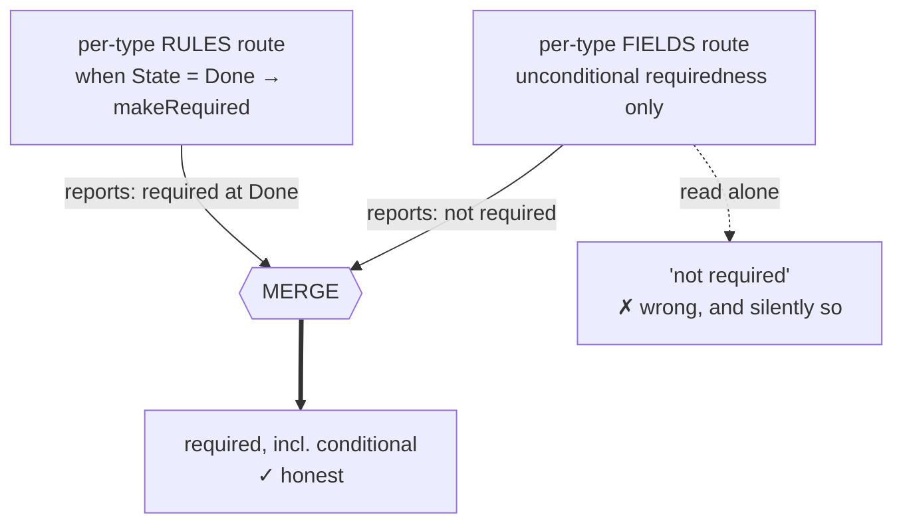
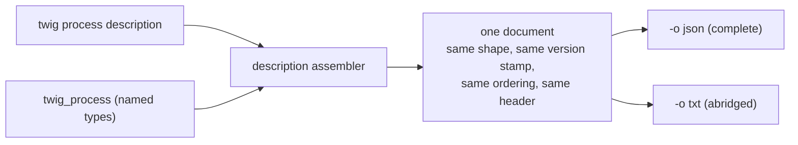

# Process Description — Functional Specification

> **Status:** Accepted 2026-08-11. Build chartered as #233-#242 under umbrella #217.
> **Domain:** Process structure export — what an ADO process is made of, written to a file.
> **Command:** `twig process description [<type>]`, beside the shipped `twig process layout <type>`.
> **Agent surface:** the existing `twig_process` MCP tool gains a named-type description.
> **Settled by:** wayfinder map #218 (closed) and its five tickets — #219 (0001, endpoint
> research), #223 (0005, picklist research), #220 (0002, what a descriptor is for), #221
> (0003, surface shape and public promise), #222 (0004, volume and the human reader).
> **Public record:** GitHub issue #368, which stays **open**.
> **Evidence:** branch `docs/process-descriptor-map`, `wayfinder-process-descriptor/assets/`
> — `0001-endpoint-findings.md`, `0005-picklist-association-findings.md`, `raw/`, `probe-all.py`.
> **Deliberately not settled here:** whether `twig process layout` survives as its own
> command. See *Open Questions* — one item, deferred to the build by ruling.

---

## Provenance — what is ruled, and what is the author's

🔴 **Read this before treating any line below as negotiable.** The map is closed and every
ticket is Done. This spec is a transcription of settled decisions into build shape, not a
fresh design. Two classes of content live here and they carry different weight:

| Class | What it is | What to do with it |
|---|---|---|
| **Ruled** | Decided on the board, mostly by Daniel in session, several of them reversing a charted recommendation. Cited to the ticket that ruled them. | Implement. Do not re-litigate. If the build finds one unworkable, that is a finding to take back to Daniel, not a licence to substitute. |
| **Author's choice** | Gaps this spec closes to make the work buildable — test seams, error-path wording, naming of internal pieces. Marked **[author]**. | Ratified by approval of this spec; correctable on review without reopening the map. |

Three decisions on the record are **reversals** of what was originally proposed. They are the
reason the map was worth running, and they are the ones most likely to be "helpfully" undone
by an implementer who did not read this section:

1. **Inherited rules are carried, not dropped.** The charting proposed filtering ~95% of
   inherited rules as noise. Ruled the other way in 0002 — omission is the primary failure
   mode.
2. **The modern route was chosen over the legacy one.** 0005 recommended the legacy
   `processdefinitions` route for its inline picklist. 0003 reversed that.
3. **The text rendering is a summary, not a second complete copy.** The recommendation was
   that both renderings be complete. **Daniel reversed it in 0004, conditionally** — the
   self-declaration requirement is his addition and is the condition on which the summary was
   accepted. A build that drops the self-declaration has not implemented the ruling.

---

## Problem Statement

A person holding two ADO processes cannot find out how they differ.

Twig already lists a process's work item types and shows a type's states and transitions.
That output is thin, and in one respect it is worse than thin — **it is untrue**. The field
list it reports for a type is not scoped to the type at all: it is the project-wide field
list, identical for every type. Asking about two different types returns the same 85 fields
in the same order. A caller reading that output believes a type carries fields it does not.

Beyond that correctness defect, the things a person actually needs in order to compare two
processes are absent entirely: which fields are mandatory, what they default to, which values
they accept, whether a type was authored here or inherited from a parent process, what rules
fire on it, which backlog levels it belongs to, and how its form is arranged. The stable
identity of a type — its reference name — is not surfaced either, and **display names lie**:
one process observed in the field used reference names from an entirely differently-named
process, so matching two processes by the names a person sees silently pairs the wrong things.

Three uses were named, and they do not want the same document:

- validating input before creating work — wants mandatory-ness, defaults, accepted values;
- explaining a process to a person — wants forms and rules;
- comparing two processes — wants stable identity and inherited-vs-authored, thinly, for
  everything.

The comparison case is the one that decides the shape, and it is the one nothing serves today.

### What is NOT the problem

- **Not a missing ability to write required fields.** That was fixed (#339, closed). The
  surviving gap inverts it: a caller can now supply a required field but still cannot
  *discover* which fields are required. This spec does not reopen #339.
- **Not org/project overrides.** Tracked separately as #216, no dependency either way.
  Verified during triage: every endpoint this feature needs is reachable through existing
  org/project resolution.
- **Not a reporting error about the remote API being broken.** The report's one unverified
  claim — that the process-wide field endpoint returns nothing — was **refuted** (0001). The
  endpoint returns a 404 at the version the reporter asked for, and its error envelope is
  itself count-shaped, which is almost certainly what was read as data. At a valid version the
  endpoint works and carries every custom field. Field enumeration is therefore a free design
  choice, not a forced workaround.

---

## Solution

**Twig emits an honest, byte-stable document describing a process's structure. The caller
points an ordinary diff tool at two of them.** (0002)

That sentence carries four rulings, each load-bearing. They are lettered **S1-S4** so that
references to them cannot be confused with the numbered Implementation Decisions later:

### S1. Twig never renders a verdict

There is **no diff verb and no similarity judgement** in scope, now or later, under this
spec. Twig's job ends at producing two files a person can trust. Comparison is a solved
problem with existing tools, and a similarity verdict is a claim Twig would have to defend
across every future shape change of the document.

### S2. Byte-stability is a hard requirement, not a quality goal

Two runs against an unchanged process must produce byte-identical files, **the header's
capture timestamp excepted — and that is the only permitted variance.** Everything else in
this document is downstream of that: if ordering wobbles, or the remote server's schema shifts
under an unpinned version, the diff fills with noise and the feature is worthless.
Byte-stability is what makes an ordinary diff tool the right answer instead of a bespoke
comparator.

**[author]** The timestamp must therefore sit where a diff tool can be pointed past it — a
header line, never interleaved into the body. The alternative considered and rejected was
omitting the timestamp entirely: it would buy exact byte-identity at the cost of the reader
knowing *when* the claim was true, and a description whose age is unknowable is a weaker truth
claim than one with a single varying line.

### S3. Omission is the primary failure mode

**Carry everything reachable; mark inherited-vs-authored rather than filtering.** (0002)

This reversed the charted proposal. The volume argument for filtering is real — types derived
from system ones carry ~54-55 rules each, almost entirely inherited system plumbing, against
0-3 authored rules on the custom types, so a verbatim dump is roughly 95% noise on exactly
the types a caller most often asks about. It was ruled against anyway, and the reasoning
binds the build: **a difference that exists only in the omitted part diffs clean.** A reader
who wants the authored rules can filter a complete document; a reader handed a filtered
document cannot recover what was dropped, and — worse — cannot tell that anything was.

Every rule carries its `customizationType`, so filtering is available *to the reader* as a
downstream operation. That is the intended way to pay the noise cost.

### S4. Structure only — never work item values

The document describes how a process is *built*: types, fields, states, transitions, rules,
behaviours, forms. It never contains anyone's actual work. **That is what makes the file safe
to hand to someone outside the team**, and it matches the existing layout command's promise,
which reads arrangement and never contents.

### The document is written to disk, not ingested

Output is a file. It is **not** loaded into Twig's local store. That store is scoped to the
workspace's own project, and a foreign process — which is the entire point of comparing two —
would poison it. (0002)

### Nothing is cached

**No caching of any kind** — not the local store, not a file cache beside the output. Always
a live fetch. (0004)

The reasoning is not performance-indifference: **a stale description is a wrong description**,
and the whole feature is a truth claim about two processes at a moment in time. A cache trades
away the single property the artifact exists to have, to save time on a command run rarely and
deliberately.

Latency is **accepted at roughly 20 seconds** for a whole process, measured serially. That is
worse than the ~15 seconds first estimated, because choosing the modern route costs additional
round-trips, and the cost is round-trip-bound rather than byte-bound (~0.45 s per call). The
calls are independent GETs. **Parallelising them is the only mitigation taken**, and it is
expected of the build.

**[author]** The ~20 s figure is the *unparallelised* ceiling the ruling accepted — it is the
number the build must not exceed, not a target it must hit. Parallelising should beat it
comfortably; no post-parallelism figure was measured, so none is quoted here.

---

## User Stories

**Comparing two processes**

1. As a process owner inheriting a customised process I did not author, I want a single file
   describing everything that process is made of, so that I can read it rather than clicking
   through a portal.
2. As a process owner, I want a second such file for a different process, so that I can diff
   them with the tools I already use.
3. As a process owner, I want the two files to be byte-identical when nothing has changed —
   apart from the header's capture timestamp — so that every line the diff shows below the
   header is a real difference.
4. As a process owner, I want one document covering the whole process, so that a type present
   in one process and absent in the other shows up as a difference — which per-type documents
   cannot express.
5. As a process owner, I want types identified by their stable reference name, so that two
   processes are matched by what they are and not by a display name that can lie.
6. As a process owner, I want to know whether each type was authored here or inherited from a
   parent, so that I can tell local customisation from what came with the parent process.
7. As a process owner, I want the same distinction on rules, so that the ~55 inherited rules
   on a derived type do not drown the two rules someone actually wrote.
8. As a process owner, I want nothing silently dropped, so that a difference cannot hide in
   the part the tool decided I did not need.

**Validating before creating work**

9. As an automation author, I want to know which fields a type genuinely carries, so that I
   stop believing the current output's project-wide list.
10. As an automation author, I want to know which fields are mandatory, so that my create call
    does not fail at the server.
11. As an automation author, I want conditional requiredness — a field that becomes mandatory
    only in a particular state — included in that answer, so that the document is not wrong in
    the silent direction about exactly the fields I care about.
12. As an automation author, I want each field's default value where one exists, so that I can
    omit what I do not need to supply.
13. As an automation author, I want the accepted values of a field that is genuinely
    constrained to a list, so that I can validate before calling.
14. As an automation author, I want fields that are *not* list-constrained to be reported as
    unconstrained, so that I am not misled by fields that merely look like choices.
15. As an automation author, I want each field's type and both its reference name and its
    display name, so that I can address it in a call and recognise it on a screen.

**Explaining a process to a person**

16. As someone onboarding a team, I want each type's states and the transitions between them,
    so that I can explain how work moves.
17. As someone onboarding a team, I want the rules that fire on a type, so that I can explain
    why a field suddenly became mandatory.
18. As someone onboarding a team, I want each type's form arrangement, so that I can explain
    what people will see.
19. As someone onboarding a team, I want to know which backlog levels a type belongs to, so
    that I can explain where it shows up.
20. As someone onboarding a team, I want a short readable rendering, so that I do not have to
    read a machine format to get oriented.
21. 🔴 As someone reading that short rendering, I want it to **tell me it is abridged and name
    the format that carries the whole thing**, so that I never mistake a summary for the
    document.

**Operating the command**

22. As a CLI user, I want to write the document to a file, so that it is an artifact I can
    keep, mail, and diff.
23. As a CLI user, I want the document on stdout when I do not ask for a file, so that it
    pipes.
24. As a CLI user, I want to choose the machine format or the readable one, so that the same
    command serves a script and a person.
25. As a CLI user, I want a confirmation that a file was written to go somewhere other than
    the output stream, so that redirecting output stays clean.
26. As a CLI user, I want the switches to look like the layout command's, so that I do not
    have to learn a second convention in the same command family.
27. As a CLI user, I want to name one type when that is all I need, so that I pay 4-6 calls
    instead of ~32.
28. As a CLI user running the whole-process case, I want the independent fetches to happen
    concurrently, so that ~20 seconds is not ~40.

**Trusting the artifact over time**

29. As a consumer of the document, I want it to declare its own version number, so that a
    shape change is announced in the artifact rather than discovered by whatever it broke.
30. As a consumer of the document, I want the header to record which org and process it
    describes and when it was taken, so that I know what I am holding.
31. As a consumer of the document, I want the exact remote API version used for each route
    recorded in the header, so that two documents taken months apart cannot differ merely
    because the server moved.
32. As someone handing this file outside the team, I want certainty that it contains no work
    item values, so that structure can be shared without leaking content.

**Agent surface**

33. As an agent, I want to ask for a description of specific named types, so that I do not pay
    for a whole-process document I did not need.
34. As an agent, I want that reply to be the *same* document with fewer types in it — same
    shape, same version stamp, same ordering, same header — so that there is only ever one
    document format to understand.
35. 🔴 As an agent, I want selection to be **only ever which types, never which parts of a
    type**, so that the agent path cannot become the filtered, quietly-lying variant this
    design exists to prevent.

---

## Implementation Decisions

### 1. A new verb — `twig process description [<type>]` (0003)

**A new verb. Not an enrichment of `twig process <type>`, and not an output mode on it.**

- Enriching the existing command in place changes what every current caller receives, and its
  four-key output is already consumed.
- Only a separate verb can carry its own stability stamp without dragging the older command's
  stability into the question.

**Noun-shaped**, matching the shipped `twig process layout <type>` precedent — the pattern in
this family is *name the artifact*, not *issue a verb*. `describe`, `detail`, and
`workitemtype` were weighed and rejected; `workitemtype` names the subject the caller already
supplied and collides in meaning with `twig process <type>`.

### 2. Switches mirror `process layout` (0003, confirmed 0004)

| Switch | Behaviour |
|---|---|
| `--out <file>` | Write the rendered document to the file. **The primary path.** |
| `-o json\|txt` | Choose the rendering. |
| *(neither)* | Render to stdout. |

The file receives the chosen rendering verbatim. The "wrote *X* to *Y*" confirmation goes to
the error stream, not the output stream, so `--out` composes in scripts — same as the layout
command does today.

### 3. No type argument means every type, one document (0003)

A caller comparing two processes wants one file per process, not fourteen files and fourteen
diffs. More decisively: **a per-type document cannot express a type's absence.** A type that
exists in one process and not the other is exactly the difference the comparison case is for,
and only a whole-process document can show it.

Naming a type is supported and is the cheap path (4-6 calls, ~2-3 s against ~32 calls, ~20 s).

### 4. Document content (0003, confirmed with Daniel)

**Header**

- Organisation and process being described.
- Timestamp of capture. **The only part of the document permitted to vary between two runs
  against an unchanged process (see S2).**
- **Descriptor version, starting at `0.1`.**
- **The pinned remote API version, per route.**

**Per type**

- **Identity:** reference name (display names lie), plus customization and what it inherits
  from.
- **Fields:** reference name *and* display name, type, required, default value, picklist
  values where genuinely present, and inherited-vs-authored.
- **States and transitions.**
- **Rules**, each tagged with its `customizationType`.
- **Behaviour membership** — which backlog levels the type belongs to.
- **Form layout.**

**Never:** work item values. Structure only.

### 5. The two honesty constraints — binding (0001, 0005, restated as binding in 0003)

🔴 These are the two places where the obvious implementation produces a document that lies.
Both are verified against live payloads, not inferred.

**a. `required` must merge the fields source with the rules source, or it lies.**

The per-type fields endpoint reports **unconditional** requiredness only. A field made
mandatory by a rule — *when State = Done → makeRequired* — reads as not-required there. A
whole-process survey reported 59 required fields at the richer schema version and **zero** at
the thinner one; the conditional cases are invisible to the fields endpoint entirely. A
descriptor reporting `required` from fields alone is **wrong about exactly the fields a caller
most needs, and wrong in the silent direction.**

The document must therefore express requiredness in a form that can carry *conditional*
requiredness, not a bare boolean. **[author]** The precise shape is a build decision; the
constraint is that a conditionally-required field must not render as simply not-required.

**b. Fields that look like enums here are unconstrained strings, and must not be reported as
constrained.**

Proven, not assumed (0005): every custom field in the org reports as not picklist-backed;
across 199 org fields, **zero** are. The seven picklists that exist back nothing. Corroborated
against the server's own validator — a validate-only write of a junk value into a
choice-looking custom field was **accepted**, while the same probe against a genuinely
constrained system field was rejected with an explicit "not in the list of supported values".

Consequences for the build:

- A descriptor reporting those fields as enums would be **lying** — the same failure class as
  today's project-wide field list.
- **No name-matching heuristic.** It is not merely undesirable, it is unnecessary: the API
  gives an explicit negative (`isPicklist: false`, and `pickList: null` on the legacy shape),
  so the document can state "not list-constrained" as fact rather than as a guess.
- Resolved values **are** permitted and expected where a field genuinely has a picklist,
  sourced by following the field's picklist id to the list contents, at one extra call per
  distinct list. In this org that is currently zero calls.

> Out of scope, recorded for whoever owns the process: the seven orphan picklists are a live
> **Niflheim process defect** — fields that read like choices accept any value today. That is a
> work item against the process, not against Twig. Not filed by this spec.

### 6. Route: the modern `processes` API at explicitly pinned versions (0003)

**Not the legacy `processdefinitions` route.** 🔴 This reverses the recommendation charted
from 0005, and the reversal came from correcting an overstatement mid-grilling.

The legacy route was framed as the only one solving the project-wide-field-list defect. That
is false: the modern per-type fields route at the richer preview version returns type-scoped
fields with requiredness and defaults. The legacy route's genuine advantage is narrower — it
returns the picklist object inline, where the modern path needs a second hop to the field's
picklist id and a third for the list contents.

**That advantage is currently unexercised**, because this org has zero picklist-backed fields.
Pinning an undocumented legacy surface Microsoft may retire, to buy a round-trip saving nobody
is presently spending, is a bad trade at 0.1.

**Revisit if** a real picklist-bearing process makes the extra hops hurt. The blast radius is
the fetch layer only — not the verb, not the document shape.

### 7. The API version is part of the contract (0001)

🔴 **The remote API version changes the response *schema*, not just the route.** Verified on
identical URLs:

- The per-type fields route at one preview version returns description/id/isIdentity/isLocked/
  name/type/url; at the next preview version it returns customization/defaultValue/isLocked/
  name/referenceName/required/type/url. Same count, **disjoint attributes**. Requiredness and
  defaults exist only at the richer one.
- The same split hits the type list: id and class at one version, reference name and
  customization at the other.
- The process-wide fields route **404s** at the plain (non-preview) version the report used,
  and works at the preview one.

Therefore: **pin an explicit version per route, and record it in the document header.**
Unpinned, two descriptors taken a month apart could differ because the server moved — which
poisons the diff the feature exists for.

**[author]** Pin the exact versions as constants in the fetch layer, named and commented with
what each buys. A version that is merely "what worked when this was written" is how this
silently regresses.

### 8. Two renderings, and only one of them is complete (0004)

**`-o json` carries everything.** No filtering, no summarising, no refusal.

**`-o txt` is a SHORT version, and 🔴 it must state on its face that it is abridged and name
the format that carries the whole thing.** Both halves are **Daniel's ruling** — the reversal
and the condition attached to it.

For scale, the complete rendering is **~1 MB across the 14 types**. That is the volume the
carry-everything rule produces, and the reason a short human rendering was wanted at all.

That disclosure is **not decoration — it is the condition on which the summary was accepted.**
A build that drops it has not implemented this ruling. The reasoning: two abridged renderings
can diff clean while a real difference sits in the omitted part. A summary that does not admit
it is a summary is precisely the cheap lie this feature exists to prevent.

**The abridged shape itself is deliberately unspecified.** It is a rendering concern with no
contract weight — the machine document is the file that carries the promise — and pinning it
at 0.1 would freeze a guess. **[author]** The build chooses it; only the self-declaration and
the naming of the complete format are fixed.

### 9. The public promise is the document, not the code (0003)

**The document carries its own version number, starting at `0.1`.**

This is stronger than either option originally offered (stable-contract vs
unstable-diagnostic): shape changes are **declared in the artifact** rather than discovered by
whoever they broke. `0.1` because the form layout structure is on the record as still under
design and the volume answer could still move the payload — claiming 1.0 with a known-unsettled
component inside would be false. **Going up costs nothing; coming down costs credibility.**

**`ProcessRule` (with its condition and action types) stays `internal`.**
It does not go through the public-API/SemVer mechanism now. Exposing it would assert stability
in code while the document declares 0.1 — a promise contradicting a warning about the same
content. **Nothing is withheld from the reader:** the document carries the full rule and layout
content; consumers read the file rather than calling the code.

> 🔴 **NARROWED by AB#253 (ruled by Daniel, 2026-08-12). This clause originally covered
> `FormLayout` as well; it no longer does.**
>
> `FormLayout` and its four child records are **`public`**, and correctly so. That was not
> drift. `wayfinder-detail-projection` ticket 0003 — `closed`, shipped as AB#155 — promoted
> them `internal` → `public`, exactly as ticket 0001 (`closed`, a research ticket) had scoped,
> because
> `WorkItemDetailProjector.Project` exposes a `FormLayout` **in its public signature** and
> `samples/Twig.DetailHost` exists to prove an external consumer can call it without
> referencing `Twig.Infrastructure`. Demoting them does not compile: it forces
> `WorkItemDetailProjector`, `FallbackFormLayout` and the whole `WorkItemDetailDocument`
> family internal too, deleting that boundary.
>
> This decision was not repudiated — it was **overtaken**. The argument below is sound, and
> was made before any external consumer of the layout existed. A proven consumer is the
> stronger claim on the boundary. The full ruling, with the measurement, is at the foot of
> `wayfinder-1.0/tickets/1004-export-work-item-form-layout.md`; the enforcement point is
> `tests/Twig.Domain.Tests/Architecture/PublicProjectionBoundaryTests.cs`.

Revisit when the 1.0 editor exists and the layout shape settles. Noted for whoever does: the
two are **not equally unsettled** — the rule type is a three-member mirror of the wire payload
with no pending design question, while the layout type is the four-level structure carrying the
open design note. ~~**If only one is promoted later, promote the rule type first.**~~

> 🔴 **That ranking is STALE AS A PREDICTION (AB#253).** Reality went the other way round: the
> layout type was promoted and the rule type was not, because the promotion was driven by a
> consumer that materialized rather than by settledness. The *observation* still holds — the
> rule type remains the simpler of the two — but do not read the sentence as describing what
> happened. Recorded rather than deleted so a reader who remembers it is not left wondering.
>
> Practical note for a future promoter: publicising `ProcessRule` **alone** does not compile.
> Its constructor exposes `RuleCondition`, `RuleAction` and `RuleCustomization`, so the family
> moves together or not at all.

### 10. The agent surface: named types only (0004 — new surface, raised and ratified by Daniel)

The MCP tool may serve a description of **named types only**, so an agent does not pay for a
whole-process document it did not ask for.

Bounded deliberately:

- **Selection is only ever which types. Never which parts of a type.**
- The result is **the same document** — same shape, same version stamp, same ordering, same
  header — with fewer types in it. Not a second format.
- 🔴 **Per-part selection is explicitly forbidden.** That is a filter, and filtering is the
  omission 0002 banned. It would also create a second document shape needing its own stability
  story.

This extends a live seam rather than inventing one: `twig_process` already exists in the MCP
tools with the same optional-type shape. **[author]** Whether the named-type description
arrives as an option on that existing tool or as a sibling tool is a build decision; the
constraint is that exactly one document format exists across both surfaces.

### 11. Resolve the process by id, via the project — never by name **[author]**

🔴 A live trap, verified: **the project named "Twig" does not run on the process named
"Twig".** Its process owns three projects; the identically-named process owns zero. Anything
resolving a descriptor by process *name* will silently describe the wrong process — and the
whole point of the feature is a truth claim about which process you are looking at.

**The trap is a grounded fact from 0001's fixture selection; resolving by id is this spec's
response to it, not a board ruling.** No ticket ruled how the description resolves its
process. It is marked author's-choice so it can be corrected on review without reopening the
map — but the underlying collision is real and an implementation that resolves by name is
wrong regardless of who decided it.

### 12. Volume arithmetic uses 14, not 17 (0004)

`twig process` lists 17 types because it includes system helper types (code review
request/response, feedback request/response) that the process's own type list does not report.
**The process has 14.** Use 14 for every volume and latency figure — it is the number the
description actually walks. Both numbers are correct and neither is a typo; quoting 17 inflates
every estimate by ~20%.

---

## Testing Decisions

### What makes a good test here

Test what a person can observe in the emitted document: what it contains, in what order,
byte-for-byte. **Do not assert the number of HTTP calls issued or the internal shape of the
fetch layer** — those are implementation detail this spec deliberately leaves open (the route
choice is explicitly marked revisitable), and pinning them makes the tests obstacles to the
revisit rather than a defence of behaviour.

The one exception: **parallelism is a ruled mitigation, not an optimisation**, so the whole-
process path may be asserted to issue its independent fetches concurrently. Assert concurrency
at the fetch abstraction, not by timing — a wall-clock assertion is a flaky test.

### The seam **[author]**

**Prefer existing seams. Use the highest one. Fewest is best.**

The repo's process data already arrives through provider interfaces in the domain layer — a
process configuration provider, a rule provider, a form layout provider — and the shipped
layout command composes one of them, builds a render tree, and hands it to the renderer
factory. Both the CLI and the agent surface reach process data through that provider layer.

**Proposed: one seam — a description assembler at the provider layer, taking the fetched parts
and producing the document model.** The command and the MCP tool are thin adapters over it:
the command resolves the type argument and the output target, the tool resolves the type
selection, and neither of them decides anything about the document.

That placement is what makes Decision 10 enforceable. If the two surfaces each assembled their
own document, "the agent gets the same document with fewer types" would be a convention rather
than a structural fact, and it would drift. Testing through both adapters would test the same
logic twice and let them disagree.

**No new public seam is proposed.** The assembler and the document model are `internal`,
consistent with Decision 9 — the file is the only public promise.

### The tests that must earn their place **[author]**

The entire test list below, its seam, its fixture hazards, and the red-flagged emphasis set are
author's-choice. The board ruled *what must be true*; it did not enumerate tests. Each test
cites the ruling it defends, so a reviewer can check the mapping without re-reading the map.

Per the repo's convention a regression test must **fail on unfixed code**. Verify against a
detached worktree at the pre-fix commit and **report which tests failed there, by name**.
"They should fail" is not evidence; this repo has already shipped a structural guard that was
silently inert.

Nearly all of these fail trivially today because the verb does not exist. That is expected and
is *not* the interesting property — the interesting property is which of them would still fail
against a plausible but wrong implementation. **Nine are marked 🔴 on that basis (1-7, 14, 15)
and must not be dropped as obvious.** Two of the nine — 4 and 15 — are hollow when taken
alone and are load-bearing only with the mitigation named beneath the table; do not ship
either without it — test 4's is the bolded note directly beneath this table, test 15's is in
*Fixture hazards* below it.

| # | Test | What it defends |
|---|---|---|
| 1 | 🔴 **Byte-stability.** Two runs against an unchanged process produce byte-identical output, timestamp excluded by construction. | Ruling S2. Fails against any implementation with non-deterministic ordering — dictionary iteration, unsorted rule collections, concurrent completion order. This is the single most important test in the suite. |
| 2 | 🔴 **Parallel fetch does not perturb ordering.** The whole-process document is byte-identical whether the independent fetches complete in order or in reverse. | The parallelism mitigation is what most plausibly breaks test 1. Drive completion order explicitly at the fetch abstraction. |
| 3 | 🔴 **A conditionally-required field is not reported as not-required.** A field whose only requiredness comes from a rule renders as required-under-that-condition. | Honesty constraint (a). Fails against the obvious implementation that reads requiredness from the fields source alone — and fails *silently* in production, which is why it is asserted here. |
| 4 | 🔴 **An unconstrained field is not reported as constrained.** A field that looks like a choice list but is not picklist-backed renders as unconstrained. | Honesty constraint (b), and the explicit ban on name-matching. |
| 5 | 🔴 **A genuinely picklist-backed field carries its resolved values.** | The other half of (b) — proves 4 is not passing by simply never emitting values. Without this pair, an implementation that emits no picklist data at all passes 4. |
| 6 | 🔴 **Inherited rules are present.** A type carrying many inherited rules emits all of them, each tagged with its customization type. | Ruling S3, the reversal most likely to be "helpfully" undone by an implementer who reads the noise argument and not the ruling. Assert a count, not merely non-empty. |
| 7 | 🔴 **The abridged rendering declares itself, and names a format that exists.** The text rendering states it is abridged AND names the complete format — and the named token must match the actual `-o` value that produces the complete document, asserted against that value rather than a hardcoded string. | Decision 8. The condition the summary was accepted on. A bare string-presence assertion is hollow: a banner naming a nonexistent format would pass it. |
| 8 | **Fields are type-scoped.** Two different types emit different field sets. | The founding correctness defect. Fails against today's behaviour, where every type reports the same project-wide list. |
| 9 | **Types are identified by reference name**, and the document is usable when display names collide or mislead. | Display names lie. |
| 10 | **Inherited-vs-authored is present on types and on rules.** | Ruling S3's other half — carrying everything is only useful if the reader can tell the classes apart. |
| 11 | **The header records org, process, timestamp, descriptor version, and the pinned API version per route.** Descriptor version reads `0.1`. | Decisions 7 and 9. |
| 12 | **No type argument describes every type**, including a type present in one process and absent in another. | Decision 3's absence argument — the reason the whole-process default exists. |
| 13 | **A named type describes only that type**, in the same document shape. | The cheap path. |
| 14 | 🔴 **The agent surface returns the same document with fewer types** — byte-identical to the CLI's output for the same type selection, header and version stamp included, capture timestamp excluded by construction per S2. | Decision 10. This is the structural proof that there is one format, not two. |
| 15 | 🔴 **The document contains no work item values.** Assert against a fixture whose work items carry distinctive content; assert that content is absent from the output. | Ruling S4 — the property that makes the file safe to share. A negative assertion, so state the precondition explicitly: the fixture must genuinely contain the distinctive content, or the test is a tautology. |
| 16 | **Nothing is written to the local store.** The store is byte-identical before and after a run. | Ruling: written to disk, not ingested. Foreign-process poisoning. |
| 17 | **No cache is consulted or written.** A second run re-fetches. | Ruling: no caching of any kind. |
| 18 | **`--out` writes the file and keeps the output stream clean**; the confirmation goes to the error stream. | Matches the layout command's shipped behaviour; a script contract. |
| 19 | **Omitting `--out` renders to the output stream.** | Same. |
| 20 | **An unknown type is a hard error** — non-zero exit, names what was asked for, no partial file written. | Error paths. **[author]** wording. |
| 21 | **A process resolved by id via the project, not by name.** Given a process whose name collides with a different process, the correct one is described. | The live name-collision trap. |

🔴 **Tests 4 and 5 must ship together.** Alone, test 4 passes against an implementation that
never emits picklist data at all. This is the same class of hollow guard the repo has already
been bitten by.

### Fixture hazards

This repo has been bitten by fixtures that silently degrade into the happy path. Two apply
here directly:

- **Test 3** requires a fixture where requiredness genuinely differs between the two sources.
  If the fixture's field is unconditionally required, the merge never runs and the test passes
  against unfixed code. **Assert that precondition explicitly.**
- **Test 15** is a negative assertion. Assert that the fixture actually contains the content
  being looked for, or a later fixture change turns the test into a tautology.

### Prior art

The shipped layout command is the closest prior art in every respect — it composes a provider,
builds a render tree, honours `--out` with the confirmation on the error stream, and reads
structure only. Its tests are the shape to follow. The captured payloads under
`wayfinder-process-descriptor/assets/raw/` on branch `docs/process-descriptor-map` are real
responses for both an inherited and a stock process, and are the natural fixture source —
including the disputed endpoint's working response, the two disjoint schema versions side by
side, and the empty-vs-populated picklist pair.

### Verdict discipline

Verdicts come only from the repo's test runner script, by its verdict line. **Never grep for a
passing summary** — an aborted run prints a clean-looking pass with a smaller total.

---

## Open Questions

**Exactly one, and it is deferred by ruling. Do not resolve it in review.**

### Does `twig process layout` survive as its own command, or become a view onto the description?

The description carries the full form layout. The shipped layout command fetches the same data
for one type. Two verbs reading overlapping data is the **accepted cost** of the separate-verb
ruling, and this is how that cost gets paid down.

🔴 **Ruled DEFERRED TO THE BUILD by Daniel.** It was raised with him explicitly rather than
absorbed silently, and he ruled it out of the map. The reasoning, which is the operative part:
it is a tidy-up question rather than a volume or contract one, and **it is cheaper to answer
once the new verb exists and the real overlap is observable rather than predicted.**

The build should answer it *after* the description ships and the overlap can be measured, and
should record the answer where the layout command's own decisions live. Nothing in this spec
depends on which way it goes.

---

## Out of Scope

- **A diff verb or a similarity verdict.** Ruled out at 0002 and not deferred — Twig emits
  documents; the caller compares them.
- **Per-part selection on any surface.** Explicitly forbidden (Decision 10). Type selection only.
- **The abridged rendering's shape.** Deliberately unspecified at 0.1.
- **Promoting `ProcessRule` to the public API.** Revisit when the 1.0 editor exists.
  (**Amended by AB#253:** this item previously also covered `FormLayout`. It does not — those
  five records are already public, deliberately, per `wayfinder-detail-projection` 0001/0003.
  See the narrowing note under Decision 9.)
- **`--org` / `--project` overrides.** Tracked as #216. Independently shippable, no dependency
  edge either way. Verified: description depth never forces the override.
- **Reopening #339.** Closed and fixed. The surviving gap is discovery, not supply.
- **Any change to how work items are read or written.** This feature touches structure only.
- **Fixing the seven orphan picklists.** A live Niflheim *process* defect, not a Twig defect.
  Worth its own work item against the process. **Not filed by this spec** — filing is outside
  this session's authority.
- **The pending map for the hostable work-item detail projection.** Settled input for one thing
  only (it promoted the form layout types and established the compatibility mechanism); this
  spec does not reopen it.
- **Writing the implementation.** The build is chartered separately, after this spec is read.

---

## Further Notes

### Why the map's research half matters to the build

Two of this spec's binding constraints exist only because someone went and looked. Neither is
derivable from the API's documentation:

- Requiredness is split across two sources, and the obvious single-source read is wrong in the
  silent direction.
- The version string on a route changes the *schema*, so an unpinned fetch is a latent
  correctness bug rather than a latent 404.

A third — that this org's choice-looking fields are unconstrained strings — was established by
creating a real picklist-backed field on a projectless process, observing it across every
route, and deleting it, with the org verified clean afterwards. The premise that spawned that
ticket turned out to be **wrong**, and finding that out is what removed the name-matching
heuristic from the design.

### On the report that started this

GitHub issue #368 is the source report and the public record. It **stays open** — closing it
would hide a live defect from contributors who have no board access. Its central unverified
claim was refuted, and one of its rows was already stale when written (the layout command had
shipped to `main` but not to the tagged release the reporter used). Neither of those diminishes
the report: the correctness defect it identified is real, and this spec exists because of it.

### Number reconciliation, once more

**14 types, not 17.** The larger number counts system helper types the process itself does not
report. Every volume and latency figure in this document uses 14.
